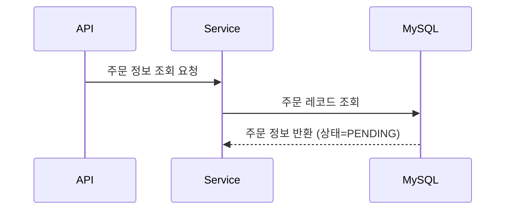
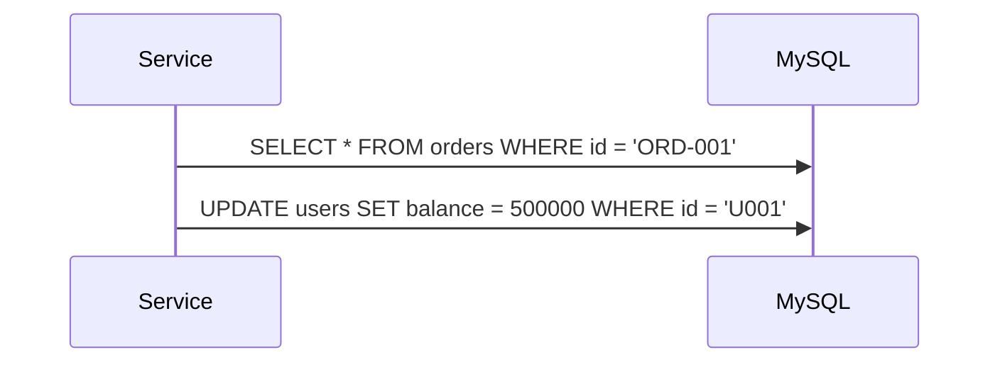
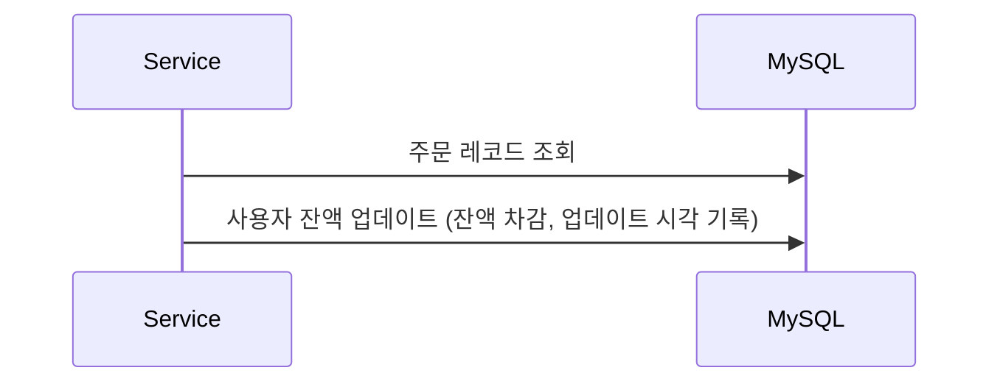

# 📚 이커머스 프로젝트 문서

항해플러스 백엔드 이커머스 과제 진행 과정에서 작성된 문서를 모아둔 디렉토리입니다.  
Week 2(설계)부터 Week 10(SRE/부하테스트/장애대응)까지, **주차별로 요구사항과 난이도가 단계적으로 올라가며** 문서가 축적됩니다.

---

## 📋 문서 개요

이 폴더에는 아래 성격의 문서가 섞여 있습니다.

- **설계/요구사항**: API/데이터모델/가용성 패턴, 다이어그램(Week 2 중심)
- **학습/정리**: 주차별 학습 로드맵/회고/코치 Q&A 요약
- **검증/증빙**: 성능 측정, 부하 테스트 결과, 장애 분석/대응, 최적화 보고서

문서가 많아 보이는 이유는 “중복”이라기보다, **같은 주제가 주차가 올라가며 더 높은 단계(검증/운영/증빙)로 확장**되기 때문입니다.

---

## 🧭 주제별 심화 로드맵(왜 문서가 여러 개인가?)

아래 표는 “비슷한 내용의 문서가 왜 여러 개인지”를 설명하기 위한 요약입니다.  
각 주제는 주차가 올라가면서 **(개념) → (구현/검증) → (운영 관점/증빙)**로 심화됩니다.

| 주제 | 기초(설계/개념) | 구현/검증 심화 | 운영/증빙 심화 |
|------|----------------|----------------|----------------|
| API/도메인 설계 | `docs/api/`, `docs/diagrams/` | - | - |
| JPA/DB 성능 | - | `docs/week4/`, `docs/week4/verification/` | `docs/week5/` (측정/최적화 관점 확장) |
| 동시성/락/멱등성 | - | `docs/week5/` (동시성/테스트/락 비교) | `docs/week6/` (분산락/재시도/캐시 등 확장) |
| Redis/랭킹/쿠폰 | - | `docs/week6/`, `docs/week7/` | `docs/week7/loadtest/` (부하/수치 기반 검증) |
| 트랜잭션 분리/이벤트 | - | `docs/week8/` (이벤트 기반, 트랜잭션 분리, 보상 트랜잭션) | - |
| Kafka/비동기 | - | `docs/week9/` (설치/개념/스프링 연동) | `docs/week9/` (use case 설계, best practices) |
| 관측/부하테스트/장애대응(SRE) | - | `docs/week10/step19-load-test-plan.md` | `docs/week10/step20-incident-report.md`, `docs/week10/RUNBOOK.md`, `docs/week10/SLO_SLI_ALERTING.md` |

---

## 🗂️ 문서 구조

```
docs/
├── api/                          # API 설계 문서
│   ├── requirements.md           # 요구사항 명세서 ⭐
│   ├── user-stories.md           # 사용자 스토리 (16개)
│   ├── api-specification.md      # API 명세서 (엔드포인트, 요청/응답)
│   ├── data-models.md            # 데이터 모델 정의
│   ├── availability-patterns.md  # 가용성 패턴 설계 ⭐
│   ├── error-codes.md            # 에러 코드 표준
│   ├── feature-list.md           # 기능 목록
│   └── scope-clarification.md    # 과제 범위 명확화
│
├── diagrams/                     # 다이어그램
│   ├── erd.md                    # ERD (DBML, Mermaid) ⭐
│   ├── sequence-diagrams.md      # 시퀀스 다이어그램 (8개) ⭐
│   └── flowcharts.md             # 플로우차트 (5개) ⭐
│
├── week4/                        # JPA 전환 & DB 최적화(주차 산출물)
├── week5/                        # 동시성/성능 측정/최적화(주차 산출물)
├── week6/                        # 분산락/멱등성/캐시/부하(주차 산출물)
├── week7/                        # Redis/쿠폰/랭킹 + 부하테스트(주차 산출물)
├── week8/                        # 트랜잭션 분리 & 이벤트 기반 설계/구현(주차 산출물)
├── week9/                        # Kafka(개념/설치/연동/설계)(주차 산출물)
├── week10/                       # SRE(관측/부하/장애 대응)(주차 산출물)
│
├── learning-points/              # 학습 포인트 요약(인덱스)
├── feedback/                     # 코치 피드백/개선 정리
└── PROJECT_STRUCTURE.md          # 프로젝트 구조 가이드
```

⭐ = 핵심 문서

---

## 📍 주요 문서 바로가기

### API 설계 문서

| 문서 | 설명 | 링크 |
|------|------|------|
| **요구사항 명세서** | 비즈니스 요구사항 및 제약사항 정의 | [requirements.md](api/requirements.md) |
| **사용자 스토리** | 16개 기능에 대한 사용자 관점 시나리오 | [user-stories.md](api/user-stories.md) |
| **API 명세서** | REST API 엔드포인트 상세 (요청/응답/에러) | [api-specification.md](api/api-specification.md) |
| **데이터 모델** | 엔티티 정의 및 비즈니스 로직 | [data-models.md](api/data-models.md) |
| **가용성 패턴** | Timeout, Retry, Fallback, Async 설계 | [availability-patterns.md](api/availability-patterns.md) |
| **에러 코드** | 표준 에러 코드 체계 | [error-codes.md](api/error-codes.md) |

### 주차별(산출물) 인덱스

- Week 4: `docs/week4/README.md`
- Week 5: `docs/week5/OVERVIEW.md`
- Week 6: `docs/week6/README.md`
- Week 7: `docs/week7/README.md`
- Week 8: `docs/week8/README.md`
- Week 9: `docs/week9/README.md`
- Week 10: `docs/week10/README.md`

### docs/ 루트 문서(주차 밖)

주차 산출물(`docs/week*/`)과 별개로, `docs/` 바로 아래에는 “전역 레퍼런스”와 “특정 이슈 대응 기록(시점 의존)” 문서가 함께 있습니다.

**전역 레퍼런스(여러 주차에서 재사용)**
- `docs/PROJECT_STRUCTURE.md` (프로젝트 구조/패키지 안내)
- `docs/INTEGRATION_TEST_STRATEGY.md` (통합 테스트 전략)

**작업/이슈 기록(시점 의존, 과거 기록일 수 있음)**
- `docs/N1_DB_LEVEL_VERIFICATION.md` (N+1/DB 레벨 검증 기록)
- `docs/EVENT_IDEMPOTENCY_AND_RETRY_IMPLEMENTATION.md` (멱등성/재시도 구현 기록)
- `docs/TEST_ANALYSIS_SUMMARY.md`
- `docs/TEST_DESIGN_BY_USECASE.md`
- `docs/TEST_FAILURE_ROOT_CAUSE_ANALYSIS.md`
- `docs/TEST_FAILURE_ROOT_CAUSE_FIX.md`
- `docs/TEST_FIX_SUMMARY.md`
- `docs/TEST_REFACTORING_COMPLETE.md`
- `docs/TEST_STRATEGY_REDESIGN.md`

**도구/흐름 가이드(사용 목적이 명확한 메타 문서)**
- `docs/CODE_REVERSE_ENGINEERING_PLAN.md` (코드 분석/리버스 엔지니어링 계획)
- `docs/CODEX_GUIDE.md` (Codex/에이전트 협업 가이드)

### 다이어그램

| 문서 | 설명 | 개수 | 링크 |
|------|------|------|------|
| **ERD** | 데이터베이스 설계 (DBML, Mermaid) | 10개 테이블 | [erd.md](diagrams/erd.md) |
| **시퀀스 다이어그램** | API별 상세 플로우 (액션 설명 기반) | 8개 플로우 | [sequence-diagrams.md](diagrams/sequence-diagrams.md) |
| **플로우차트** | 비즈니스 로직 흐름 | 5개 플로우 | [flowcharts.md](diagrams/flowcharts.md) |

---

## 🧩 Week 2 설계 문서(참고)

아래 섹션은 `docs/api/`, `docs/diagrams/` 중심의 **Week 2 설계 문서 작성 기준/의사결정**을 정리한 내용입니다.  
Week 3+ 이후의 구현/검증/운영 관점 문서는 각 주차 폴더(`docs/week*/`)를 우선 참고하세요.

<details>
<summary>Week 2 설계 문서(작성 원칙/의사결정) 펼치기</summary>

## 🎯 문서 작성 원칙

### 1. **명확성 (Clarity)**
- 기술 용어 최소화, 비즈니스 용어 사용
- 예시 포함 (요청/응답, SQL, 코드)

### 2. **완전성 (Completeness)**
- 성공 케이스 + 실패 케이스 모두 문서화
- 예외 상황 및 에러 처리 명시

### 3. **일관성 (Consistency)**
- 네이밍 컨벤션 통일
  - 인덱스: `idx_`, unique 인덱스: `uidx_`
  - 에러 코드: `P001`, `O002` 등
- 용어 통일 (stock ✅, inventory ❌)

### 4. **실행 가능성 (Actionability)**
- 개발자가 바로 구현 가능한 수준
- SQL, Java 코드 예시 포함

---

## 📊 다이어그램 사용 가이드

### ERD (erd.md)

**목적**: 데이터베이스 테이블 구조 및 관계 정의

**포함 내용**:
- 10개 테이블 정의 (DBML, Mermaid 형식)
- 인덱스 전략 (복합 인덱스, Unique 제약)
- 동시성 제어 필드 (`version`)
- 주요 쿼리 예시

**활용 도구**:
- [dbdiagram.io](https://dbdiagram.io/d) - DBML 렌더링
- [Mermaid Live Editor](https://mermaid.live) - Mermaid 렌더링

---

### 시퀀스 다이어그램 (sequence-diagrams.md)

**목적**: API별 요청/응답 흐름 및 인프라 상호작용 표현

**포함 내용**:
- 8개 API 플로우 (REST API 7개 + 배치 1개)
- 트랜잭션 경계 명시 (BEGIN, COMMIT, ROLLBACK)
- Lock 획득/해제 시점 표시 (**LOCKED**)
- 성공/실패 분기 (alt fragment)
- **액션 설명 기반** (SQL 쿼리, 메서드명 제거)

**예시**:


**피어 리뷰 피드백 반영**:
- ❌ `getOrder(orderId)` → ✅ "주문 정보 조회 요청"
- ❌ `SELECT * FROM orders WHERE id = ?` → ✅ "주문 레코드 조회"

---

### 플로우차트 (flowcharts.md)

**목적**: 비즈니스 로직의 의사결정 흐름 시각화

**포함 내용**:
- 5개 핵심 플로우 (주문 생성, 결제 처리, 쿠폰 발급, 재고 차감, 장바구니 전환)
- 유효성 검증 단계
- 성공/실패 분기
- 예외 처리

**활용 시나리오**:
- 비즈니스 로직 리뷰
- 테스트 케이스 설계
- 코드 구현 가이드

---

## 🔍 핵심 설계 결정

### 1. 시퀀스 다이어그램: SQL 쿼리 제거

**Before (잘못된 방식)**:


**After (올바른 방식)**:


**이유**:
- 시퀀스 다이어그램은 **흐름**을 보여주는 것이 목적
- 구현 세부사항(SQL)은 **의도**를 가림
- 메서드명도 제거하고 **액션 설명**으로 변경

---

### 2. ERD: Unique Index 네이밍 (uidx_)

**적용**:
```sql
-- 일반 인덱스
CREATE INDEX idx_products_category ON products(category);

-- Unique 인덱스
CREATE UNIQUE INDEX uidx_stock_product_warehouse ON stock(product_id, warehouse_id);
CREATE UNIQUE INDEX uidx_user_coupons_user_coupon ON user_coupons(user_id, coupon_id);
```

**이유**:
- 한눈에 Unique 인덱스 구분 가능
- DB 제약조건 명확화 (1인 1매, 창고별 재고)

---

### 3. 가용성 패턴: Circuit Breaker 제거

**결정**: Week 2에서는 Circuit Breaker 패턴 제거

**남은 패턴**:
1. **Timeout** (3초)
2. **Retry** (Exponential Backoff: 1분 → 5분 → 30분)
3. **Fallback** (Outbox 패턴, 빈 배열 반환)
4. **Async** (`@Async` 비동기 처리)

**이유**:
- Week 2 수준에서 Circuit Breaker는 과도한 복잡도
- 핵심 패턴에 집중하여 학습 목표 달성
- 필요 시 추후 추가 가능

---

## ✅ 문서 검증 체크리스트

### API 명세서
- [ ] 모든 엔드포인트 문서화 (URL, Method, 인증)
- [ ] 요청/응답 예시 포함
- [ ] 에러 케이스 문서화 (400, 404, 409)
- [ ] HTTP Status Code 올바르게 매핑

### ERD
- [ ] 모든 테이블 정의 (10개)
- [ ] 인덱스 설계 포함 (복합 인덱스, Unique)
- [ ] 동시성 제어 필드 (`version`)
- [ ] FK 정책 명시 (CASCADE, RESTRICT)
- [ ] Unique 인덱스 `uidx_` 네이밍 사용

### 시퀀스 다이어그램
- [ ] 트랜잭션 경계 명시 (BEGIN, COMMIT, ROLLBACK)
- [ ] Lock 획득/해제 표시 (**LOCKED**)
- [ ] 성공/실패 분기 (alt fragment)
- [ ] **SQL 쿼리 제거** ✅
- [ ] **메서드명 제거**, 액션 설명 사용 ✅

### 플로우차트
- [ ] 비즈니스 로직 의사결정 흐름
- [ ] 유효성 검증 단계
- [ ] 예외 처리 분기

---

## 🚀 다음 단계 (Week 3+)

### 구현 단계
1. **Spring Boot 프로젝트 생성**
2. **Entity 클래스 작성** (ERD 기반)
3. **Repository 인터페이스** (JPA)
4. **Service 계층** (비즈니스 로직)
5. **Controller 계층** (REST API)

### 테스트 단계
1. **단위 테스트** (Service 계층)
2. **통합 테스트** (API 엔드포인트)
3. **동시성 테스트** (재고 차감, 쿠폰 발급)

### 최적화 단계
1. **Redis 캐싱** (인기 상품)
2. **Kafka 메시징** (외부 연동)
3. **성능 테스트** (부하 테스트)

---

## 📚 문서 작성 가이드

### 새 문서 추가 시
1. 목적 명확히 (Why)
2. 예시 포함 (How)
3. 제약사항 명시 (What not to do)
4. 관련 문서 링크

### 기존 문서 수정 시
1. 변경 이력 기록 (변경 날짜, 이유)
2. 영향받는 다른 문서 확인
3. 예시 코드 업데이트

---

</details>

## 🔗 관련 링크

- **루트 README**: [../README.md](../README.md)
- **프로젝트 구조**: [PROJECT_STRUCTURE.md](PROJECT_STRUCTURE.md)
- **GitHub Issues**: 피드백 및 개선사항

---

이 문서는 “문서 인덱스 + Week 2 설계 문서 참고” 성격을 함께 가집니다.
