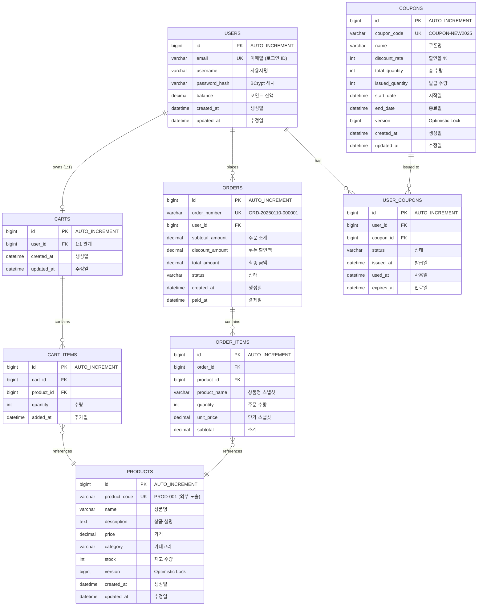

# ERD (Entity Relationship Diagram)

## 🎯 설계 원칙

**이커머스 시스템 데이터베이스 설계 - 성능 최적화 중심**

### 핵심 원칙
1. **ID 전략**: BIGINT AUTO_INCREMENT (클러스터드 인덱스 최적화)
2. **비즈니스 ID**: 별도 VARCHAR 컬럼 (외부 노출용 - product_code, order_number)
3. **인덱스**: 쿼리 패턴 기반 복합 인덱스 설계
4. **유니크 제약**: 비즈니스 규칙을 DB 레벨에서 보장
5. **정규화**: 3NF 준수하되 조회 성능 우선

### 기술 스택
- **Database**: MySQL 8.0+
- **Engine**: InnoDB (트랜잭션, 외래키, 클러스터드 인덱스)
- **Charset**: utf8mb4 (이모지 지원)
- **Collation**: utf8mb4_unicode_ci

---

## 📊 DBML 형식 (dbdiagram.io)

아래 코드를 [dbdiagram.io](https://dbdiagram.io/d)에 붙여넣으세요.

```dbml
// ====================================
// E-Commerce Database Schema
// Performance-Optimized Design
// MySQL 8.0+ / InnoDB
// ====================================

// ====================================
// 1. 상품 관리
// ====================================

Table products {
  id bigint [pk, increment, note: 'Auto increment PK']
  product_code varchar(20) [not null, unique, note: 'PROD-001 형식 (외부 노출)']
  name varchar(200) [not null, note: '상품명']
  description text [note: '상품 설명']
  price decimal(12,2) [not null, note: '가격 (최대 9999억)']
  category varchar(50) [not null, note: '카테고리']
  stock int [not null, default: 0, note: '재고 수량']
  version bigint [not null, default: 0, note: 'Optimistic Lock']
  created_at datetime(6) [not null, default: `CURRENT_TIMESTAMP(6)`]
  updated_at datetime(6) [not null, default: `CURRENT_TIMESTAMP(6)`, note: 'ON UPDATE CURRENT_TIMESTAMP(6)']

  indexes {
    (category, created_at) [name: 'idx_category_created', note: '카테고리별 최신순 조회']
    name [name: 'idx_name', note: '상품명 검색 (LIKE)']
    created_at [name: 'idx_created_at', note: '최신 상품 조회']
  }
}

// ====================================
// 2. 사용자
// ====================================

Table users {
  id bigint [pk, increment]
  email varchar(255) [not null, unique, note: '이메일 (로그인 ID)']
  username varchar(100) [not null, note: '사용자명']
  password_hash varchar(255) [note: 'BCrypt 해시 (향후 추가)']
  balance decimal(12,2) [not null, default: 0, note: '포인트 잔액']
  created_at datetime(6) [not null, default: `CURRENT_TIMESTAMP(6)`]
  updated_at datetime(6) [not null, default: `CURRENT_TIMESTAMP(6)`]

  indexes {
    email [name: 'idx_email', note: '이메일 검색']
  }
}

// ====================================
// 3. 장바구니
// ====================================

Table carts {
  id bigint [pk, increment]
  user_id bigint [not null, unique, ref: > users.id, note: '사용자당 1개 장바구니']
  created_at datetime(6) [not null, default: `CURRENT_TIMESTAMP(6)`]
  updated_at datetime(6) [not null, default: `CURRENT_TIMESTAMP(6)`]

  indexes {
    user_id [name: 'idx_user_id']
  }

  note: 'FK ON DELETE: CASCADE (사용자 삭제 시 장바구니도 삭제)'
}

Table cart_items {
  id bigint [pk, increment]
  cart_id bigint [not null, ref: > carts.id]
  product_id bigint [not null, ref: > products.id]
  quantity int [not null, default: 1, note: '수량 (1 이상)']
  added_at datetime(6) [not null, default: `CURRENT_TIMESTAMP(6)`]

  indexes {
    (cart_id, product_id) [unique, name: 'uk_cart_product', note: '장바구니 내 중복 상품 방지']
    cart_id [name: 'idx_cart_id']
    product_id [name: 'idx_product_id']
  }

  note: 'FK: cart_id CASCADE, product_id RESTRICT'
}

// ====================================
// 4. 주문/결제
// ====================================

Table orders {
  id bigint [pk, increment]
  order_number varchar(30) [not null, unique, note: 'ORD-20250110-000001 (외부 노출)']
  user_id bigint [not null, ref: > users.id]
  subtotal_amount decimal(12,2) [not null, note: '주문 소계']
  discount_amount decimal(12,2) [not null, default: 0, note: '쿠폰 할인액']
  total_amount decimal(12,2) [not null, note: '최종 결제 금액']
  status varchar(20) [not null, default: 'PENDING', note: 'PENDING, COMPLETED, CANCELLED']
  created_at datetime(6) [not null, default: `CURRENT_TIMESTAMP(6)`]
  paid_at datetime(6) [note: '결제 완료 시각']

  indexes {
    (user_id, created_at) [name: 'idx_user_created', note: '사용자별 주문 내역 (최신순)']
    (user_id, status) [name: 'idx_user_status', note: '사용자별 특정 상태 주문']
    (status, paid_at) [name: 'idx_status_paid', note: '완료 주문 조회 (통계)']
    created_at [name: 'idx_created_at', note: '전체 주문 최신순']
  }

  note: 'FK ON DELETE: RESTRICT (주문 데이터 보존)'
}

Table order_items {
  id bigint [pk, increment]
  order_id bigint [not null, ref: > orders.id]
  product_id bigint [not null, ref: > products.id]
  product_name varchar(200) [not null, note: '주문 시점 상품명 (스냅샷)']
  quantity int [not null, note: '주문 수량']
  unit_price decimal(12,2) [not null, note: '주문 시점 단가 (스냅샷)']
  subtotal decimal(12,2) [not null, note: 'unit_price * quantity']

  indexes {
    order_id [name: 'idx_order_id']
    product_id [name: 'idx_product_id', note: '상품별 판매 통계']
    (product_id, order_id) [name: 'idx_product_order', note: '복합 조회 (커버링 인덱스)']
  }

  note: 'FK ON DELETE: RESTRICT. 가격은 주문 시점 스냅샷'
}

// ====================================
// 5. 쿠폰 시스템
// ====================================

Table coupons {
  id bigint [pk, increment]
  coupon_code varchar(30) [not null, unique, note: 'COUPON-NEW2025']
  name varchar(100) [not null, note: '쿠폰명']
  discount_rate int [not null, note: '할인율 % (1~100)']
  total_quantity int [not null, note: '총 발급 가능 수량']
  issued_quantity int [not null, default: 0, note: '현재 발급된 수량']
  start_date datetime(6) [not null, note: '시작일']
  end_date datetime(6) [not null, note: '종료일']
  version bigint [not null, default: 0, note: 'Optimistic Lock (선착순)']
  created_at datetime(6) [not null, default: `CURRENT_TIMESTAMP(6)`]
  updated_at datetime(6) [not null, default: `CURRENT_TIMESTAMP(6)`]

  indexes {
    (start_date, end_date) [name: 'idx_dates', note: '유효 쿠폰 조회']
  }
}

Table user_coupons {
  id bigint [pk, increment]
  user_id bigint [not null, ref: > users.id]
  coupon_id bigint [not null, ref: > coupons.id]
  status varchar(20) [not null, default: 'AVAILABLE', note: 'AVAILABLE, USED, EXPIRED']
  issued_at datetime(6) [not null, default: `CURRENT_TIMESTAMP(6)`]
  used_at datetime(6) [note: '사용 시각']
  expires_at datetime(6) [not null, note: '만료 시각']

  indexes {
    (user_id, coupon_id) [unique, name: 'uk_user_coupon', note: '1인 1매 제한 (중복 발급 방지)']
    (user_id, status) [name: 'idx_user_status', note: '사용자별 사용 가능 쿠폰']
    expires_at [name: 'idx_expires_at', note: '만료 쿠폰 배치 처리']
    (coupon_id, status) [name: 'idx_coupon_status', note: '쿠폰별 발급/사용 통계']
  }

  note: 'FK ON DELETE: RESTRICT. 1인 1매 제한 (UK)'
}

// ====================================
// 관계 요약
// ====================================
// 1:1: User -> Cart
// 1:N: User -> Order, User -> UserCoupon
//      Cart -> CartItem, Order -> OrderItem
//      Coupon -> UserCoupon
// N:1: CartItem -> Product, OrderItem -> Product
```

---

## 🗂️ Mermaid 형식 (Markdown 렌더링)



---

## 💾 CREATE TABLE DDL

### 1. products (상품)

```sql
CREATE TABLE products (
  -- PK: 클러스터드 인덱스 (InnoDB)
  id BIGINT AUTO_INCREMENT PRIMARY KEY COMMENT 'PK',

  -- 비즈니스 ID (외부 노출, API 응답)
  product_code VARCHAR(20) NOT NULL UNIQUE COMMENT 'PROD-001 형식',

  -- 기본 정보
  name VARCHAR(200) NOT NULL COMMENT '상품명',
  description TEXT COMMENT '상품 설명',
  price DECIMAL(12,2) NOT NULL COMMENT '가격 (최대 9999억)',
  category VARCHAR(50) NOT NULL COMMENT '카테고리',

  -- 재고 (Product에 통합)
  stock INT NOT NULL DEFAULT 0 COMMENT '재고 수량',
  version BIGINT NOT NULL DEFAULT 0 COMMENT 'Optimistic Lock (재고 차감용)',

  -- 메타데이터
  created_at DATETIME(6) NOT NULL DEFAULT CURRENT_TIMESTAMP(6) COMMENT '생성일',
  updated_at DATETIME(6) NOT NULL DEFAULT CURRENT_TIMESTAMP(6) ON UPDATE CURRENT_TIMESTAMP(6) COMMENT '수정일',

  -- 복합 인덱스 (쿼리 패턴 최적화)
  INDEX idx_category_created (category, created_at DESC) COMMENT '카테고리별 최신순 조회',
  INDEX idx_name (name) COMMENT '상품명 검색 (LIKE)',
  INDEX idx_created_at (created_at DESC) COMMENT '최신 상품 조회'

) ENGINE=InnoDB DEFAULT CHARSET=utf8mb4 COLLATE=utf8mb4_unicode_ci COMMENT='상품';
```

### 2. users (사용자)

```sql
CREATE TABLE users (
  -- PK
  id BIGINT AUTO_INCREMENT PRIMARY KEY COMMENT 'PK',

  -- 유니크 제약 (로그인 ID)
  email VARCHAR(255) NOT NULL UNIQUE COMMENT '이메일 (로그인 ID)',

  -- 기본 정보
  username VARCHAR(100) NOT NULL COMMENT '사용자명',
  password_hash VARCHAR(255) COMMENT 'BCrypt 해시 (향후 추가)',

  -- 포인트 시스템
  balance DECIMAL(12,2) NOT NULL DEFAULT 0 COMMENT '포인트 잔액',

  -- 메타데이터
  created_at DATETIME(6) NOT NULL DEFAULT CURRENT_TIMESTAMP(6) COMMENT '생성일',
  updated_at DATETIME(6) NOT NULL DEFAULT CURRENT_TIMESTAMP(6) ON UPDATE CURRENT_TIMESTAMP(6) COMMENT '수정일',

  -- 인덱스
  INDEX idx_email (email) COMMENT '이메일 검색'

) ENGINE=InnoDB DEFAULT CHARSET=utf8mb4 COLLATE=utf8mb4_unicode_ci COMMENT='사용자';
```

### 3. carts (장바구니)

```sql
CREATE TABLE carts (
  -- PK
  id BIGINT AUTO_INCREMENT PRIMARY KEY COMMENT 'PK',

  -- FK (1:1 관계)
  user_id BIGINT NOT NULL UNIQUE COMMENT '사용자 ID (1:1 관계)',

  -- 메타데이터
  created_at DATETIME(6) NOT NULL DEFAULT CURRENT_TIMESTAMP(6) COMMENT '생성일',
  updated_at DATETIME(6) NOT NULL DEFAULT CURRENT_TIMESTAMP(6) ON UPDATE CURRENT_TIMESTAMP(6) COMMENT '수정일',

  -- 외래키
  CONSTRAINT fk_carts_user FOREIGN KEY (user_id) REFERENCES users(id) ON DELETE CASCADE,

  -- 인덱스
  INDEX idx_user_id (user_id) COMMENT '사용자별 장바구니 조회'

) ENGINE=InnoDB DEFAULT CHARSET=utf8mb4 COLLATE=utf8mb4_unicode_ci COMMENT='장바구니';
```

### 4. cart_items (장바구니 상품)

```sql
CREATE TABLE cart_items (
  -- PK
  id BIGINT AUTO_INCREMENT PRIMARY KEY COMMENT 'PK',

  -- FK
  cart_id BIGINT NOT NULL COMMENT '장바구니 ID',
  product_id BIGINT NOT NULL COMMENT '상품 ID',

  -- 수량
  quantity INT NOT NULL DEFAULT 1 COMMENT '수량 (1 이상)',

  -- 메타데이터
  added_at DATETIME(6) NOT NULL DEFAULT CURRENT_TIMESTAMP(6) COMMENT '추가일',

  -- 외래키
  CONSTRAINT fk_cart_items_cart FOREIGN KEY (cart_id) REFERENCES carts(id) ON DELETE CASCADE,
  CONSTRAINT fk_cart_items_product FOREIGN KEY (product_id) REFERENCES products(id) ON DELETE RESTRICT,

  -- 유니크 제약 (장바구니 내 중복 상품 방지)
  UNIQUE KEY uk_cart_product (cart_id, product_id) COMMENT '중복 상품 방지',

  -- 인덱스
  INDEX idx_cart_id (cart_id) COMMENT '장바구니별 상품 조회',
  INDEX idx_product_id (product_id) COMMENT '상품별 장바구니 조회',

  -- 제약조건
  CONSTRAINT chk_quantity CHECK (quantity > 0)

) ENGINE=InnoDB DEFAULT CHARSET=utf8mb4 COLLATE=utf8mb4_unicode_ci COMMENT='장바구니 상품';
```

### 5. orders (주문)

```sql
CREATE TABLE orders (
  -- PK
  id BIGINT AUTO_INCREMENT PRIMARY KEY COMMENT 'PK',

  -- 비즈니스 ID (외부 노출)
  order_number VARCHAR(30) NOT NULL UNIQUE COMMENT 'ORD-20250110-000001 형식',

  -- FK
  user_id BIGINT NOT NULL COMMENT '사용자 ID',

  -- 금액 정보
  subtotal_amount DECIMAL(12,2) NOT NULL COMMENT '주문 소계',
  discount_amount DECIMAL(12,2) NOT NULL DEFAULT 0 COMMENT '쿠폰 할인액',
  total_amount DECIMAL(12,2) NOT NULL COMMENT '최종 결제 금액',

  -- 상태
  status VARCHAR(20) NOT NULL DEFAULT 'PENDING' COMMENT '주문 상태: PENDING, COMPLETED, CANCELLED',

  -- 메타데이터
  created_at DATETIME(6) NOT NULL DEFAULT CURRENT_TIMESTAMP(6) COMMENT '생성일',
  paid_at DATETIME(6) COMMENT '결제 완료 시각',

  -- 외래키
  CONSTRAINT fk_orders_user FOREIGN KEY (user_id) REFERENCES users(id) ON DELETE RESTRICT,

  -- 복합 인덱스 (조회 패턴 최적화)
  INDEX idx_user_created (user_id, created_at DESC) COMMENT '사용자별 주문 내역 (최신순)',
  INDEX idx_user_status (user_id, status) COMMENT '사용자별 특정 상태 주문',
  INDEX idx_status_paid (status, paid_at) COMMENT '완료 주문 조회 (통계)',
  INDEX idx_created_at (created_at DESC) COMMENT '전체 주문 최신순'

) ENGINE=InnoDB DEFAULT CHARSET=utf8mb4 COLLATE=utf8mb4_unicode_ci COMMENT='주문';
```

### 6. order_items (주문 상세)

```sql
CREATE TABLE order_items (
  -- PK
  id BIGINT AUTO_INCREMENT PRIMARY KEY COMMENT 'PK',

  -- FK
  order_id BIGINT NOT NULL COMMENT '주문 ID',
  product_id BIGINT NOT NULL COMMENT '상품 ID',

  -- 주문 시점 스냅샷 (가격 변동 대비)
  product_name VARCHAR(200) NOT NULL COMMENT '주문 시점 상품명',
  quantity INT NOT NULL COMMENT '주문 수량',
  unit_price DECIMAL(12,2) NOT NULL COMMENT '주문 시점 단가',
  subtotal DECIMAL(12,2) NOT NULL COMMENT 'unit_price * quantity',

  -- 외래키
  CONSTRAINT fk_order_items_order FOREIGN KEY (order_id) REFERENCES orders(id) ON DELETE RESTRICT,
  CONSTRAINT fk_order_items_product FOREIGN KEY (product_id) REFERENCES products(id) ON DELETE RESTRICT,

  -- 인덱스 (인기 상품 집계 최적화)
  INDEX idx_order_id (order_id) COMMENT '주문별 상품 조회',
  INDEX idx_product_id (product_id) COMMENT '상품별 판매 통계',
  INDEX idx_product_order (product_id, order_id) COMMENT '복합 조회 (커버링 인덱스)',

  -- 제약조건
  CONSTRAINT chk_quantity CHECK (quantity > 0)

) ENGINE=InnoDB DEFAULT CHARSET=utf8mb4 COLLATE=utf8mb4_unicode_ci COMMENT='주문 상세';
```

### 7. coupons (쿠폰 마스터)

```sql
CREATE TABLE coupons (
  -- PK
  id BIGINT AUTO_INCREMENT PRIMARY KEY COMMENT 'PK',

  -- 비즈니스 ID
  coupon_code VARCHAR(30) NOT NULL UNIQUE COMMENT 'COUPON-NEW2025 형식',

  -- 쿠폰 정보
  name VARCHAR(100) NOT NULL COMMENT '쿠폰명',
  discount_rate INT NOT NULL COMMENT '할인율 % (1~100)',

  -- 수량 관리
  total_quantity INT NOT NULL COMMENT '총 발급 가능 수량',
  issued_quantity INT NOT NULL DEFAULT 0 COMMENT '현재 발급된 수량',

  -- 유효기간
  start_date DATETIME(6) NOT NULL COMMENT '시작일',
  end_date DATETIME(6) NOT NULL COMMENT '종료일',

  -- Optimistic Lock (선착순)
  version BIGINT NOT NULL DEFAULT 0 COMMENT 'Optimistic Lock',

  -- 메타데이터
  created_at DATETIME(6) NOT NULL DEFAULT CURRENT_TIMESTAMP(6) COMMENT '생성일',
  updated_at DATETIME(6) NOT NULL DEFAULT CURRENT_TIMESTAMP(6) ON UPDATE CURRENT_TIMESTAMP(6) COMMENT '수정일',

  -- 인덱스
  INDEX idx_dates (start_date, end_date) COMMENT '유효 쿠폰 조회',

  -- 제약조건
  CONSTRAINT chk_discount_rate CHECK (discount_rate BETWEEN 1 AND 100),
  CONSTRAINT chk_quantity CHECK (issued_quantity <= total_quantity)

) ENGINE=InnoDB DEFAULT CHARSET=utf8mb4 COLLATE=utf8mb4_unicode_ci COMMENT='쿠폰';
```

### 8. user_coupons (사용자 쿠폰)

```sql
CREATE TABLE user_coupons (
  -- PK
  id BIGINT AUTO_INCREMENT PRIMARY KEY COMMENT 'PK',

  -- FK
  user_id BIGINT NOT NULL COMMENT '사용자 ID',
  coupon_id BIGINT NOT NULL COMMENT '쿠폰 ID',

  -- 상태
  status VARCHAR(20) NOT NULL DEFAULT 'AVAILABLE' COMMENT '상태: AVAILABLE, USED, EXPIRED',

  -- 시각 정보
  issued_at DATETIME(6) NOT NULL DEFAULT CURRENT_TIMESTAMP(6) COMMENT '발급일',
  used_at DATETIME(6) COMMENT '사용일',
  expires_at DATETIME(6) NOT NULL COMMENT '만료일',

  -- 외래키
  CONSTRAINT fk_user_coupons_user FOREIGN KEY (user_id) REFERENCES users(id) ON DELETE RESTRICT,
  CONSTRAINT fk_user_coupons_coupon FOREIGN KEY (coupon_id) REFERENCES coupons(id) ON DELETE RESTRICT,

  -- 유니크 제약 (1인 1매 제한)
  UNIQUE KEY uk_user_coupon (user_id, coupon_id) COMMENT '1인 1매 제한 (중복 발급 방지)',

  -- 복합 인덱스
  INDEX idx_user_status (user_id, status) COMMENT '사용자별 사용 가능 쿠폰 조회',
  INDEX idx_expires_at (expires_at) COMMENT '만료 쿠폰 배치 처리',
  INDEX idx_coupon_status (coupon_id, status) COMMENT '쿠폰별 발급/사용 통계'

) ENGINE=InnoDB DEFAULT CHARSET=utf8mb4 COLLATE=utf8mb4_unicode_ci COMMENT='사용자 쿠폰';
```

---

## 🎯 주요 설계 결정 사항

### 1. ID 전략: BIGINT AUTO_INCREMENT

**선택 이유:**
- ✅ **클러스터드 인덱스 최적화**: InnoDB는 PK 기준으로 데이터 정렬
- ✅ **INSERT 성능**: 순차 증가로 인덱스 리프 노드 분할 최소화
- ✅ **범위 조회 성능**: `WHERE id BETWEEN 1 AND 100` 빠름
- ✅ **JPA 표준**: `@GeneratedValue(strategy = GenerationType.IDENTITY)`

**UUID 대비 장점:**
```
BIGINT: 8 bytes, 순차적, 인덱스 효율적
UUID: 16 bytes, 랜덤, 인덱스 비효율적 (페이지 분할 ↑)
```

### 2. 비즈니스 ID 분리

**설계:**
```sql
-- Internal ID (PK, 성능 최적화)
id BIGINT AUTO_INCREMENT

-- Business ID (외부 노출, 가독성)
product_code VARCHAR(20) UNIQUE  -- 'PROD-001'
order_number VARCHAR(30) UNIQUE  -- 'ORD-20250110-000001'
coupon_code VARCHAR(30) UNIQUE   -- 'COUPON-NEW2025'
```

**장점:**
- API 응답: 비즈니스 ID 노출 (보안)
- DB 조인: PK (BIGINT) 사용 (성능)
- 마이그레이션: ID 변경 없이 코드 변경 가능

### 3. 복합 인덱스 설계 원칙

**순서 규칙:** 등호 조건 → 범위 조건 → 정렬

```sql
-- ✅ 좋은 예
INDEX idx_user_created (user_id, created_at DESC)
-- WHERE user_id = 123 ORDER BY created_at DESC
-- user_id (=) → created_at (정렬)

-- ❌ 나쁜 예
INDEX idx_created_user (created_at, user_id)
-- user_id 조건 사용 불가 (범위 조건이 앞에)
```

### 4. 유니크 제약 전략

| 테이블 | 유니크 컬럼 | 비즈니스 규칙 |
|--------|------------|--------------|
| users | email | 중복 회원가입 방지 |
| products | product_code | 상품 코드 중복 방지 |
| orders | order_number | 주문 번호 중복 방지 |
| coupons | coupon_code | 쿠폰 코드 중복 방지 |
| cart_items | (cart_id, product_id) | 장바구니 내 중복 상품 방지 |
| user_coupons | (user_id, coupon_id) | 1인 1매 제한 |

### 5. Optimistic Lock 적용

```sql
-- 재고 차감 (products.version)
UPDATE products
SET stock = stock - :quantity,
    version = version + 1
WHERE id = :productId
  AND stock >= :quantity
  AND version = :currentVersion;

-- 쿠폰 발급 (coupons.version)
UPDATE coupons
SET issued_quantity = issued_quantity + 1,
    version = version + 1
WHERE id = :couponId
  AND issued_quantity < total_quantity
  AND version = :currentVersion;
```

---

## ⚡ 성능 최적화 전략

### 1. 커버링 인덱스

**개념:** SELECT하는 컬럼이 모두 인덱스에 포함되어 테이블 접근 불필요

```sql
-- 쿼리
SELECT id, created_at FROM orders
WHERE user_id = 123 ORDER BY created_at DESC LIMIT 10;

-- 인덱스 (커버링)
INDEX idx_user_created (user_id, created_at DESC, id)
-- user_id, created_at, id 모두 인덱스에 존재 → Using index
```

### 2. 복합 인덱스 활용

```sql
-- orders 테이블: idx_user_created (user_id, created_at DESC)

-- ✅ 인덱스 사용 O
WHERE user_id = 123 ORDER BY created_at DESC  -- BOTH
WHERE user_id = 123  -- user_id만
WHERE user_id = 123 AND created_at > '2025-01-01'  -- BOTH

-- ❌ 인덱스 사용 X
WHERE created_at > '2025-01-01'  -- user_id 누락
ORDER BY created_at DESC  -- user_id 누락
```

### 3. 선택도(Selectivity) 고려

**선택도 = 유니크 값 개수 / 전체 레코드 수**

```sql
-- 높은 선택도 (인덱스 효과적)
email (거의 모두 다름) → 1.0
order_number (모두 다름) → 1.0

-- 낮은 선택도 (인덱스 비효율적)
status (PENDING, COMPLETED, CANCELLED) → 0.3
category (Electronics, Clothing 등 수십 개) → 0.1
```

**해결책: 복합 인덱스**
```sql
-- status 단독 인덱스 (비효율)
INDEX idx_status (status)

-- 복합 인덱스 (효율적)
INDEX idx_user_status (user_id, status)
-- user_id로 먼저 필터링 → status 조건 적용
```

### 4. 쿼리 성능 예측

#### Q1: 사용자 주문 내역 조회
```sql
-- 쿼리
SELECT * FROM orders WHERE user_id = 123 ORDER BY created_at DESC LIMIT 10;

-- 인덱스: idx_user_created (user_id, created_at DESC)
-- EXPLAIN:
-- type: ref (인덱스 사용)
-- rows: 10 (인덱스로 즉시 10건 추출)
-- Extra: Using index condition; Backward index scan
```

#### Q2: 인기 상품 Top 5
```sql
SELECT p.id, p.name, SUM(oi.quantity) as sales
FROM products p
JOIN order_items oi ON p.id = oi.product_id
JOIN orders o ON oi.order_id = o.id
WHERE o.status = 'COMPLETED'
  AND o.paid_at >= DATE_SUB(NOW(), INTERVAL 3 DAY)
GROUP BY p.id, p.name
ORDER BY sales DESC
LIMIT 5;

-- 최적화:
-- 1. orders: idx_status_paid (status, paid_at) → 최근 3일 완료 주문 추출
-- 2. order_items: idx_order_id (order_id) → 해당 주문 상품 조인
-- 3. products: PK (id) → 상품 정보 조인
-- 4. GROUP BY, ORDER BY → 메모리에서 처리
```

---

## 📊 인덱스 전략 요약

### 단일 컬럼 인덱스

| 테이블 | 인덱스 | 용도 |
|--------|--------|------|
| products | product_code (UNIQUE) | 상품 코드 조회 |
| products | name | 상품명 검색 (LIKE) |
| users | email (UNIQUE) | 로그인, 회원 조회 |
| orders | order_number (UNIQUE) | 주문 번호 조회 |
| coupons | coupon_code (UNIQUE) | 쿠폰 코드 조회 |

### 복합 인덱스 (핵심)

| 테이블 | 인덱스 | 쿼리 패턴 | 효과 |
|--------|--------|----------|------|
| products | (category, created_at DESC) | 카테고리별 최신 상품 | 정렬 최적화 |
| orders | (user_id, created_at DESC) | 사용자 주문 내역 | 커버링 인덱스 |
| orders | (user_id, status) | 특정 상태 주문 | 등호 조건 최적화 |
| orders | (status, paid_at) | 통계 쿼리 | 범위 조건 최적화 |
| order_items | (product_id, order_id) | 인기 상품 집계 | 커버링 인덱스 |
| user_coupons | (user_id, status) | 사용 가능 쿠폰 | 등호 조건 최적화 |

### 유니크 제약 인덱스

| 테이블 | 유니크 인덱스 | 비즈니스 규칙 |
|--------|--------------|--------------|
| cart_items | (cart_id, product_id) | 장바구니 내 중복 상품 방지 |
| user_coupons | (user_id, coupon_id) | 1인 1매 제한 |

---

## 🔧 마이그레이션 가이드

### Week 3 → Week 4 전환

**Entity 변경 사항:**

```java
// Week 3 (In-Memory)
public class Product {
    private String id;  // "P001"
    private Integer stock;
}

// Week 4 (JPA)
@Entity
@Table(name = "products")
public class Product {
    @Id
    @GeneratedValue(strategy = GenerationType.IDENTITY)
    private Long id;  // BIGINT AUTO_INCREMENT

    @Column(name = "product_code", unique = true, length = 20)
    private String productCode;  // "PROD-001" (비즈니스 ID)

    @Column(name = "stock")
    private Integer stock;

    @Version
    private Long version;  // Optimistic Lock
}
```

**Repository 변경 사항:**

```java
// Week 3
public interface ProductRepository {
    Optional<Product> findById(String id);
}

// Week 4
public interface ProductRepository extends JpaRepository<Product, Long> {
    Optional<Product> findByProductCode(String productCode);

    default Product findByProductCodeOrThrow(String productCode) {
        return findByProductCode(productCode)
            .orElseThrow(() -> new BusinessException(ErrorCode.PRODUCT_NOT_FOUND));
    }
}
```

---

## 📚 관련 문서

- [API 명세서](../api/api-specification.md)
- [요구사항 명세서](../api/requirements.md)
- [시퀀스 다이어그램](./sequence-diagrams.md)

---

## 🎓 참고 자료

- [MySQL 8.0 Reference Manual - InnoDB](https://dev.mysql.com/doc/refman/8.0/en/innodb-storage-engine.html)
- [MySQL 8.0 Reference Manual - Indexes](https://dev.mysql.com/doc/refman/8.0/en/optimization-indexes.html)
- [High Performance MySQL, 4th Edition](https://www.oreilly.com/library/view/high-performance-mysql/9781492080503/)
