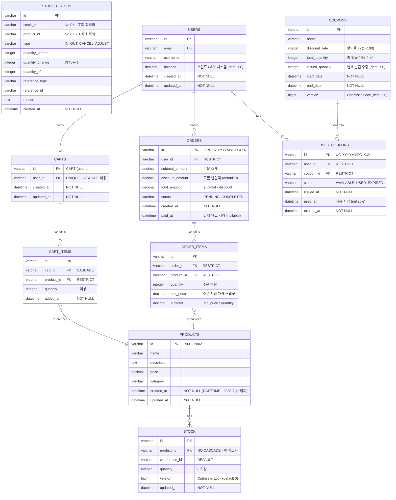

# ERD (Entity Relationship Diagram)

## ⚠️ Week 3 Implementation Notes

**중요**: 이 ERD는 **Week 4 이후 데이터베이스 연동 시** 사용될 설계입니다.

### Week 3 (Step 5-6) 구현 방식

**Week 3에서는 데이터베이스를 사용하지 않습니다:**
- ❌ JPA, H2, MySQL 사용 안 함
- ❌ @Entity, @Table, @Version 어노테이션 사용 안 함
- ✅ **In-Memory Only**: ConcurrentHashMap, ArrayList로 모든 데이터 관리
- ✅ **Pure Java Entity**: 순수 Java 클래스 + Lombok
- ✅ **Thread-Safe Collections**: ConcurrentHashMap 필수

### Week 3 구현 가이드

**1. Entity 설계**
```java
// ✅ Week 3: Pure Java (JPA 어노테이션 없음)
@Getter
@AllArgsConstructor
public class Product {
    private String id;
    private String name;
    private Long price;
    private Integer stock;  // Week 3: Product에 stock 직접 포함
    private LocalDateTime createdAt;
}
```

**2. Repository 구현**
```java
// Domain Layer (interface only)
package io.hhplus.ecommerce.domain.product;

public interface ProductRepository {
    Optional<Product> findById(String id);
    List<Product> findAll();
    Product save(Product product);
}

// Infrastructure Layer (In-Memory implementation)
package io.hhplus.ecommerce.infrastructure.persistence.product;

@Repository
public class InMemoryProductRepository implements ProductRepository {
    private final Map<String, Product> storage = new ConcurrentHashMap<>();

    @Override
    public Optional<Product> findById(String id) {
        return Optional.ofNullable(storage.get(id));
    }

    @Override
    public Product save(Product product) {
        storage.put(product.getId(), product);
        return product;
    }
}
```

**3. 관계 표현**
```java
// Week 3: 객체 참조로 관계 표현 (FK 없음)
@Getter
@AllArgsConstructor
public class OrderItem {
    private String id;
    private String orderId;     // Order 객체 ID (문자열 참조)
    private String productId;   // Product 객체 ID (문자열 참조)
    private Integer quantity;
    private Long unitPrice;

    // 필요시 UseCase에서 Repository로 조회
    // Product product = productRepository.findById(productId).orElseThrow();
}
```

**4. 동시성 제어**

**Step 5**: ConcurrentHashMap만 사용
```java
@Repository
public class InMemoryProductRepository implements ProductRepository {
    private final Map<String, Product> storage = new ConcurrentHashMap<>();
    // ConcurrentHashMap 자체가 Thread-Safe
}
```

**Step 6**: 선착순 쿠폰만 AtomicInteger 사용
```java
@Getter
@AllArgsConstructor
public class Coupon {
    private String id;
    private String name;
    private Integer totalQuantity;
    private AtomicInteger issuedQuantity;  // AtomicInteger로 동시성 제어

    public boolean tryIssue() {
        while (true) {
            int current = issuedQuantity.get();
            if (current >= totalQuantity) return false;
            if (issuedQuantity.compareAndSet(current, current + 1)) {
                return true;
            }
        }
    }
}
```

### Week 3 vs Week 4+ 비교

| 항목 | Week 3 (In-Memory) | Week 4+ (Database) |
|------|-------------------|-------------------|
| **Entity** | Pure Java + Lombok | @Entity, @Table, @Id |
| **Repository** | Interface + In-Memory Impl | JpaRepository, EntityManager |
| **Storage** | ConcurrentHashMap | MySQL, H2 |
| **Relationship** | 객체 ID (String) 참조 | @OneToMany, @ManyToOne, FK |
| **Concurrency** | synchronized, AtomicInteger | @Version (Optimistic Lock) |
| **Transaction** | 수동 관리 (없음) | @Transactional |
| **Index** | 불필요 | CREATE INDEX |

### Week 3 단순화 사항

아래 ERD 설계에서 Week 3 구현 시 단순화할 부분:

1. **Stock 테이블 통합**: Product에 stock 필드로 포함
2. **StockHistory 생략**: Week 3에서는 선택 사항
3. **Relationship**: FK 대신 String ID로 참조
4. **Concurrency**: @Version 대신 AtomicInteger 사용 (쿠폰만)
5. **Index**: In-Memory라서 불필요

**참고**: 아래 ERD는 Week 3 설계를 이해하는 참고 자료로 활용하되, 실제 구현은 In-Memory 방식을 따릅니다.

**학습 자료**: [docs/learning-points/04-repository-pattern.md](../learning-points/04-repository-pattern.md)

---

## 이커머스 시스템의 데이터베이스 설계 (Week 4+)

---

## DBML 형식 (dbdiagram.io)

아래 코드를 [dbdiagram.io](https://dbdiagram.io/d)에 붙여넣으세요.

```dbml
// E-Commerce Database Schema
// 항해플러스 이커머스 시스템

// ====================================
// 1. 상품 관리
// ====================================

Table products {
  id varchar [primary key, note: 'P001, P002 형식']
  name varchar [not null]
  description text
  price decimal(10,2) [not null]
  category varchar
  created_at datetime [not null, note: 'DATETIME 사용 (TIMESTAMP 2038 이슈 회피)']
  updated_at datetime [not null]

  indexes {
    category
    created_at
  }

  note: 'FK ON DELETE: 없음 (상품 삭제는 soft delete 권장)'
}

Table stock {
  id varchar [primary key]
  product_id varchar [not null, note: 'FK to products (NO CASCADE - 락 범위 최소화)']
  warehouse_id varchar [not null, default: 'DEFAULT', note: '향후 다중 창고 확장']
  quantity integer [not null, default: 0]
  version bigint [not null, default: 0, note: 'Optimistic Lock']
  updated_at datetime [not null]

  indexes {
    product_id
    (product_id, warehouse_id) [unique, name: 'uidx_stock_product_warehouse']
  }

  note: 'FK ON DELETE: RESTRICT (재고 있는 상품 삭제 방지)'
}

Ref: stock.product_id > products.id [delete: restrict]

Table stock_history {
  id varchar [primary key]
  stock_id varchar [note: 'FK 제약조건 없음 - 조회 성능 최적화 (인덱스만 설정)']
  product_id varchar [note: 'FK 제약조건 없음 - 조회 성능 최적화']
  type varchar [not null, note: 'IN, OUT, CANCEL, ADJUST']
  quantity_before integer [not null]
  quantity_change integer [not null, note: '양수(증가) 또는 음수(감소)']
  quantity_after integer [not null]
  reference_type varchar [note: 'ORDER, PURCHASE, RETURN, ADJUSTMENT']
  reference_id varchar
  reason text
  created_at datetime [not null]

  indexes {
    stock_id
    product_id
    (reference_type, reference_id)
    created_at [note: 'DESC']
  }

  note: 'INSERT ONLY 테이블 (감사 목적). FK 없음 - 락 병목 회피'
}

// ====================================
// 2. 장바구니
// ====================================

Table carts {
  id varchar [primary key, note: 'CART-{userId}']
  user_id varchar [not null, unique]
  created_at datetime [not null]
  updated_at datetime [not null]

  indexes {
    user_id
  }

  note: 'FK ON DELETE: CASCADE (사용자 삭제 시 장바구니도 삭제 - 부작용 없음)'
}

Ref: carts.user_id > users.id [delete: cascade]

Table cart_items {
  id varchar [primary key]
  cart_id varchar [not null]
  product_id varchar [not null]
  quantity integer [not null, note: '1 이상']
  added_at datetime [not null]

  indexes {
    cart_id
    product_id
  }

  note: 'FK ON DELETE: CASCADE (장바구니 삭제 시 항목도 삭제), NO CASCADE (상품 삭제 방지)'
}

Ref: cart_items.cart_id > carts.id [delete: cascade]
Ref: cart_items.product_id > products.id [delete: restrict]

// ====================================
// 3. 주문/결제
// ====================================

Table orders {
  id varchar [primary key, note: 'ORDER-YYYYMMDD-XXX']
  user_id varchar [not null]
  subtotal_amount decimal(10,2) [not null, note: '주문 소계']
  discount_amount decimal(10,2) [not null, default: 0, note: '쿠폰 할인액']
  total_amount decimal(10,2) [not null, note: 'subtotal - discount']
  status varchar [not null, note: 'PENDING, COMPLETED, CANCELLED']
  created_at datetime [not null]
  paid_at datetime [note: '결제 완료 시각 (nullable)']

  indexes {
    (user_id, status)
    created_at
    paid_at
  }

  note: 'FK ON DELETE: RESTRICT (주문 있는 사용자 삭제 방지 - 데이터 보존)'
}

Ref: orders.user_id > users.id [delete: restrict]

Table order_items {
  id varchar [primary key]
  order_id varchar [not null]
  product_id varchar [not null]
  quantity integer [not null, note: '주문 수량']
  unit_price decimal(10,2) [not null, note: '주문 시점 가격 (스냅샷)']
  subtotal decimal(10,2) [not null, note: 'unit_price * quantity']

  indexes {
    order_id
    product_id [note: '인기 상품 집계용']
  }

  note: 'FK ON DELETE: RESTRICT (주문 데이터 보존). 가격은 주문 시점 스냅샷'
}

Ref: order_items.order_id > orders.id [delete: restrict]
Ref: order_items.product_id > products.id [delete: restrict]

// ====================================
// 4. 쿠폰 시스템
// ====================================

Table coupons {
  id varchar [primary key]
  name varchar [not null]
  discount_rate integer [not null, note: '할인율 (%) 1~100']
  total_quantity integer [not null, note: '총 발급 가능 수량']
  issued_quantity integer [not null, default: 0, note: '현재 발급된 수량']
  start_date datetime [not null]
  end_date datetime [not null]
  version bigint [not null, default: 0, note: 'Optimistic Lock (선착순 보장)']

  note: 'FK 없음. Optimistic Lock으로 동시성 제어'
}

Table user_coupons {
  id varchar [primary key, note: 'UC-YYYYMMDD-XXX']
  user_id varchar [not null]
  coupon_id varchar [not null]
  status varchar [not null, note: 'AVAILABLE, USED, EXPIRED']
  issued_at datetime [not null]
  used_at datetime [note: '사용 시각 (nullable)']
  expires_at datetime [not null]

  indexes {
    (user_id, status)
    expires_at
    (user_id, coupon_id) [unique, name: 'uidx_user_coupons_user_coupon', note: '1인 1매 제한 (DB Unique Constraint)']
  }

  note: 'FK ON DELETE: RESTRICT (쿠폰/사용자 데이터 보존). Unique로 1인 1매 보장'
}

Ref: user_coupons.user_id > users.id [delete: restrict]
Ref: user_coupons.coupon_id > coupons.id [delete: restrict]

// ====================================
// 5. 사용자
// ====================================

Table users {
  id varchar [primary key]
  email varchar [unique, not null]
  username varchar [not null]
  balance decimal(10,2) [not null, default: 0, note: '포인트 잔액 (내부 시스템, PG 없음)']
  created_at datetime [not null]
  updated_at datetime [not null]

  note: 'FK 없음. Pessimistic Lock (SELECT FOR UPDATE)로 포인트 정확성 보장'
}

// ====================================
// 관계 요약
// ====================================
// 1:N Relationships:
//   - User -> Cart (1:1 실제로는)
//   - User -> Order
//   - User -> UserCoupon
//   - Cart -> CartItem
//   - Order -> OrderItem
//   - Product -> Stock
//   - Coupon -> UserCoupon
//
// N:1 Relationships:
//   - CartItem -> Product
//   - OrderItem -> Product
//   - Stock -> Product
//
// 참고:
//   - StockHistory는 FK 제약조건 없음 (조회 최적화)
```

---

## Mermaid 형식 (mermaidchart.com)

아래 코드를 [Mermaid Chart](https://www.mermaidchart.com)에서 사용하거나, Markdown에서 직접 렌더링할 수 있습니다.



---

## 주요 설계 포인트

### 1. 재고 관리 분리
- **Product**: 상품 정보만 관리 (stock 필드 제거)
- **Stock**: 현재 재고 수량 (Optimistic Lock)
- **StockHistory**: 재고 변동 이력 (FK 없음, 조회 최적화)

**장점:**
- 재고 이력 완전 추적 (감사 가능)
- 다중 창고 확장 가능 (warehouse_id)
- 재고 불일치 디버깅 용이

### 2. 포인트 시스템
- **User.balance**: 내부 포인트 잔액
- PG 연동 없이 충전된 포인트로만 결제
- Pessimistic Lock으로 정확성 보장

### 3. 장바구니
- **Cart**: 사용자당 1개
- **CartItem**: 장바구니 상품 목록
- 주문 생성 시 CartItem → OrderItem 변환

### 4. 동시성 제어
- **Stock**: Optimistic Lock (@Version)
- **Coupon**: Optimistic Lock (@Version) - 선착순
- **User (포인트)**: Pessimistic Lock - 정확성 우선

### 5. 제약 조건
- **user_coupons**: (user_id, coupon_id) Unique - 1인 1매
- **stock**: (product_id, warehouse_id) Unique - 창고별 재고
- **users.email**: Unique

### 6. 인덱스 전략
- 복합 인덱스: (user_id, status), (reference_type, reference_id)
- 시간순 인덱스: created_at, paid_at
- 재고 이력: created_at DESC

---

## 엔티티 상세 설명

### Product (상품)
- **역할**: 상품 기본 정보만 관리
- **관계**: 1 → N Stock
- **참고**: stock 필드 제거, Stock 테이블로 분리

### Stock (재고 현황)
- **역할**: 현재 재고 수량 관리
- **동시성**: Optimistic Lock (version 필드)
- **확장**: warehouse_id로 다중 창고 지원

### StockHistory (재고 변동 이력)
- **역할**: 모든 재고 변동 기록 (감사용)
- **특징**: FK 제약조건 없음 (성능 최적화)
- **타입**: IN(입고), OUT(출고), CANCEL(취소), ADJUST(조정)

### Cart (장바구니)
- **역할**: 사용자별 임시 상품 보관
- **관계**: User 1 → 1 Cart (실제 구현)
- **특징**: 주문 생성 전 상품 담기

### CartItem (장바구니 상품)
- **역할**: 장바구니 내 상품 목록
- **관계**: Cart 1 → N CartItem
- **변환**: 주문 시 OrderItem으로 변환

### Order (주문)
- **역할**: 주문 정보 및 상태 관리
- **상태**: PENDING, COMPLETED, CANCELLED
- **결제**: 포인트 기반 결제

### OrderItem (주문 상세)
- **역할**: 주문 상품 상세 정보
- **관계**: Order 1 → N OrderItem
- **데이터**: 수량, 단가, 소계

### Coupon (쿠폰 마스터)
- **역할**: 쿠폰 템플릿 관리
- **동시성**: Optimistic Lock (선착순)
- **수량**: total_quantity, issued_quantity

### UserCoupon (사용자 쿠폰)
- **역할**: 발급된 쿠폰 관리
- **상태**: AVAILABLE, USED, EXPIRED
- **제약**: 1인 1매 (Unique 제약)

### User (사용자)
- **역할**: 사용자 정보 및 포인트 관리
- **balance**: 포인트 잔액 (PG 없음)
- **동시성**: Pessimistic Lock (정확성 우선)

---

## 주요 쿼리 예시

### 인기 상품 조회 (최근 3일, Top 5)
```sql
SELECT
    p.id,
    p.name,
    SUM(oi.quantity) as sales_count,
    SUM(oi.subtotal) as revenue
FROM products p
JOIN order_items oi ON p.id = oi.product_id
JOIN orders o ON oi.order_id = o.id
WHERE o.status = 'COMPLETED'
  AND o.paid_at >= NOW() - INTERVAL 3 DAY
GROUP BY p.id, p.name
ORDER BY sales_count DESC
LIMIT 5;
```

### 재고 차감 (Optimistic Lock)
```sql
UPDATE stock
SET quantity = quantity - :quantity,
    version = version + 1,
    updated_at = NOW()
WHERE product_id = :productId
  AND quantity >= :quantity
  AND version = :currentVersion;
```

### 재고 이력 기록
```sql
INSERT INTO stock_history (
  id, stock_id, product_id, type,
  quantity_before, quantity_change, quantity_after,
  reference_type, reference_id, reason, created_at
) VALUES (
  :id, :stockId, :productId, 'OUT',
  :quantityBefore, :quantityChange, :quantityAfter,
  'ORDER', :orderId, '주문에 따른 재고 차감', NOW()
);
```

### 쿠폰 발급 (Optimistic Lock)
```sql
UPDATE coupons
SET issued_quantity = issued_quantity + 1,
    version = version + 1
WHERE id = :couponId
  AND issued_quantity < total_quantity
  AND version = :currentVersion;
```

### 포인트 차감 (Pessimistic Lock)
```sql
-- 트랜잭션 내에서 SELECT ... FOR UPDATE
SELECT * FROM users WHERE id = :userId FOR UPDATE;

UPDATE users
SET balance = balance - :amount,
    updated_at = NOW()
WHERE id = :userId
  AND balance >= :amount;
```

---

## 인덱스 전략

```sql
-- 상품 조회 최적화
CREATE INDEX idx_products_category ON products(category);
CREATE INDEX idx_products_created_at ON products(created_at);

-- 재고 조회 최적화
CREATE INDEX idx_stock_product_id ON stock(product_id);
CREATE UNIQUE INDEX uidx_stock_product_warehouse ON stock(product_id, warehouse_id);

-- 재고 이력 조회 최적화 (FK 제약조건 없이 인덱스만 설정)
CREATE INDEX idx_stock_history_stock_id ON stock_history(stock_id);
CREATE INDEX idx_stock_history_product_id ON stock_history(product_id);
CREATE INDEX idx_stock_history_reference ON stock_history(reference_type, reference_id);
CREATE INDEX idx_stock_history_created_at ON stock_history(created_at DESC);

-- 장바구니 조회 최적화
CREATE INDEX idx_carts_user_id ON carts(user_id);
CREATE INDEX idx_cart_items_cart_id ON cart_items(cart_id);
CREATE INDEX idx_cart_items_product_id ON cart_items(product_id);

-- 주문 조회 최적화
CREATE INDEX idx_orders_user_status ON orders(user_id, status);
CREATE INDEX idx_orders_created_at ON orders(created_at);
CREATE INDEX idx_orders_paid_at ON orders(paid_at);

-- 통계 쿼리 최적화 (인기 상품)
CREATE INDEX idx_order_items_product ON order_items(product_id);

-- 쿠폰 조회 최적화
CREATE INDEX idx_user_coupons_user_status ON user_coupons(user_id, status);
CREATE INDEX idx_user_coupons_expires_at ON user_coupons(expires_at);
CREATE UNIQUE INDEX uidx_user_coupons_user_coupon ON user_coupons(user_id, coupon_id);
```

---

## ERD 다이어그램 생성 방법

### Option 1: dbdiagram.io (추천)
1. https://dbdiagram.io/d 접속
2. 위의 DBML 코드 복사
3. 에디터에 붙여넣기
4. 자동으로 다이어그램 생성됨
5. Export → PNG/PDF/SQL

### Option 2: Mermaid Chart
1. https://www.mermaidchart.com 접속
2. 새 다이어그램 생성
3. 위의 Mermaid 코드 복사
4. 에디터에 붙여넣기
5. 자동으로 다이어그램 생성됨

### Option 3: VS Code (Preview)
- Mermaid Preview 확장 설치
- Markdown 파일에서 ```mermaid 블록 사용
- 미리보기로 다이어그램 확인

---

## 데이터베이스 특징

### 강점
✅ 재고와 상품 분리로 확장성 확보
✅ 재고 이력 완전 추적 (감사 가능)
✅ 포인트 시스템 단순화 (PG 없음)
✅ 동시성 제어 전략 명확화
✅ 장바구니 → 주문 플로우 지원

### 확장 가능성
- 다중 창고 지원 (warehouse_id)
- 향후 PG 연동 시 Payment 테이블 추가
- 배송 정보는 Order 테이블 확장으로 추가 가능

---

## 관련 문서
- [데이터 모델 상세 설명](../api/data-models.md)
- [API 명세서](../api/api-specification.md)
- [요구사항 명세서](../api/requirements.md)
