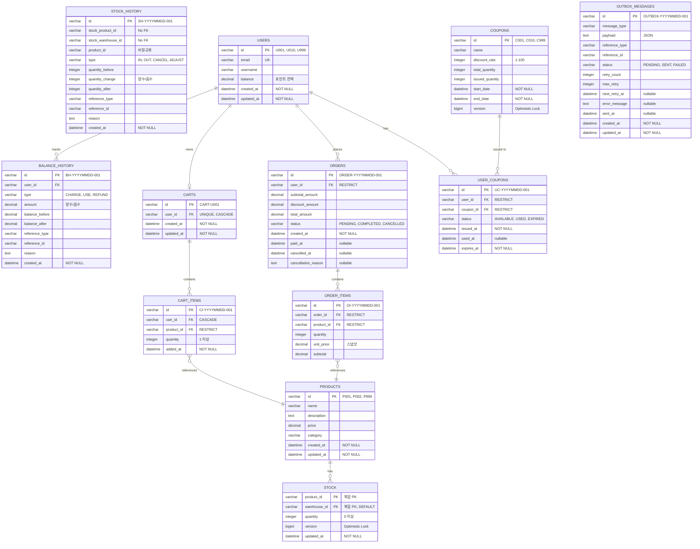

# ERD (Entity Relationship Diagram)

## 📋 ERD 변경 이력

### v2.0 (2025-01-10) - 5가지 개선사항 반영

**개선 사항:**
1. ✅ **balance_history 테이블 추가** - 포인트 충전/사용 이력 추적 (감사 필수)
2. ✅ **outbox_messages 테이블 추가** - 외부 API 전송 실패 재시도 메커니즘
3. ✅ **stock 테이블 PK 구조 개선** - 복합 PK로 변경 (product_id, warehouse_id)
4. ✅ **orders 테이블 필드 추가** - cancelled_at, cancellation_reason (감사 목적)
5. ✅ **ID 생성 전략 문서화** - 모든 테이블 note에 ID 생성 규칙 명시

**테이블 개수:** 10개 → **12개** (balance_history, outbox_messages 추가)

---

## ⚠️ Week 3 Implementation Notes

**중요**: 이 ERD는 **Week 4 이후 데이터베이스 연동 시** 사용될 설계입니다.

### Week 3 (Step 5-6) 구현 방식

**Week 3에서는 데이터베이스를 사용하지 않습니다:**
- ❌ JPA, H2, MySQL 사용 안 함
- ❌ @Entity, @Table, @Version 어노테이션 사용 안 함
- ✅ **In-Memory Only**: ConcurrentHashMap, ArrayList로 모든 데이터 관리
- ✅ **Pure Java Entity**: 순수 Java 클래스 + Lombok
- ✅ **Thread-Safe Collections**: ConcurrentHashMap 필수

### Week 3 구현 가이드

**1. Entity 설계**
```java
// ✅ Week 3: Pure Java (JPA 어노테이션 없음)
@Getter
@AllArgsConstructor
public class Product {
    private String id;
    private String name;
    private Long price;
    private Integer stock;  // Week 3: Product에 stock 직접 포함
    private LocalDateTime createdAt;
}
```

**2. Repository 구현**
```java
// Domain Layer (interface only)
package io.hhplus.ecommerce.domain.product;

public interface ProductRepository {
    Optional<Product> findById(String id);
    List<Product> findAll();
    Product save(Product product);
}

// Infrastructure Layer (In-Memory implementation)
package io.hhplus.ecommerce.infrastructure.persistence.product;

@Repository
public class InMemoryProductRepository implements ProductRepository {
    private final Map<String, Product> storage = new ConcurrentHashMap<>();

    @Override
    public Optional<Product> findById(String id) {
        return Optional.ofNullable(storage.get(id));
    }

    @Override
    public Product save(Product product) {
        storage.put(product.getId(), product);
        return product;
    }
}
```

**3. 관계 표현**
```java
// Week 3: 객체 참조로 관계 표현 (FK 없음)
@Getter
@AllArgsConstructor
public class OrderItem {
    private String id;
    private String orderId;     // Order 객체 ID (문자열 참조)
    private String productId;   // Product 객체 ID (문자열 참조)
    private Integer quantity;
    private Long unitPrice;

    // 필요시 UseCase에서 Repository로 조회
    // Product product = productRepository.findById(productId).orElseThrow();
}
```

**4. 동시성 제어**

**Step 5**: ConcurrentHashMap만 사용
```java
@Repository
public class InMemoryProductRepository implements ProductRepository {
    private final Map<String, Product> storage = new ConcurrentHashMap<>();
    // ConcurrentHashMap 자체가 Thread-Safe
}
```

**Step 6**: 선착순 쿠폰만 AtomicInteger 사용
```java
@Getter
@AllArgsConstructor
public class Coupon {
    private String id;
    private String name;
    private Integer totalQuantity;
    private AtomicInteger issuedQuantity;  // AtomicInteger로 동시성 제어

    public boolean tryIssue() {
        while (true) {
            int current = issuedQuantity.get();
            if (current >= totalQuantity) return false;
            if (issuedQuantity.compareAndSet(current, current + 1)) {
                return true;
            }
        }
    }
}
```

### Week 3 vs Week 4+ 비교

| 항목 | Week 3 (In-Memory) | Week 4+ (Database) |
|------|-------------------|-------------------|
| **Entity** | Pure Java + Lombok | @Entity, @Table, @Id |
| **Repository** | Interface + In-Memory Impl | JpaRepository, EntityManager |
| **Storage** | ConcurrentHashMap | MySQL, H2 |
| **Relationship** | 객체 ID (String) 참조 | @OneToMany, @ManyToOne, FK |
| **Concurrency** | synchronized, AtomicInteger | @Version (Optimistic Lock) |
| **Transaction** | 수동 관리 (없음) | @Transactional |
| **Index** | 불필요 | CREATE INDEX |

### Week 3 단순화 사항

아래 ERD 설계에서 Week 3 구현 시 단순화할 부분:

1. **Stock 테이블 통합**: Product에 stock 필드로 포함
2. **StockHistory, BalanceHistory, OutboxMessages 생략**: Week 3에서는 선택 사항
3. **Relationship**: FK 대신 String ID로 참조
4. **Concurrency**: @Version 대신 AtomicInteger 사용 (쿠폰만)
5. **Index**: In-Memory라서 불필요

**참고**: 아래 ERD는 Week 3 설계를 이해하는 참고 자료로 활용하되, 실제 구현은 In-Memory 방식을 따릅니다.

**학습 자료**: [docs/learning-points/04-repository-pattern.md](../learning-points/04-repository-pattern.md)

---

## 이커머스 시스템의 데이터베이스 설계 (Week 4+)

---

## DBML 형식 (dbdiagram.io)

아래 코드를 [dbdiagram.io](https://dbdiagram.io/d)에 붙여넣으세요.

```dbml
// E-Commerce Database Schema v2.0
// 항해플러스 이커머스 시스템
// Last Updated: 2025-01-10

// ====================================
// 1. 상품 관리
// ====================================

Table products {
  id varchar [primary key, note: 'ID 생성: P{3자리 숫자} (예: P001, P002, P999)']
  name varchar [not null]
  description text
  price decimal(10,2) [not null]
  category varchar
  created_at datetime [not null, note: 'DATETIME 사용 (TIMESTAMP 2038 이슈 회피)']
  updated_at datetime [not null]

  indexes {
    category
    created_at
  }

  note: 'FK ON DELETE: 없음 (상품 삭제는 soft delete 권장)'
}

Table stock {
  product_id varchar [primary key, note: 'ID 생성: products.id 참조']
  warehouse_id varchar [primary key, default: 'DEFAULT', note: '향후 다중 창고 확장. 기본값: DEFAULT']
  quantity integer [not null, default: 0]
  version bigint [not null, default: 0, note: 'Optimistic Lock']
  updated_at datetime [not null]

  note: '복합 PK (product_id, warehouse_id) - 인덱스 중복 제거. FK ON DELETE: RESTRICT (재고 있는 상품 삭제 방지)'
}

Ref: stock.product_id > products.id [delete: restrict]

Table stock_history {
  id varchar [primary key, note: 'ID 생성: SH-YYYYMMDD-{시퀀스} (예: SH-20250110-001)']
  stock_product_id varchar [note: 'FK 제약조건 없음 - 조회 성능 최적화 (인덱스만 설정)']
  stock_warehouse_id varchar [note: 'FK 제약조건 없음 - 조회 성능 최적화']
  product_id varchar [note: '비정규화 (조회 최적화): products.id 참조']
  type varchar [not null, note: 'IN(입고), OUT(출고), CANCEL(취소), ADJUST(조정)']
  quantity_before integer [not null]
  quantity_change integer [not null, note: '양수(증가) 또는 음수(감소)']
  quantity_after integer [not null]
  reference_type varchar [note: 'ORDER, PURCHASE, RETURN, ADJUSTMENT']
  reference_id varchar
  reason text
  created_at datetime [not null]

  indexes {
    (stock_product_id, stock_warehouse_id)
    product_id
    (reference_type, reference_id)
    created_at [note: 'DESC']
  }

  note: 'INSERT ONLY 테이블 (감사 목적). FK 없음 - 락 병목 회피'
}

// ====================================
// 2. 장바구니
// ====================================

Table carts {
  id varchar [primary key, note: 'ID 생성: CART-{userId} (예: CART-U001)']
  user_id varchar [not null, unique]
  created_at datetime [not null]
  updated_at datetime [not null]

  indexes {
    user_id
  }

  note: 'FK ON DELETE: CASCADE (사용자 삭제 시 장바구니도 삭제 - 부작용 없음)'
}

Ref: carts.user_id > users.id [delete: cascade]

Table cart_items {
  id varchar [primary key, note: 'ID 생성: CI-YYYYMMDD-{시퀀스} (예: CI-20250110-001)']
  cart_id varchar [not null]
  product_id varchar [not null]
  quantity integer [not null, note: '1 이상']
  added_at datetime [not null]

  indexes {
    cart_id
    product_id
  }

  note: 'FK ON DELETE: CASCADE (장바구니 삭제 시 항목도 삭제), NO CASCADE (상품 삭제 방지)'
}

Ref: cart_items.cart_id > carts.id [delete: cascade]
Ref: cart_items.product_id > products.id [delete: restrict]

// ====================================
// 3. 주문/결제
// ====================================

Table orders {
  id varchar [primary key, note: 'ID 생성: ORDER-YYYYMMDD-{3자리 시퀀스} (예: ORDER-20250110-001, ORDER-20250110-999)']
  user_id varchar [not null]
  subtotal_amount decimal(10,2) [not null, note: '주문 소계']
  discount_amount decimal(10,2) [not null, default: 0, note: '쿠폰 할인액']
  total_amount decimal(10,2) [not null, note: 'subtotal - discount']
  status varchar [not null, note: 'PENDING(대기), COMPLETED(완료), CANCELLED(취소)']
  created_at datetime [not null]
  paid_at datetime [note: '결제 완료 시각 (nullable)']
  cancelled_at datetime [note: '주문 취소 시각 (nullable) - 감사 목적']
  cancellation_reason text [note: '취소 사유 (nullable) - CS 대응용']

  indexes {
    (user_id, status)
    created_at
    paid_at
    cancelled_at
  }

  note: 'FK ON DELETE: RESTRICT (주문 있는 사용자 삭제 방지 - 데이터 보존)'
}

Ref: orders.user_id > users.id [delete: restrict]

Table order_items {
  id varchar [primary key, note: 'ID 생성: OI-YYYYMMDD-{시퀀스} (예: OI-20250110-001)']
  order_id varchar [not null]
  product_id varchar [not null]
  quantity integer [not null, note: '주문 수량']
  unit_price decimal(10,2) [not null, note: '주문 시점 가격 (스냅샷)']
  subtotal decimal(10,2) [not null, note: 'unit_price * quantity']

  indexes {
    order_id
    product_id [note: '인기 상품 집계용']
  }

  note: 'FK ON DELETE: RESTRICT (주문 데이터 보존). 가격은 주문 시점 스냅샷'
}

Ref: order_items.order_id > orders.id [delete: restrict]
Ref: order_items.product_id > products.id [delete: restrict]

// ====================================
// 4. 쿠폰 시스템
// ====================================

Table coupons {
  id varchar [primary key, note: 'ID 생성: C{3자리 숫자} (예: C001, C010, C999)']
  name varchar [not null]
  discount_rate integer [not null, note: '할인율 (%) 1~100']
  total_quantity integer [not null, note: '총 발급 가능 수량']
  issued_quantity integer [not null, default: 0, note: '현재 발급된 수량']
  start_date datetime [not null]
  end_date datetime [not null]
  version bigint [not null, default: 0, note: 'Optimistic Lock (선착순 보장)']

  note: 'FK 없음. Optimistic Lock으로 동시성 제어'
}

Table user_coupons {
  id varchar [primary key, note: 'ID 생성: UC-YYYYMMDD-{3자리 시퀀스} (예: UC-20250110-001, UC-20250110-999)']
  user_id varchar [not null]
  coupon_id varchar [not null]
  status varchar [not null, note: 'AVAILABLE(사용가능), USED(사용됨), EXPIRED(만료됨)']
  issued_at datetime [not null]
  used_at datetime [note: '사용 시각 (nullable)']
  expires_at datetime [not null]

  indexes {
    (user_id, status)
    expires_at
    (user_id, coupon_id) [unique, name: 'uidx_user_coupons_user_coupon', note: '1인 1매 제한 (DB Unique Constraint)']
  }

  note: 'FK ON DELETE: RESTRICT (쿠폰/사용자 데이터 보존). Unique로 1인 1매 보장'
}

Ref: user_coupons.user_id > users.id [delete: restrict]
Ref: user_coupons.coupon_id > coupons.id [delete: restrict]

// ====================================
// 5. 사용자 & 포인트 관리
// ====================================

Table users {
  id varchar [primary key, note: 'ID 생성: U{3자리 숫자} (예: U001, U010, U999)']
  email varchar [unique, not null]
  username varchar [not null]
  balance decimal(10,2) [not null, default: 0, note: '포인트 잔액 (내부 시스템, PG 없음)']
  created_at datetime [not null]
  updated_at datetime [not null]

  note: 'FK 없음. Pessimistic Lock (SELECT FOR UPDATE)로 포인트 정확성 보장'
}

Table balance_history {
  id varchar [primary key, note: 'ID 생성: BH-YYYYMMDD-{시퀀스} (예: BH-20250110-001)']
  user_id varchar [not null]
  type varchar [not null, note: 'CHARGE(충전), USE(사용), REFUND(환불)']
  amount decimal(10,2) [not null, note: '양수(충전/환불) 또는 음수(사용)']
  balance_before decimal(10,2) [not null]
  balance_after decimal(10,2) [not null]
  reference_type varchar [note: 'ORDER(주문), ADMIN_ADJUSTMENT(관리자 조정)']
  reference_id varchar
  reason text
  created_at datetime [not null]

  indexes {
    user_id
    (reference_type, reference_id)
    created_at [note: 'DESC']
  }

  note: 'INSERT ONLY 테이블 (감사 목적). 포인트 충전/사용 이력 추적'
}

Ref: balance_history.user_id > users.id [delete: restrict]

// ====================================
// 6. 외부 연동 (Outbox Pattern)
// ====================================

Table outbox_messages {
  id varchar [primary key, note: 'ID 생성: OUTBOX-YYYYMMDD-{시퀀스} (예: OUTBOX-20250110-001)']
  message_type varchar [not null, note: 'ORDER_COMPLETED, PAYMENT_SUCCESS']
  payload text [not null, note: 'JSON 형식으로 직렬화된 메시지 내용']
  reference_type varchar [not null, note: 'ORDER, PAYMENT']
  reference_id varchar [not null]
  status varchar [not null, note: 'PENDING(대기), SENT(전송완료), FAILED(실패), PERMANENT_FAILURE(영구실패)']
  retry_count integer [not null, default: 0]
  max_retry integer [not null, default: 3, note: '최대 재시도 횟수']
  next_retry_at datetime [note: '다음 재시도 시각 (Exponential Backoff: 1분→5분→30분)']
  error_message text [note: '마지막 에러 메시지']
  sent_at datetime [note: '전송 성공 시각']
  created_at datetime [not null]
  updated_at datetime [not null]

  indexes {
    status
    (status, next_retry_at) [note: '재시도 스케줄러용']
    (reference_type, reference_id)
    created_at
  }

  note: 'INSERT ONLY 테이블. Retry 워커가 PENDING 상태를 주기적으로 처리. 가용성 패턴 (Retry, Fallback) 구현'
}

// ====================================
// 관계 요약
// ====================================
// 1:N Relationships:
//   - User -> Cart (1:1 실제로는)
//   - User -> Order
//   - User -> UserCoupon
//   - User -> BalanceHistory
//   - Cart -> CartItem
//   - Order -> OrderItem
//   - Product -> Stock
//   - Coupon -> UserCoupon
//
// N:1 Relationships:
//   - CartItem -> Product
//   - OrderItem -> Product
//   - Stock -> Product
//
// 참고:
//   - StockHistory, BalanceHistory, OutboxMessages는 FK 제약조건 없음 (조회 최적화)
//   - Stock은 복합 PK (product_id, warehouse_id) 사용
```

---

## Mermaid 형식 (mermaidchart.com)

아래 코드를 [Mermaid Chart](https://www.mermaidchart.com)에서 사용하거나, Markdown에서 직접 렌더링할 수 있습니다.


```mermaid
erDiagram
    %% ====================================
    %% 상품 및 재고 관리
    %% ====================================

    PRODUCTS {
        varchar id PK "P001, P002, P999"
        varchar name
        text description
        decimal price
        varchar category
        datetime created_at "NOT NULL"
        datetime updated_at "NOT NULL"
    }

    STOCK {
        varchar product_id PK "복합 PK"
        varchar warehouse_id PK "복합 PK, DEFAULT"
        integer quantity "0 이상"
        bigint version "Optimistic Lock"
        datetime updated_at "NOT NULL"
    }

    STOCK_HISTORY {
        varchar id PK "SH-YYYYMMDD-001"
        varchar stock_product_id "No FK"
        varchar stock_warehouse_id "No FK"
        varchar product_id "비정규화"
        varchar type "IN, OUT, CANCEL, ADJUST"
        integer quantity_before
        integer quantity_change "양수/음수"
        integer quantity_after
        varchar reference_type
        varchar reference_id
        text reason
        datetime created_at "NOT NULL"
    }

    %% ====================================
    %% 사용자 & 포인트
    %% ====================================

    USERS {
        varchar id PK "U001, U010, U999"
        varchar email UK
        varchar username
        decimal balance "포인트 잔액"
        datetime created_at "NOT NULL"
        datetime updated_at "NOT NULL"
    }

    BALANCE_HISTORY {
        varchar id PK "BH-YYYYMMDD-001"
        varchar user_id FK
        varchar type "CHARGE, USE, REFUND"
        decimal amount "양수/음수"
        decimal balance_before
        decimal balance_after
        varchar reference_type
        varchar reference_id
        text reason
        datetime created_at "NOT NULL"
    }

    %% ====================================
    %% 장바구니
    %% ====================================

    CARTS {
        varchar id PK "CART-U001"
        varchar user_id FK "UNIQUE, CASCADE"
        datetime created_at "NOT NULL"
        datetime updated_at "NOT NULL"
    }

    CART_ITEMS {
        varchar id PK "CI-YYYYMMDD-001"
        varchar cart_id FK "CASCADE"
        varchar product_id FK "RESTRICT"
        integer quantity "1 이상"
        datetime added_at "NOT NULL"
    }

    %% ====================================
    %% 주문/결제
    %% ====================================

    ORDERS {
        varchar id PK "ORDER-YYYYMMDD-001"
        varchar user_id FK "RESTRICT"
        decimal subtotal_amount
        decimal discount_amount
        decimal total_amount
        varchar status "PENDING, COMPLETED, CANCELLED"
        datetime created_at "NOT NULL"
        datetime paid_at "nullable"
        datetime cancelled_at "nullable"
        text cancellation_reason "nullable"
    }

    ORDER_ITEMS {
        varchar id PK "OI-YYYYMMDD-001"
        varchar order_id FK "RESTRICT"
        varchar product_id FK "RESTRICT"
        integer quantity
        decimal unit_price "스냅샷"
        decimal subtotal
    }

    %% ====================================
    %% 쿠폰 시스템
    %% ====================================

    COUPONS {
        varchar id PK "C001, C010, C999"
        varchar name
        integer discount_rate "1-100"
        integer total_quantity
        integer issued_quantity
        datetime start_date "NOT NULL"
        datetime end_date "NOT NULL"
        bigint version "Optimistic Lock"
    }

    USER_COUPONS {
        varchar id PK "UC-YYYYMMDD-001"
        varchar user_id FK "RESTRICT"
        varchar coupon_id FK "RESTRICT"
        varchar status "AVAILABLE, USED, EXPIRED"
        datetime issued_at "NOT NULL"
        datetime used_at "nullable"
        datetime expires_at "NOT NULL"
    }

    %% ====================================
    %% 외부 연동 (Outbox)
    %% ====================================

    OUTBOX_MESSAGES {
        varchar id PK "OUTBOX-YYYYMMDD-001"
        varchar message_type
        text payload "JSON"
        varchar reference_type
        varchar reference_id
        varchar status "PENDING, SENT, FAILED"
        integer retry_count
        integer max_retry
        datetime next_retry_at "nullable"
        text error_message "nullable"
        datetime sent_at "nullable"
        datetime created_at "NOT NULL"
        datetime updated_at "NOT NULL"
    }

    %% ====================================
    %% 관계 정의
    %% ====================================

    %% 상품 -> 재고
    PRODUCTS ||--o{ STOCK : "has"

    %% 사용자 관계
    USERS ||--o| CARTS : "owns"
    USERS ||--o{ ORDERS : "places"
    USERS ||--o{ USER_COUPONS : "has"
    USERS ||--o{ BALANCE_HISTORY : "tracks"

    %% 장바구니
    CARTS ||--o{ CART_ITEMS : "contains"
    CART_ITEMS }o--|| PRODUCTS : "references"

    %% 주문
    ORDERS ||--o{ ORDER_ITEMS : "contains"
    ORDER_ITEMS }o--|| PRODUCTS : "references"

    %% 쿠폰
    COUPONS ||--o{ USER_COUPONS : "issued to"
```

---

## 주요 설계 포인트

### 1. 재고 관리 분리
- **Product**: 상품 정보만 관리 (stock 필드 제거)
- **Stock**: 현재 재고 수량 (Optimistic Lock, 복합 PK)
- **StockHistory**: 재고 변동 이력 (FK 없음, 조회 최적화)

**장점:**
- 재고 이력 완전 추적 (감사 가능)
- 다중 창고 확장 가능 (warehouse_id)
- 재고 불일치 디버깅 용이
- 복합 PK로 인덱스 중복 제거 (성능 향상)

### 2. 포인트 시스템
- **User.balance**: 내부 포인트 잔액
- **BalanceHistory**: 포인트 충전/사용 이력 추적 (NEW ✨)
- PG 연동 없이 충전된 포인트로만 결제
- Pessimistic Lock으로 정확성 보장

**장점:**
- 포인트 변동 완전 추적 (감사 필수)
- 데이터 무결성 검증 가능
- 잔액 불일치 디버깅 용이

### 3. 외부 연동 (Outbox Pattern)
- **OutboxMessages**: 외부 API 전송 실패 시 재시도 메커니즘 (NEW ✨)
- Retry 전략: Exponential Backoff (1분 → 5분 → 30분)
- 스케줄러가 PENDING 상태를 주기적으로 처리

**장점:**
- 외부 API 장애 시에도 데이터 유실 방지
- 재시도 로직 명확화
- 가용성 패턴 (Retry, Fallback) 구현

### 4. 장바구니
- **Cart**: 사용자당 1개
- **CartItem**: 장바구니 상품 목록
- 주문 생성 시 CartItem → OrderItem 변환

### 5. 동시성 제어
- **Stock**: Optimistic Lock (@Version), 복합 PK
- **Coupon**: Optimistic Lock (@Version) - 선착순
- **User (포인트)**: Pessimistic Lock - 정확성 우선

### 6. 제약 조건
- **user_coupons**: (user_id, coupon_id) Unique - 1인 1매
- **stock**: 복합 PK (product_id, warehouse_id) - 창고별 재고
- **users.email**: Unique

### 7. 인덱스 전략
- 복합 인덱스: (user_id, status), (reference_type, reference_id)
- 시간순 인덱스: created_at, paid_at, cancelled_at
- 재고 이력: created_at DESC

---

## 엔티티 상세 설명

### Product (상품)
- **역할**: 상품 기본 정보만 관리
- **관계**: 1 → N Stock
- **ID 생성**: P{3자리 숫자} (P001, P002, P999)

### Stock (재고 현황)
- **역할**: 현재 재고 수량 관리
- **PK**: 복합 PK (product_id, warehouse_id) ⭐ 변경
- **동시성**: Optimistic Lock (version 필드)
- **확장**: warehouse_id로 다중 창고 지원

### StockHistory (재고 변동 이력)
- **역할**: 모든 재고 변동 기록 (감사용)
- **특징**: FK 제약조건 없음 (성능 최적화)
- **타입**: IN(입고), OUT(출고), CANCEL(취소), ADJUST(조정)
- **ID 생성**: SH-YYYYMMDD-{시퀀스}

### BalanceHistory (포인트 이력) ⭐ NEW
- **역할**: 포인트 충전/사용 이력 추적 (감사 필수)
- **특징**: FK 제약조건 없음 (성능 최적화)
- **타입**: CHARGE(충전), USE(사용), REFUND(환불)
- **ID 생성**: BH-YYYYMMDD-{시퀀스}

### OutboxMessages (외부 연동 메시지) ⭐ NEW
- **역할**: 외부 API 전송 실패 시 재시도 메커니즘
- **Retry**: Exponential Backoff (1분 → 5분 → 30분)
- **상태**: PENDING, SENT, FAILED, PERMANENT_FAILURE
- **ID 생성**: OUTBOX-YYYYMMDD-{시퀀스}

### Cart (장바구니)
- **역할**: 사용자별 임시 상품 보관
- **관계**: User 1 → 1 Cart (실제 구현)
- **ID 생성**: CART-{userId} (예: CART-U001)

### CartItem (장바구니 상품)
- **역할**: 장바구니 내 상품 목록
- **관계**: Cart 1 → N CartItem
- **ID 생성**: CI-YYYYMMDD-{시퀀스}

### Order (주문)
- **역할**: 주문 정보 및 상태 관리
- **상태**: PENDING, COMPLETED, CANCELLED
- **추가 필드**: cancelled_at, cancellation_reason ⭐ 변경
- **ID 생성**: ORDER-YYYYMMDD-{3자리 시퀀스}

### OrderItem (주문 상세)
- **역할**: 주문 상품 상세 정보
- **관계**: Order 1 → N OrderItem
- **ID 생성**: OI-YYYYMMDD-{시퀀스}

### Coupon (쿠폰 마스터)
- **역할**: 쿠폰 템플릿 관리
- **동시성**: Optimistic Lock (선착순)
- **ID 생성**: C{3자리 숫자} (C001, C010, C999)

### UserCoupon (사용자 쿠폰)
- **역할**: 발급된 쿠폰 관리
- **상태**: AVAILABLE, USED, EXPIRED
- **제약**: 1인 1매 (Unique 제약)
- **ID 생성**: UC-YYYYMMDD-{3자리 시퀀스}

### User (사용자)
- **역할**: 사용자 정보 및 포인트 관리
- **balance**: 포인트 잔액 (PG 없음)
- **동시성**: Pessimistic Lock (정확성 우선)
- **ID 생성**: U{3자리 숫자} (U001, U010, U999)

---

## 주요 쿼리 예시

### 인기 상품 조회 (최근 3일, Top 5)
```sql
SELECT
    p.id,
    p.name,
    SUM(oi.quantity) as sales_count,
    SUM(oi.subtotal) as revenue
FROM products p
JOIN order_items oi ON p.id = oi.product_id
JOIN orders o ON oi.order_id = o.id
WHERE o.status = 'COMPLETED'
  AND o.paid_at >= NOW() - INTERVAL 3 DAY
GROUP BY p.id, p.name
ORDER BY sales_count DESC
LIMIT 5;
```

### 재고 차감 (Optimistic Lock) - 복합 PK 사용
```sql
UPDATE stock
SET quantity = quantity - :quantity,
    version = version + 1,
    updated_at = NOW()
WHERE product_id = :productId
  AND warehouse_id = :warehouseId
  AND quantity >= :quantity
  AND version = :currentVersion;
```

### 재고 이력 기록 - 복합 PK 참조
```sql
INSERT INTO stock_history (
  id, stock_product_id, stock_warehouse_id, product_id, type,
  quantity_before, quantity_change, quantity_after,
  reference_type, reference_id, reason, created_at
) VALUES (
  :id, :productId, :warehouseId, :productId, 'OUT',
  :quantityBefore, :quantityChange, :quantityAfter,
  'ORDER', :orderId, '주문에 따른 재고 차감', NOW()
);
```

### 포인트 차감 + 이력 기록 (트랜잭션)
```sql
-- 1. 트랜잭션 내에서 SELECT ... FOR UPDATE (Pessimistic Lock)
SELECT * FROM users WHERE id = :userId FOR UPDATE;

-- 2. 포인트 차감
UPDATE users
SET balance = balance - :amount,
    updated_at = NOW()
WHERE id = :userId
  AND balance >= :amount;

-- 3. 이력 기록
INSERT INTO balance_history (
  id, user_id, type, amount,
  balance_before, balance_after,
  reference_type, reference_id, reason, created_at
) VALUES (
  :id, :userId, 'USE', -:amount,
  :balanceBefore, :balanceAfter,
  'ORDER', :orderId, '주문 결제', NOW()
);
```

### 쿠폰 발급 (Optimistic Lock)
```sql
UPDATE coupons
SET issued_quantity = issued_quantity + 1,
    version = version + 1
WHERE id = :couponId
  AND issued_quantity < total_quantity
  AND version = :currentVersion;
```

### Outbox 메시지 재시도 (스케줄러)
```sql
-- 재시도 대상 조회
SELECT * FROM outbox_messages
WHERE status = 'PENDING'
  AND retry_count < max_retry
  AND next_retry_at <= NOW()
ORDER BY created_at
LIMIT 100;

-- 재시도 실패 후 업데이트 (Exponential Backoff)
UPDATE outbox_messages
SET retry_count = retry_count + 1,
    next_retry_at = CASE
      WHEN retry_count = 0 THEN NOW() + INTERVAL 1 MINUTE
      WHEN retry_count = 1 THEN NOW() + INTERVAL 5 MINUTE
      WHEN retry_count = 2 THEN NOW() + INTERVAL 30 MINUTE
      ELSE NULL
    END,
    status = CASE
      WHEN retry_count >= max_retry - 1 THEN 'PERMANENT_FAILURE'
      ELSE 'PENDING'
    END,
    error_message = :errorMessage,
    updated_at = NOW()
WHERE id = :id;
```

---

## 인덱스 전략

```sql
-- 상품 조회 최적화
CREATE INDEX idx_products_category ON products(category);
CREATE INDEX idx_products_created_at ON products(created_at);

-- 재고 조회 최적화 (복합 PK가 자동으로 인덱스 생성)
-- PK (product_id, warehouse_id)는 자동 인덱스

-- 재고 이력 조회 최적화 (FK 제약조건 없이 인덱스만 설정)
CREATE INDEX idx_stock_history_stock ON stock_history(stock_product_id, stock_warehouse_id);
CREATE INDEX idx_stock_history_product_id ON stock_history(product_id);
CREATE INDEX idx_stock_history_reference ON stock_history(reference_type, reference_id);
CREATE INDEX idx_stock_history_created_at ON stock_history(created_at DESC);

-- 장바구니 조회 최적화
CREATE INDEX idx_carts_user_id ON carts(user_id);
CREATE INDEX idx_cart_items_cart_id ON cart_items(cart_id);
CREATE INDEX idx_cart_items_product_id ON cart_items(product_id);

-- 주문 조회 최적화
CREATE INDEX idx_orders_user_status ON orders(user_id, status);
CREATE INDEX idx_orders_created_at ON orders(created_at);
CREATE INDEX idx_orders_paid_at ON orders(paid_at);
CREATE INDEX idx_orders_cancelled_at ON orders(cancelled_at);

-- 통계 쿼리 최적화 (인기 상품)
CREATE INDEX idx_order_items_product ON order_items(product_id);

-- 쿠폰 조회 최적화
CREATE INDEX idx_user_coupons_user_status ON user_coupons(user_id, status);
CREATE INDEX idx_user_coupons_expires_at ON user_coupons(expires_at);
CREATE UNIQUE INDEX uidx_user_coupons_user_coupon ON user_coupons(user_id, coupon_id);

-- 포인트 이력 조회 최적화
CREATE INDEX idx_balance_history_user_id ON balance_history(user_id);
CREATE INDEX idx_balance_history_reference ON balance_history(reference_type, reference_id);
CREATE INDEX idx_balance_history_created_at ON balance_history(created_at DESC);

-- Outbox 메시지 재시도 최적화
CREATE INDEX idx_outbox_status ON outbox_messages(status);
CREATE INDEX idx_outbox_retry ON outbox_messages(status, next_retry_at);
CREATE INDEX idx_outbox_reference ON outbox_messages(reference_type, reference_id);
CREATE INDEX idx_outbox_created_at ON outbox_messages(created_at);
```

---

## JPA Entity 구현 예시 (Stock 복합 PK)

### StockId (복합 PK 클래스)
```java
@Embeddable
@Getter
@NoArgsConstructor
@AllArgsConstructor
@EqualsAndHashCode
public class StockId implements Serializable {

    @Column(name = "product_id")
    private String productId;

    @Column(name = "warehouse_id")
    private String warehouseId = "DEFAULT";
}
```

### Stock Entity (복합 PK 사용)
```java
@Entity
@Table(name = "stock")
@Getter
@NoArgsConstructor
public class Stock {

    @EmbeddedId
    private StockId id;

    @Column(nullable = false)
    private Integer quantity = 0;

    @Version
    private Long version = 0L;

    @Column(name = "updated_at", nullable = false)
    private LocalDateTime updatedAt;

    public Stock(String productId, String warehouseId, Integer quantity) {
        this.id = new StockId(productId, warehouseId);
        this.quantity = quantity;
        this.updatedAt = LocalDateTime.now();
    }

    public void decrease(int quantity) {
        if (this.quantity < quantity) {
            throw new BusinessException(ErrorCode.INSUFFICIENT_STOCK);
        }
        this.quantity -= quantity;
        this.updatedAt = LocalDateTime.now();
    }
}
```

### Repository
```java
public interface StockRepository extends JpaRepository<Stock, StockId> {

    @Lock(LockModeType.OPTIMISTIC)
    Optional<Stock> findById(StockId id);
}
```

---

## ERD 다이어그램 생성 방법

### Option 1: dbdiagram.io (추천)
1. https://dbdiagram.io/d 접속
2. 위의 DBML 코드 복사
3. 에디터에 붙여넣기
4. 자동으로 다이어그램 생성됨
5. Export → PNG/PDF/SQL

### Option 2: Mermaid Chart
1. https://www.mermaidchart.com 접속
2. 새 다이어그램 생성
3. 위의 Mermaid 코드 복사
4. 에디터에 붙여넣기
5. 자동으로 다이어그램 생성됨

### Option 3: VS Code (Preview)
- Mermaid Preview 확장 설치
- Markdown 파일에서 ```mermaid 블록 사용
- 미리보기로 다이어그램 확인

---

## 데이터베이스 특징

### 강점
✅ 재고와 상품 분리로 확장성 확보
✅ 재고 이력 완전 추적 (감사 가능)
✅ **포인트 이력 완전 추적 (감사 필수)** ⭐ NEW
✅ **외부 API 재시도 메커니즘 (가용성 보장)** ⭐ NEW
✅ 포인트 시스템 단순화 (PG 없음)
✅ 동시성 제어 전략 명확화
✅ 장바구니 → 주문 플로우 지원
✅ **복합 PK로 인덱스 최적화** ⭐ NEW
✅ **주문 취소 감사 추적 강화** ⭐ NEW

### 확장 가능성
- 다중 창고 지원 (warehouse_id)
- 향후 PG 연동 시 Payment 테이블 추가
- 배송 정보는 Order 테이블 확장으로 추가 가능
- Outbox 메시지를 Kafka/RabbitMQ로 전환 가능

---

## 개선 이력 상세

### v2.0 개선 사항 (2025-01-10)

#### 1. balance_history 테이블 추가 (Critical) ⭐⭐⭐
**문제:** 포인트 이력 추적 불가
**해결:** 충전/사용/환불 이력 완전 추적
**영향:** 감사(Audit) 필수, 데이터 무결성 검증 가능

#### 2. outbox_messages 테이블 추가 (Critical) ⭐⭐⭐
**문제:** 요구사항에 명시된 Retry 패턴 테이블 부재
**해결:** Exponential Backoff 재시도 메커니즘
**영향:** 가용성 패턴 (Retry, Fallback) 완전 구현

#### 3. stock 테이블 PK 구조 개선 (Important) ⭐⭐
**변경:** id (PK) + Unique Index → 복합 PK (product_id, warehouse_id)
**장점:** 인덱스 중복 제거, 저장 공간 절약, 쿼리 성능 향상
**단점:** JPA 복합 PK 구현 복잡도 증가 (@EmbeddedId 필요)

#### 4. orders 테이블 필드 추가 (Nice to have) ⭐
**추가:** cancelled_at, cancellation_reason
**장점:** 주문 취소 감사, CS 대응 용이

#### 5. ID 생성 전략 문서화 (Documentation) ⭐
**개선:** 모든 테이블 note에 ID 생성 규칙 명시
**예시:**
- products: P{3자리} (P001)
- orders: ORDER-YYYYMMDD-{3자리} (ORDER-20250110-001)
- user_coupons: UC-YYYYMMDD-{3자리}

---

## 관련 문서
- [데이터 모델 상세 설명](../api/data-models.md)
- [API 명세서](../api/api-specification.md)
- [요구사항 명세서](../api/requirements.md)
