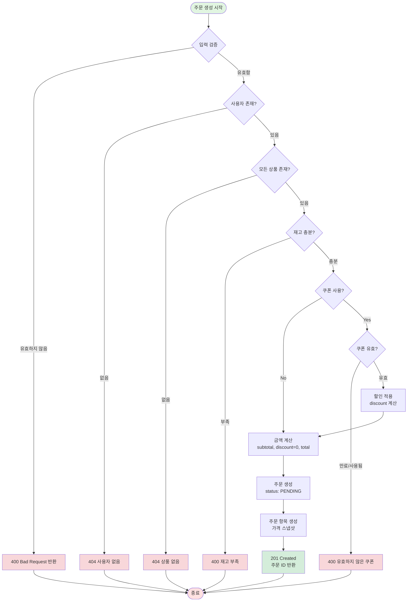
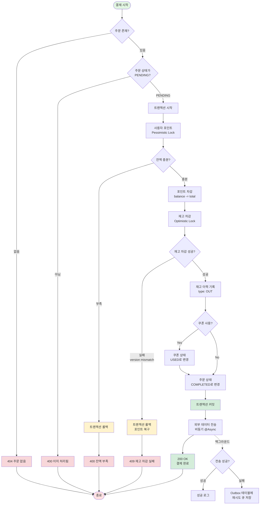
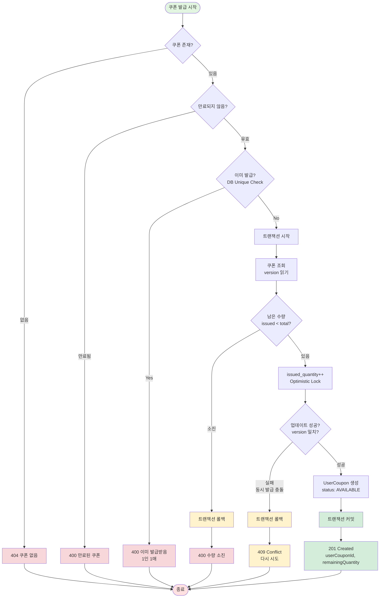
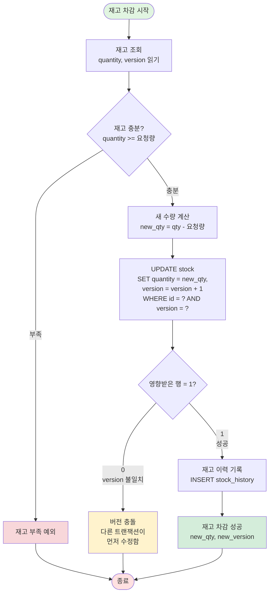
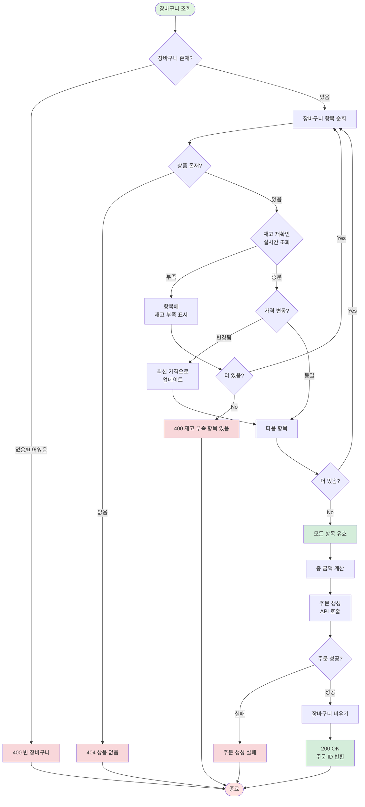

# 플로우차트 (Flowcharts)

이커머스 시스템의 핵심 비즈니스 로직 흐름을 flowchart로 표현합니다.

---

## 목차

1. [주문 생성 플로우](#1-주문-생성-플로우)
2. [결제 처리 플로우](#2-결제-처리-플로우)
3. [쿠폰 발급 플로우 (선착순)](#3-쿠폰-발급-플로우-선착순)
4. [재고 차감 플로우](#4-재고-차감-플로우)
5. [장바구니에서 주문 전환 플로우](#5-장바구니에서-주문-전환-플로우)

---

## 1. 주문 생성 플로우

### 설명
사용자가 상품을 주문할 때의 비즈니스 로직 흐름입니다.

---

## 2. 결제 처리 플로우

### 설명
주문에 대한 결제를 처리하는 흐름입니다. 포인트 차감, 재고 차감, 외부 데이터 전송이 포함됩니다.

---

## 3. 쿠폰 발급 플로우 (선착순)

### 설명
선착순 쿠폰 발급 시 동시성을 제어하고 1인 1매를 보장하는 흐름입니다.

---

## 4. 재고 차감 플로우

### 설명
Optimistic Lock을 사용한 재고 차감 로직입니다.

---

## 5. 장바구니에서 주문 전환 플로우

### 설명
장바구니 항목들을 검증하고 주문으로 전환하는 흐름입니다.

---

## 플로우차트 활용 방법

### Mermaid Live Editor
1. https://mermaid.live 접속
2. 위의 mermaid 코드 복사
3. 에디터에 붙여넣기
4. PNG/SVG로 내보내기

### VS Code
- Mermaid Preview 확장 설치
- Markdown 파일에서 미리보기

### GitHub/GitLab
- README.md에 mermaid 코드 블록 포함
- 자동으로 렌더링됨

---

## 핵심 패턴 정리

### 1. 재고 확인
- **주문 생성 시**: 재고 확인만 (차감하지 않음)
- **결제 처리 시**: 실제 재고 차감 (Optimistic Lock)

### 2. 동시성 제어
- **포인트**: Pessimistic Lock (`SELECT FOR UPDATE`)
- **재고/쿠폰**: Optimistic Lock (`version` 필드)

### 3. 트랜잭션 경계
- **주문 생성**: 조회만 (트랜잭션 불필요)
- **결제 처리**: 포인트 + 재고 + 주문 상태 (하나의 트랜잭션)

### 4. 외부 연동
- **비동기 처리**: `@Async`로 Non-blocking
- **Fallback**: 실패 시 Outbox 저장

---

## 관련 문서

- [시퀀스 다이어그램](./sequence-diagrams.md) - API별 상세 흐름
- [ERD](./erd.md) - 데이터베이스 설계
- [API 명세서](../api/api-specification.md) - API 엔드포인트
- [가용성 패턴](../api/availability-patterns.md) - Timeout, Retry, Fallback, Async
