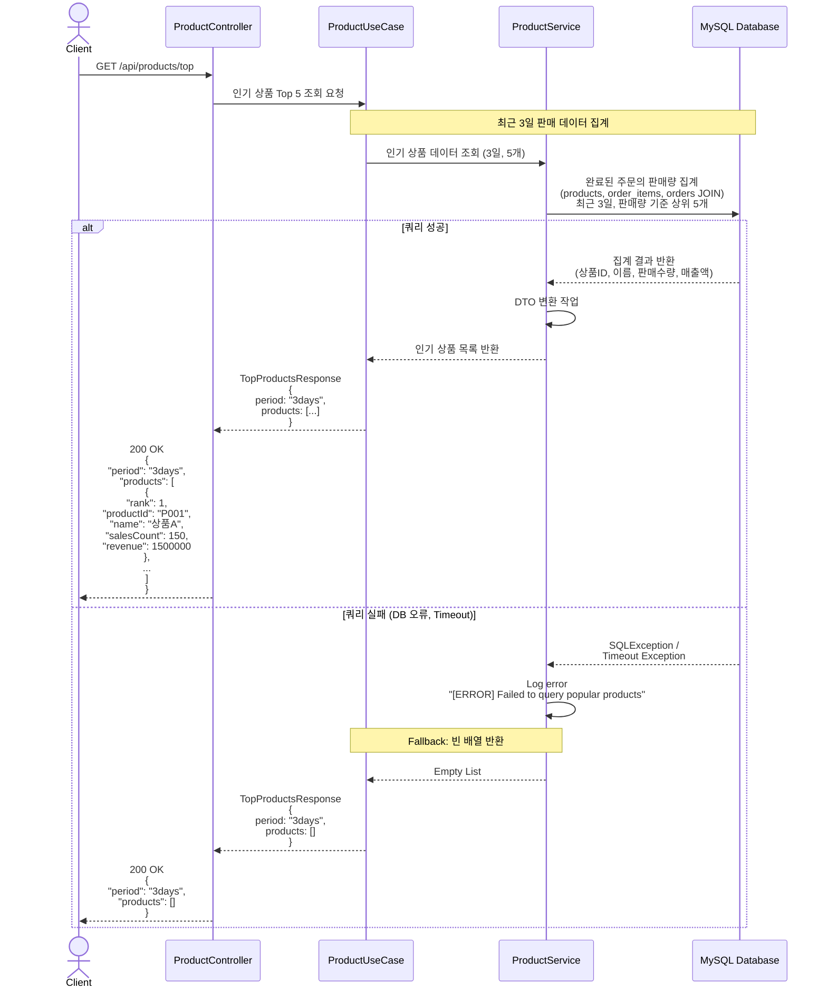
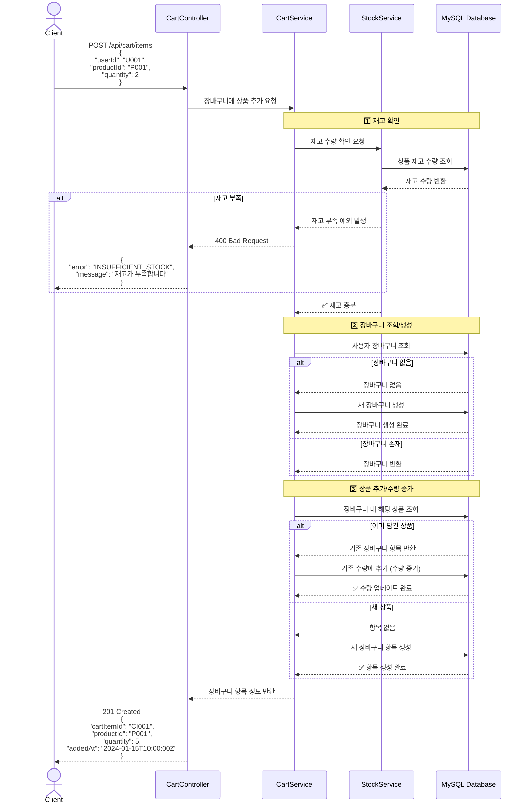
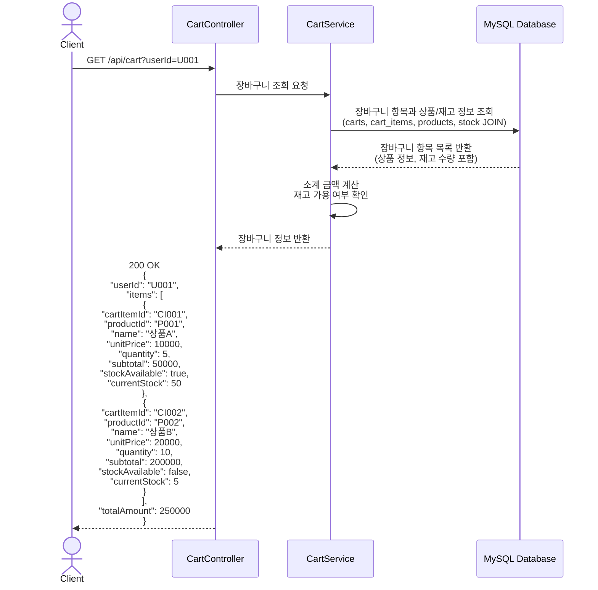
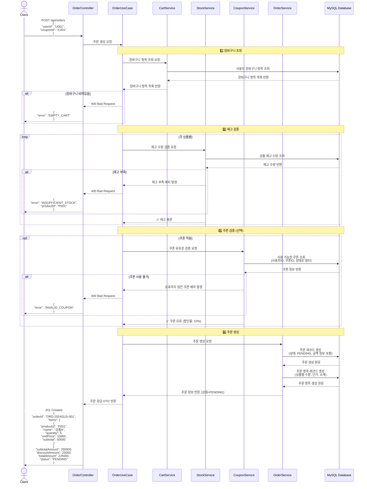
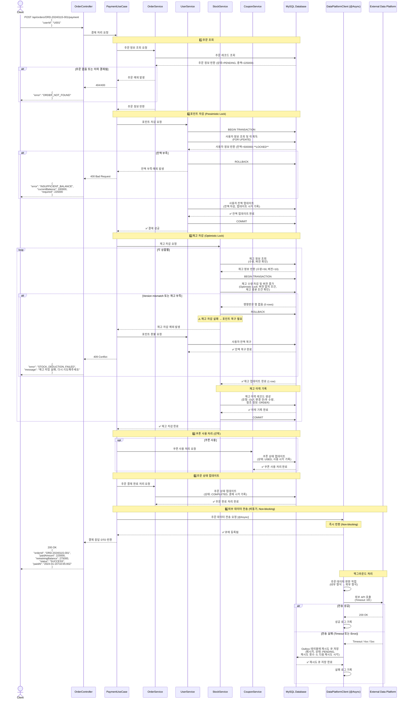
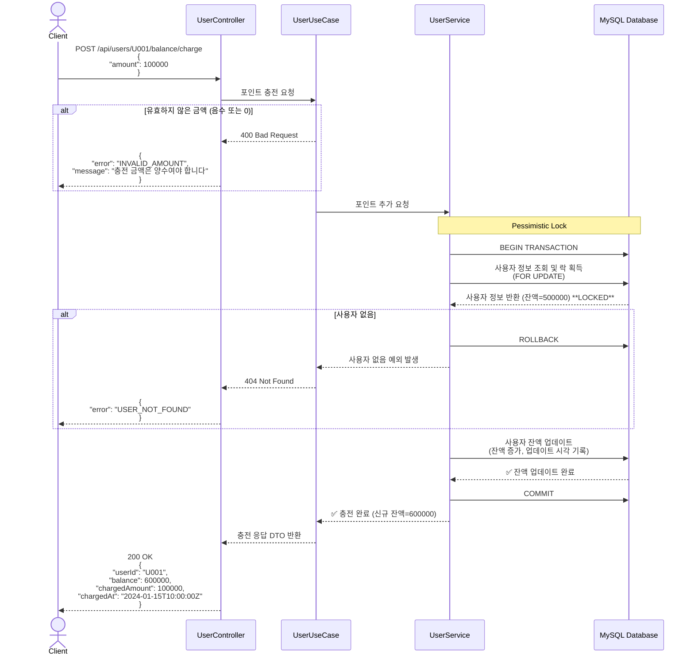
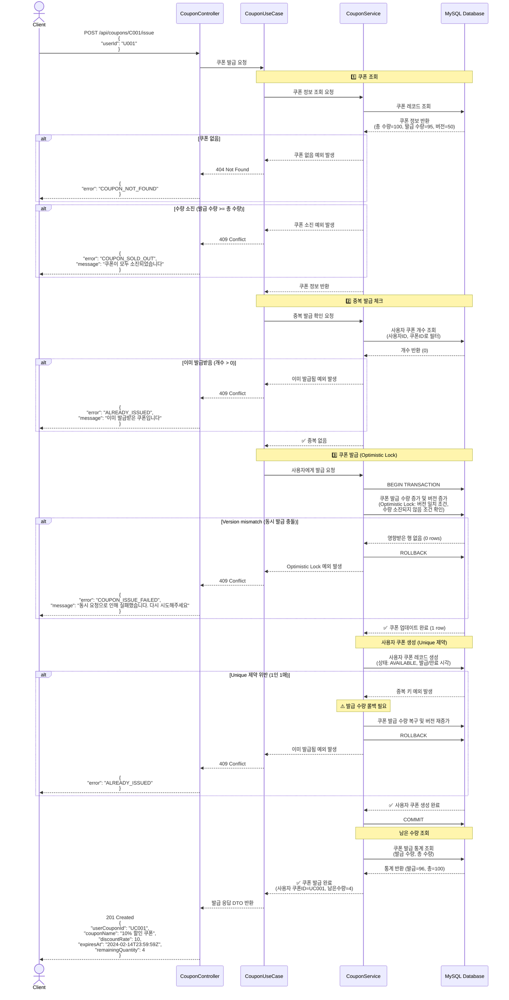
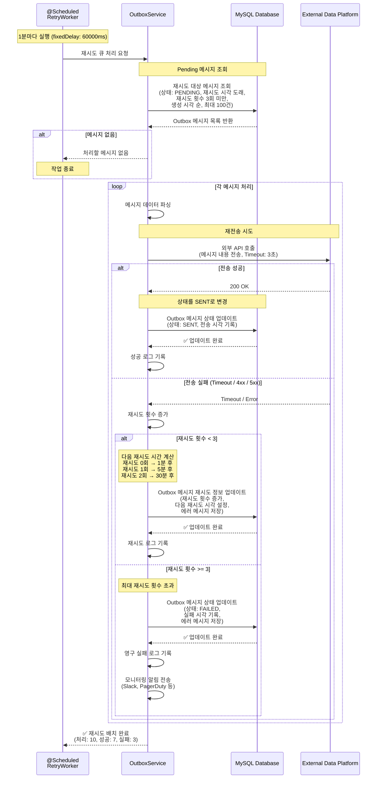

# 시퀀스 다이어그램

이커머스 시스템의 API별 시퀀스 다이어그램입니다. 인프라 구성요소(MySQL, External API)를 명확히 구분하여 표현합니다.

---

## 목차

### REST API
1. [GET /api/products/top - 인기 상품 조회](#1-get-apiproductstop---인기-상품-조회)
2. [POST /api/cart/items - 장바구니 추가](#2-post-apicartitems---장바구니-추가)
3. [GET /api/cart - 장바구니 조회](#3-get-apicart---장바구니-조회)
4. [POST /api/orders - 주문 생성](#4-post-apiorders---주문-생성)
5. [POST /api/orders/{orderId}/payment - 결제 처리](#5-post-apiordersorderidpayment---결제-처리)
6. [POST /api/users/{userId}/balance/charge - 포인트 충전](#6-post-apiusersuseridbalancecharge---포인트-충전)
7. [POST /api/coupons/{couponId}/issue - 쿠폰 발급](#7-post-apicouponscouponidissue---쿠폰-발급)

### 배치 & 백그라운드
8. [외부 API 재시도 워커](#8-외부-api-재시도-워커)

---

## 인프라 구성

| 구성요소 | 역할 | 기술 |
|---------|------|------|
| **MySQL** | 트랜잭션 데이터 저장 | products, stock, stock_history, orders, order_items, carts, cart_items, users, coupons, user_coupons, outbox |
| **External Data Platform** | 외부 데이터 수신 | 주문 데이터 전송 API |

---

## 1. GET /api/products/top - 인기 상품 조회

### 설명
최근 3일간 판매량 기준 Top 5 상품을 **실시간 쿼리**로 조회합니다. 조회 실패 시 빈 배열을 반환합니다.

**인프라:**
- MySQL (products, order_items, orders 테이블 - 읽기 전용)

> **설계 결정**: 초기에는 실시간 쿼리로 단순하게 구현하고, 성능 이슈 발생 시 배치/캐시로 개선 (Week 2 피드백 반영)

---

## 2. POST /api/cart/items - 장바구니 추가

### 설명
장바구니에 상품을 추가합니다. 재고 확인 후 **MySQL**에 저장합니다.

**인프라:**
- MySQL (stock, carts, cart_items 테이블)

---

## 3. GET /api/cart - 장바구니 조회

### 설명
사용자의 장바구니 내용을 조회합니다. **MySQL**에서 장바구니, 상품, 재고 정보를 JOIN하여 반환합니다.

**인프라:**
- MySQL (carts, cart_items, products, stock 테이블)

---

## 4. POST /api/orders - 주문 생성

### 설명
장바구니 상품들을 주문으로 변환합니다. **MySQL**에서 재고 확인 및 쿠폰 검증 후 주문을 생성합니다.

**인프라:**
- MySQL (carts, cart_items, stock, user_coupons, orders, order_items 테이블)

---

## 5. POST /api/orders/{orderId}/payment - 결제 처리

### 설명
주문에 대한 결제를 처리합니다. **MySQL**에서 포인트 차감(Pessimistic Lock), 재고 차감(Optimistic Lock), 재고 이력 기록을 수행하고, **External API**로 비동기 전송합니다.

**인프라:**
- MySQL (users, stock, stock_history, orders, user_coupons, outbox 테이블)
- External Data Platform API (비동기 호출)

---

## 6. POST /api/users/{userId}/balance/charge - 포인트 충전

### 설명
사용자 포인트를 충전합니다. **MySQL**에서 Pessimistic Lock으로 정확성을 보장합니다.

**인프라:**
- MySQL (users 테이블)

---

## 7. POST /api/coupons/{couponId}/issue - 쿠폰 발급

### 설명
선착순 쿠폰을 발급합니다. **MySQL**에서 Optimistic Lock으로 동시성을 제어하고, Unique 제약으로 1인 1매를 보장합니다.

**인프라:**
- MySQL (coupons, user_coupons 테이블)

---

## 8. 외부 API 재시도 워커

### 설명
1분마다 실행되는 백그라운드 워커가 **MySQL outbox** 테이블에서 실패한 외부 API 전송 건을 조회하여 **External API**로 재전송합니다.

**인프라:**
- MySQL (outbox 테이블)
- External Data Platform API

---

## API 요약

| API 엔드포인트 | HTTP Method | 인프라 사용 | 주요 기술 |
|---------------|-------------|------------|---------|
| `/api/products/top` | GET | MySQL (products, order_items, orders 읽기) | Real-time Query, Fallback |
| `/api/cart/items` | POST | MySQL (stock, carts, cart_items) | Stock Validation |
| `/api/cart` | GET | MySQL (JOIN 쿼리) | Read-only |
| `/api/orders` | POST | MySQL (stock, orders, order_items) | Stock Validation, Coupon Validation |
| `/api/orders/{orderId}/payment` | POST | MySQL (users, stock, stock_history, orders) + External API | Pessimistic Lock (포인트), Optimistic Lock (재고), Async (외부 전송) |
| `/api/users/{userId}/balance/charge` | POST | MySQL (users) | Pessimistic Lock |
| `/api/coupons/{couponId}/issue` | POST | MySQL (coupons, user_coupons) | Optimistic Lock, Unique Constraint |

---

## 배치/백그라운드 프로세스 요약

| 프로세스 | 실행 주기 | 인프라 사용 | 주요 기술 |
|---------|---------|------------|---------|
| 외부 API 재시도 워커 | 1분마다 | MySQL (outbox) → External API | Retry Pattern, Exponential Backoff |

---

## 인프라 연동 패턴

### MySQL
- **트랜잭션**: BEGIN → (쿼리) → COMMIT/ROLLBACK
- **Pessimistic Lock**: `SELECT ... FOR UPDATE` (포인트 충전, 포인트 차감)
- **Optimistic Lock**: `WHERE version = ?` (재고 차감, 쿠폰 발급)
- **Unique Constraint**: 1인 1매 쿠폰 보장

### External Data Platform API
- **동기 호출**: `POST /api/orders` (Timeout: 3초)
- **비동기 호출**: `@Async` (Non-blocking)
- **재시도**: 1분 → 5분 → 30분 (최대 3회)
- **Fallback**: Outbox 패턴 (MySQL outbox 테이블)

---

## 다이어그램 활용 방법

### Mermaid Live Editor
1. https://mermaid.live 접속
2. 위의 mermaid 코드 복사
3. 에디터에 붙여넣기
4. PNG/SVG로 내보내기

### VS Code
- Mermaid Preview 확장 설치
- Markdown 파일에서 미리보기

### GitHub/GitLab
- README.md에 mermaid 코드 블록 포함
- 자동으로 렌더링됨

---

## 관련 문서
- [ERD](./erd.md)
- [데이터 모델](../api/data-models.md)
- [API 명세서](../api/api-specification.md)
- [요구사항 명세서](../api/requirements.md)
