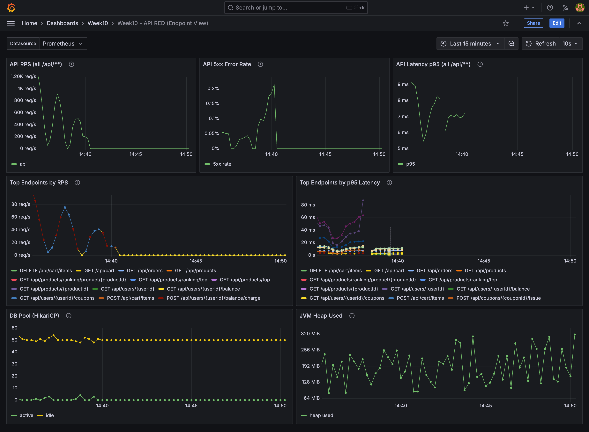

# STEP20 결과 분석 & (가상) 장애 대응 문서

## 0) Executive Summary
- 테스트 개요: `k6`로 `/api/**` 전체를 순환 호출(가벼운 기본 + 점진 증가), Grafana/Prometheus로 RED + JVM/DB Pool 관측
- 핵심 결과(재측정, 5 VUs / 3분):
  - `http_req_failed`: `0.82%`
  - `http_req_duration p95`: `7.94ms` (k6 기준)
- SLI/SLO 판정(서버 측, `/api/**` 기준)
  - SLI: 5xx rate / latency(p95, p99)
  - SLO(가정, STEP19): 5xx rate < 1%(5m), p95 < 300ms, p99 < 800ms
  - 본 문서에서는 Prometheus 쿼리로 SLI를 확인하고, SLO 충족 여부를 “판정” 기준으로 사용한다.
- SLA는 고객에게 제공하는 서비스 수준 약속 문서(측정/예외/보상 포함)이며, 본 과제 범위에서는 SLA 작성 대신 SLI/SLO 정의·측정에 집중한다.
- 발견된 병목/장애 징후
  - (주요) Docker 환경에서 Kafka 브로커가 “컨테이너 내부 접근 경로”를 잘못 광고(advertise)하여, 앱 컨테이너가 `localhost:9092`로 접속을 시도 → 연결 실패/재시도/타임아웃
  - (추가 관측) `POST /api/cart/items`가 동시 요청에서 간헐적으로 `500(COMMON001)`을 반환 (재현: `CART_WRITE_PROB=1` + 5 VUs)
- 개선/대응 요약
  - Kafka 리스너를 내부/외부로 분리(`kafka:29092` / `localhost:9092`), 앱의 bootstrap을 `kafka:29092`로 고정
  - 재측정에서 “order/payment 타임아웃” 경고가 재현되지 않음을 확인
  - 장바구니 `500`은 STEP20에서 “후속 액션 아이템”으로 정리(원인 파고들기)

## 1) 테스트 환경/조건(재현 가능하게)
- 실행 일시(재측정): `2025-12-26` (KST)
- 커밋: `3a76fcf`
- SUT 실행 방식: `docker compose` (app/mysql/redis/kafka/prometheus/grafana)
- k6 실행(도커):
  - `docker run --rm --network ecommerce_ecommerce-network -e BASE_URL=http://app:8080 -v "$PWD/loadtest/k6:/scripts" grafana/k6:latest run /scripts/step19-all-apis.js`
- k6 시나리오/옵션
  - 스크립트: `loadtest/k6/step19-all-apis.js`
  - stages (default): 30s(1VU) → 60s(3VU) → 60s(5VU) → 30s(1VU)
  - 확률(기본값): `CART_WRITE_PROB=0.3`, `ORDER_CREATE_PROB=0.05`, `ORDER_COMPLETE_PROB=0.02`, `COUPON_RESERVE_PROB=0.05`, `COUPON_ISSUE_PROB=0.02`
- 데이터 초기화 방식
  - DB/Redis는 `docker compose` 볼륨으로 “누적”되는 구성
  - 스크립트는 `/api/products` 응답을 기반으로 `stock`이 충분한 상품을 선택(환경 차이로 인한 `productId` 변동 대응)

## 2) 결과 요약(표/그래프 링크)
- Grafana 대시보드(로컬)
  - API 엔드포인트 뷰: `http://localhost:3000/d/week10-api-red/week10-api-red-endpoint-view`
  - Overview(RED+JVM+DB): `Week10 - Overview (RED + JVM + DB)`
- 시나리오별 RPS/TPS
  - 단일 시나리오(`allApisRamp`)만 사용 (STEP19 “전체 API 커버리지” 목적)
  - 관측은 Grafana `API RPS (all /api/**)`로 확인
- latency(p95/p99)
  - k6 결과: `http_req_duration p95=7.94ms`
  - Prometheus(서버 측): `histogram_quantile(0.95, sum by (le) (rate(http_server_requests_seconds_bucket{uri=~\"/api/.*\"}[$__rate_interval])))`
- error rate
  - k6 결과: `http_req_failed=0.82%`
  - Prometheus 5xx rate: `(sum(rate(http_server_requests_seconds_count{uri=~\"/api/.*\",status=~\"5..\"}[$__rate_interval])) / sum(rate(http_server_requests_seconds_count{uri=~\"/api/.*\"}[$__rate_interval])))`
- 리소스(CPU/Mem/GC/DB pool)
  - DB Pool: `hikaricp_connections_active`, `hikaricp_connections_idle`
  - JVM Heap: `jvm_memory_used_bytes{area=\"heap\"}`

## 2-1) 제출 캡처 체크리스트(권장)
- 공통 세팅(권장)
  - Grafana 우측 상단 Time range: **Last 15 minutes**
  - Refresh: **10s**
  - 캡처 타이밍: k6 실행 **마지막 1분 구간이 포함**되도록(실행 중 또는 실행 직후) 캡처
  - 파일명 예시
    - `step20-01-api-red.png`
    - `step20-02-overview.png`
    - (선택) `step20-03-before.png`, `step20-04-after.png`

- 캡처 1) API RED(엔드포인트 뷰)
  - 대시보드: `Week10 - API RED (Endpoint View)`
  - URL: `http://localhost:3000/d/week10-api-red/week10-api-red-endpoint-view`
  - 화면에 포함 권장 패널
    - `API RPS (all /api/**)`
    - `API 5xx Error Rate`
    - `API Latency p95 (all /api/**)`
    - `Top Endpoints by RPS`
    - `Top Endpoints by p95 Latency`
    - (추가) `Endpoint (method+uri)` 상세 패널/테이블
  - 목적: “어떤 엔드포인트가 트래픽/지연/에러를 만들었는지” 증빙

  

- 캡처 2) Overview(리소스/DB pool/JVM)
  - 대시보드: `Week10 - Overview (RED + JVM + DB)`
  - 화면에 포함 권장 패널
    - `HTTP RPS`(또는 유사 요청량 패널)
    - `HTTP 5xx`(있으면)
    - `HikariCP active/idle`
    - `JVM Heap used`
  - 목적: “병목이 앱/DB풀/JVM 쪽인지” 증빙

- (선택) 개선 전/후 비교 캡처
  - 동일한 대시보드/Time range로 “개선 전 1장 + 개선 후 1장”을 캡처해 Before/After로 첨부

## 3) 이상 징후(있다면)
### (주요) Kafka 연결 실패로 인한 타임아웃/불안정
- 현상
  - k6 실행 중 `POST /api/orders/{orderId}/payment`, `POST /api/orders/complete`에서 request timeout 경고가 발생(초기 상태)
  - 앱 로그에 Kafka 접속이 `localhost:9092`로 향하는 흔적이 다수(컨테이너 내부에서는 실패)
- 영향 범위(가상)
  - 결제/주문완료 흐름에서 지연 또는 실패(5xx/timeout) → 결제 성공률 하락 및 CS 증가 가능
- 타임라인(가상)
  - T0: Grafana `API 5xx Error Rate` 상승, `Top Endpoints by p95 Latency`에서 주문/결제 계열 상승
  - T0+5m: 로그 확인으로 Kafka 접속 실패(`localhost:9092`) 확인
  - T0+15m: Kafka listener/advertised 설정 수정 및 app bootstrap 변경
  - T0+30m: k6 재실행으로 타임아웃 경고 재현되지 않음을 확인

## 4) 원인 분석
### 가설
- Docker compose 환경에서 Kafka 브로커가 `PLAINTEXT://localhost:9092`만 광고하고 있어, 컨테이너 내부 클라이언트(app)가 broker metadata를 받은 뒤 `localhost:9092`로 재접속 → 실패/재시도 → 일부 요청이 타임아웃/지연

### 근거(로그/메트릭)
- 근거 로그(초기 상태)
  - `Connection to node 1 (localhost/127.0.0.1:9092) could not be established. Node may not be available.`
- 메트릭 근거(대시보드)
  - `Week10 - API RED (Endpoint View)`에서 주문/결제 endpoint의 p95 상승 및 5xx 증가를 확인 가능

### 결론
- Kafka advertised/listener 설정 불일치(컨테이너 내부/외부)가 장애의 1차 원인이었고, 내부 접근용 리스너를 분리하여 해결했다.

## 5) 즉시 대응(Short-term)
- (가상) 주문/결제 계열 endpoint의 에러율이 급상승한 상황에서, 우선 “확산 방지”를 위해 기능 플래그/라우팅으로 비핵심 흐름(쿠폰 예약 등)을 임시 제한
- 앱 로그 기반으로 외부 의존성(Kafka/DB/Redis) 연결 상태부터 확인

## 6) 개선(Mid-term)
### 개선 내용
- `docker-compose.yml`에서 Kafka 리스너를 내부/외부로 분리
  - 컨테이너 내부: `PLAINTEXT://kafka:29092`
  - 호스트 접근: `PLAINTEXT_HOST://localhost:9092`
- app 설정 변경
  - `SPRING_KAFKA_BOOTSTRAP_SERVERS=kafka:29092`

### 재측정 결과(전/후 비교)
- 전(초기 상태 예시)
  - k6 실행 중 주문/결제 request timeout 경고 발생
  - `http_req_failed=1.36%` (3분 실행, 초기 로그 기준)
- 후(개선 후 재측정)
  - k6 결과(5 VUs / 3분): `http_req_failed=0.82%`, `p95=7.94ms`
  - 동일 시나리오에서 주문/결제 request timeout 경고가 재현되지 않음

> 참고: 잔여 `http_req_failed`에는 상태변경 API(장바구니/쿠폰/주문)의 충돌/오류가 포함될 수 있어, STEP20 후속으로 “의도된 4xx vs 비의도 5xx”를 분리해 보는 것이 좋다.

## 7) 재발 방지(Long-term)
### 모니터링/알람
- Grafana(대시보드): `Week10 - API RED (Endpoint View)`
  - 알람 후보
    - `/api/**` 5xx error rate > 1% (5m)
    - `/api/orders/**` p95 > 1s (5m)
    - `hikaricp_connections_active`가 최대치 근접 + latency 상승 동시 발생

### 회귀 테스트
- Docker 환경 “내부/외부 연결” 회귀 체크리스트 추가
  - `app` 컨테이너에서 `kafka:29092`로 접속 가능한지
  - 호스트에서 `localhost:9092`로 접속 가능한지

### 운영 가이드
- `docs/week10/README.md`의 Kafka 접속 가이드를 단일 소스로 유지(내부/외부)

## 8) 포스트모템(Do not blame)
### 5 Whys(간단)
- Why1: 주문/결제 요청이 타임아웃/실패했다 → Kafka 연결 실패/재시도가 섞이면서 요청 처리 지연이 발생
- Why2: Kafka 연결이 실패했다 → 컨테이너 내부에서 `localhost:9092`로 접속 시도
- Why3: 왜 `localhost:9092`였나 → broker metadata가 그렇게 advertise 되어 있었음
- Why4: 왜 그렇게 advertise 했나 → Docker 내부/외부 리스너를 분리하지 않은 단일 설정
- Why5: 왜 놓쳤나 → “컨테이너 내부 네트워크 경로”를 포함한 환경 검증 체크리스트 부재

### 액션 아이템(담당/기한/우선순위)
- P0 / 이번 주: Docker Kafka 설정(내부/외부) 가이드 고정 및 재현 커맨드 문서화 (완료)
- P1 / 다음 주: `POST /api/cart/items` 간헐적 `500(COMMON001)` 원인 분석 및 재현 테스트 작성 (미완료)
  - 재현 힌트: `CART_WRITE_PROB=1` + 5 VUs에서 `500` 관측
  - 목표: 5xx 제거 또는 “정상적인 4xx로 치환” (멱등/경합 처리)
