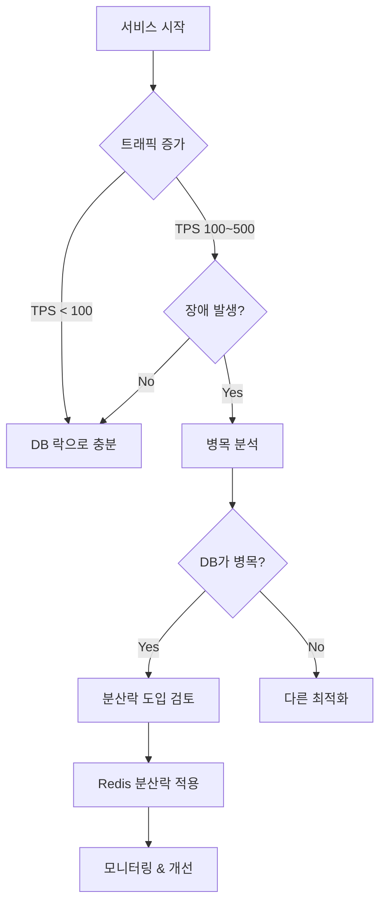
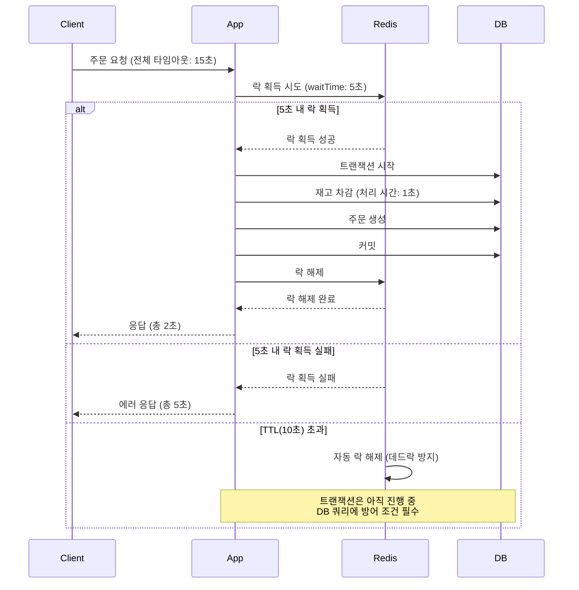

# Week 6 멘토링 QnA 정리

> **일시**: 2025-11-24 (평일 QnA), 2025-11-25 (멘토링)
> **코치**: 김종협 코치님, 제이 코치님
> **주제**: STEP11-12 분산락 & 캐싱

---

## 📅 Section 1: 평일 QnA (김종협 코치님, 2025-11-24)

### 세션 전체 주제
- STEP11 분산락, STEP12 캐시 준비 중 **개념/설계 질문 QnA**
- 핵심 키워드:
  - 언제 DB 락 vs Redis 분산락으로 전환할 것인가
  - 단일 DB 구조에서의 비관/낙관 락과 분산락의 관계
  - 락 TTL / 대기시간(waitTime) / 처리시간 기준
  - 캐시 갱신 전략 (Lazy, Refresh-ahead, 스케줄 기반)
  - 실제 트래픽/부하 상황에서의 선택 기준

---

### 1. 분산락 vs DB 락 사용 기준

#### 질문
> "언제 분산락으로 전환해야 하나요? 단일 서버/단일 DB에서는 그냥 DB 락으로도 충분한 것 같은데, 어디까지가 DB 락 영역이고 언제 분산락을 고려해야 하나요?"

#### 핵심 답변

**1. 단일 DB + 트래픽이 크지 않으면 → DB 락이 정답**
- TPS 10, 20, 100 언더 수준에서 굳이 분산락 쓸 이유 없음
- 단일 DB 구성에서 비관/낙관 락으로도 **동시성 제어는 충분히 가능**
- 분산락은 복잡도와 운영 부담이 크기 때문에 **규모가 작을 땐 오버엔지니어링**

**2. 분산락이 의미 있는 지점**
- 애플리케이션 서버는 여러 대, DB는 1대일 때
  → 모든 동시성 제어를 DB 락으로만 처리하면 DB가 병목
- 향후 MS 분리, DB 샤딩 등으로 **"단일 DB"라는 가정이 무너지는 시점**
- 기준:
  - **DB가 버틸 수 있는 TPS를 이미 넘기거나, 곧 넘을 게 확실할 때**
  - 혹은 **논리적으로 여러 DB/서비스에 걸친 동시성 제어가 필요할 때**

**3. "미리" 분산락 깔아두는 건 보통 틀린 판단**
- 실제로는
  1. 유저/트래픽이 늘고
  2. 장애(또는 심각한 지연)를 한 번 겪고
  3. 그 이후에 **부하 분산/분산락/캐시**를 도입하는 패턴이 일반적
- "언젠가 클 거니까 일단 분산락부터" 하는 건 현실성이 떨어짐

#### 실무 적용



---

### 2. 비관락/낙관락 vs 분산락

#### 질문
> "단일 DB 환경에서 비관락/낙관락이면 동시성 제어가 되는데, 이때도 굳이 분산락이 필요한가요?"

#### 핵심 답변

**단일 DB 환경이라면**
- 비관락이든 낙관락이든 **"동일 리소스에 대한 동시성 제어는 이미 가능"**

**다만, 이 구조가 의미 있으려면 전제가 붙음:**
- 서비스가 **평생 단일 DB 구조에서 끝날 것**인가?

**실제 서비스는:**
- 유저가 어느 정도 이상 늘어나면 **단일 DB로 못 버티고 구조가 바뀐다**
- 그때부터는 "DB 락만으로" 해결이 안 되는 상황이 생김

**결론:**
- 질문 자체는 맞는 이야기지만,
- "지금 단일 DB 상태에 갇혀서만 생각하면 안 된다"는 게 포인트

#### 비교표

| 구분 | DB 락 (비관/낙관) | Redis 분산락 |
|-----|------------------|-------------|
| **적용 환경** | 단일 DB | 다중 인스턴스 또는 MSA |
| **동시성 제어 범위** | DB 트랜잭션 내 | 애플리케이션 레벨 전체 |
| **성능** | DB 부하 증가 | Redis 기반으로 빠름 |
| **복잡도** | 낮음 | 높음 (TTL, 대기시간 등 고려) |
| **확장성** | 제한적 | 높음 (서비스 분리에 유리) |
| **언제 사용?** | TPS < 100, 단일 DB | TPS > 100, 다중 인스턴스 |

---

### 3. 락 TTL, waitTime(대기 시간) 설계 기준

#### 질문
> "락 대기 시간, TTL(자동 해제 시간)을 어느 기준으로 잡는 게 맞나요? TTL 안에 처리 못하면 어떻게 되나요?"

#### 핵심 답변

**1. 락 대기 시간(waitTime)**
- 프론트/외부 호출 **전체 타임아웃**을 기준으로 해야 함
- 예: 클라이언트가 전체 요청 왕복을 15초 안에 기대한다면,
  - 락 대기만 15초 줄 수는 없음
  - **보통 3~5초 정도**가 현실적인 상한선
- 그 이상은 유저 입장에서도 "응답 없음"으로 느껴질 확률이 큼

**2. 락 TTL/leaseTime(자동 해제 시간)**
- "**이 로직이 아무리 느려도 끝나는 시간 + 여유 몇 초**"가 기준
- 예: 최악 1초 처리 → 3~5초 이상으로 잡는 식
- 로직마다 다를 수 있으니 **일괄 고정할 필요는 없고, 파라미터/설정으로 분리**하는 게 좋음

**3. TTL 동안 처리 못했을 때**
- 락은 풀렸는데 트랜잭션이 아직 돌고 있을 수 있음
- 그래서 TTL만 믿지 말고, **DB 쿼리 자체에 방어 조건을 넣어야 한다**
- 예: `WHERE quantity >= ?` 같이, 동시성 경쟁 상황에서도 잘못된 업데이트를 막는 패턴

#### 설정 예시

```java
@DistributedLock(
    key = "'order:product:' + #productId",
    waitTime = 5,      // 5초 대기 (프론트 타임아웃 15초 고려)
    leaseTime = 10     // 10초 후 자동 해제 (최악 처리 시간 1초 + 여유 9초)
)
@Transactional
public OrderResponse createOrder(Long productId, int quantity) {
    // 1. 상품 조회
    Product product = productRepository.findById(productId)
            .orElseThrow();

    // 2. 재고 차감 (방어 조건 포함)
    if (product.getStock() < quantity) {
        throw new InsufficientStockException();
    }
    product.decreaseStock(quantity);

    // 3. 주문 생성
    return OrderResponse.from(orderRepository.save(order));
}
```

#### 타임아웃 흐름도



---

### 4. 캐시 갱신 전략 (Lazy vs Refresh-ahead vs 스케줄)

#### 질문
> "캐시 갱신을 Lazy로 할지, TTL 끝나기 전에 미리 할지, 스케줄로 할지 실무에서는 어떻게 선택하나요?"

#### 핵심 답변

**1. 기본은 Lazy Loading**
- 대부분 서비스는 `캐시 미스 → DB 조회 → 캐시에 저장` 패턴으로도 충분
- 캐시가 없던 시절에도 유저는 그 정도 속도에 어느 정도 익숙하다

**2. Refresh-ahead / 스케줄 갱신은 "부하 패턴"을 볼 때 고민**
- 특정 시간대에 트래픽/부하가 집중되는 구간이 명확하면:
  - 그 전에 미리 캐싱(스케줄/배치)해서 해당 기간 동안 DB를 보호
- 예: 출근 시간, 점심 시간, 특정 이벤트 시간 등

**3. 스탬피드(동시에 캐시 미스) 상황**
- Lazy만 쓰면 만료 시점에 모든 요청이 DB로 몰릴 수 있음
- 이때는
  - 일부는 "몇 초 포기",
  - 일부는 캐시 락 + Lazy,
  - 일부는 백그라운드 리프레시 등 **조합**으로 풀어가는 패턴이 많다

#### 전략 비교표

| 전략 | 장점 | 단점 | 사용 시기 |
|-----|------|------|----------|
| **Lazy Loading** | 구현 간단<br/>필요한 데이터만 캐싱 | 첫 요청 느림<br/>스탬피드 위험 | 기본 전략 |
| **Refresh-ahead** | 캐시 만료 전 갱신<br/>응답 시간 일정 | 복잡도 증가<br/>불필요한 갱신 가능 | 트래픽 집중 시간대 |
| **스케줄 갱신** | 예측 가능한 부하<br/>DB 보호 | 실시간성 떨어짐<br/>타이밍 조정 필요 | 정기적 데이터 갱신 |
| **조합 전략** | 유연성 최대화<br/>장애 대응 강화 | 구현/운영 복잡 | 대규모 트래픽 서비스 |

#### 구현 예시

```java
@Service
@RequiredArgsConstructor
public class ProductCacheService {

    private final ProductRepository productRepository;
    private final RedissonClient redissonClient;
    private final LockManager lockManager;

    // 1. Lazy Loading (기본)
    public List<ProductResponse> getPopularProducts() {
        String cacheKey = "popular:products";

        // 캐시 조회
        RBucket<List<ProductResponse>> bucket = redissonClient.getBucket(cacheKey);
        List<ProductResponse> cached = bucket.get();

        if (cached != null) {
            log.info("캐시 Hit: {}", cacheKey);
            return cached;
        }

        // Cache Miss - Lazy Loading
        log.info("캐시 Miss: {} - Lazy Loading", cacheKey);
        return loadAndCacheProducts(cacheKey);
    }

    // 2. Refresh-ahead (TTL 만료 전 백그라운드 갱신)
    @Scheduled(cron = "0 */9 * * * *")  // TTL(10분) 1분 전 갱신
    public void refreshPopularProductsCache() {
        String cacheKey = "popular:products";

        log.info("캐시 Refresh-ahead 시작: {}", cacheKey);

        try {
            List<Product> products = productRepository.findTop5ByOrderBySalesCountDesc();
            List<ProductResponse> response = products.stream()
                    .map(ProductResponse::from)
                    .toList();

            RBucket<List<ProductResponse>> bucket = redissonClient.getBucket(cacheKey);
            bucket.set(response, Duration.ofMinutes(10));

            log.info("캐시 Refresh-ahead 완료: {}", cacheKey);
        } catch (Exception e) {
            log.error("캐시 Refresh-ahead 실패: {}", cacheKey, e);
        }
    }

    // 3. 스케줄 갱신 (특정 시간대 전 미리 캐싱)
    @Scheduled(cron = "0 50 8 * * *")  // 매일 오전 8시 50분 (출근 시간 전)
    public void preCacheForRushHour() {
        log.info("출근 시간 대비 캐시 사전 로딩 시작");

        // 핵심 캐시들을 미리 로딩
        loadAndCacheProducts("popular:products");
        loadAndCacheCategories("categories:list");
        // ...

        log.info("출근 시간 대비 캐시 사전 로딩 완료");
    }

    // 4. 캐시 로딩 (분산락으로 스탬피드 방지)
    private List<ProductResponse> loadAndCacheProducts(String cacheKey) {
        return lockManager.executeWithLock("lock:" + cacheKey, () -> {
            // Double-Check
            RBucket<List<ProductResponse>> bucket = redissonClient.getBucket(cacheKey);
            List<ProductResponse> cached = bucket.get();

            if (cached != null) {
                log.info("Double-Check 캐시 Hit: {}", cacheKey);
                return cached;
            }

            // DB 조회
            List<Product> products = productRepository.findTop5ByOrderBySalesCountDesc();
            List<ProductResponse> response = products.stream()
                    .map(ProductResponse::from)
                    .toList();

            // TTL 랜덤화 (스탬피드 방지)
            Duration baseTTL = Duration.ofMinutes(10);
            Duration randomTTL = baseTTL.plus(
                Duration.ofSeconds(ThreadLocalRandom.current().nextInt(60))
            );

            bucket.set(response, randomTTL);
            log.info("캐시 저장: {} (TTL: {})", cacheKey, randomTTL);

            return response;
        });
    }
}
```

---

## 📅 Section 2: 멘토링 (제이 코치님, 2025-11-25)

### 세션 전체 주제
- STEP11/12 실습에 맞춰 **실무적인 관점**에서 정리:
  - Redis 관련 실무 금기 사항(예: KEYS)
  - 캐시 키/무효화 전략
  - 분산락 구현(AOP vs 명시적 호출)
  - Redis 메모리/정책, 스탬피드 방어
  - Spin Lock vs Pub/Sub 기반 락
  - 락 전략 선택(낙관락 vs Redis 락)

---

### 1. Redis 캐시 무효화 & 키 관리

#### 핵심 내용

**1. `KEYS` 명령어는 프로덕션 금지**
- 전체 키 공간을 순회하는 O(N) 연산 + 실행 중 블로킹
- 트래픽 많은 환경에서 쉽게 장애 포인트가 됨
- **실무에서 절대 안 씀**

**2. 대신 Set 자료구조로 캐시 키를 관리**
```redis
# 상품 캐시 키 그룹 관리
SADD product:cache:keys product:1 product:2 product:3

# 상품 수정 시 관련 캐시 일괄 삭제
SMEMBERS product:cache:keys  # 키 목록 조회
DEL product:1 product:2 product:3
```

**3. 캐시 무효화는 완벽하지 않다**
- Redis 명령 실패, 앱 버그, 다중 인스턴스 환경 등으로
  - 일부 인스턴스/키가 유실되거나 갱신이 늦을 수밖에 없음
- 결론: **TTL + 최대한의 무효화 전략 조합**이 현실적인 해법

#### 구현 패턴

```java
@Service
@RequiredArgsConstructor
public class CacheKeyManager {

    private final RedisTemplate<String, String> redisTemplate;

    /**
     * 캐시 키 그룹에 추가
     */
    public void addCacheKey(String groupKey, String cacheKey) {
        redisTemplate.opsForSet().add(groupKey, cacheKey);
    }

    /**
     * 캐시 키 그룹 조회
     */
    public Set<String> getCacheKeys(String groupKey) {
        return redisTemplate.opsForSet().members(groupKey);
    }

    /**
     * 캐시 키 그룹 일괄 삭제
     */
    public void evictCacheGroup(String groupKey) {
        Set<String> keys = getCacheKeys(groupKey);
        if (keys != null && !keys.isEmpty()) {
            redisTemplate.delete(keys);
            redisTemplate.delete(groupKey);  // 그룹 키도 삭제
            log.info("캐시 그룹 삭제 완료: {} ({}개)", groupKey, keys.size());
        }
    }

    /**
     * 특정 패턴의 캐시만 삭제
     */
    public void evictCacheByPattern(String groupKey, String pattern) {
        Set<String> keys = getCacheKeys(groupKey);
        if (keys != null) {
            Set<String> matchedKeys = keys.stream()
                    .filter(key -> key.matches(pattern))
                    .collect(Collectors.toSet());

            if (!matchedKeys.isEmpty()) {
                redisTemplate.delete(matchedKeys);
                log.info("캐시 패턴 삭제 완료: {} ({}개)", pattern, matchedKeys.size());
            }
        }
    }
}

@Service
@RequiredArgsConstructor
public class ProductCacheService {

    private final RedissonClient redissonClient;
    private final CacheKeyManager cacheKeyManager;

    /**
     * 상품 캐시 저장 (키 그룹에 등록)
     */
    public void cacheProduct(String productId, ProductResponse product) {
        String cacheKey = "product:" + productId;
        String groupKey = "product:cache:keys";

        // 1. 캐시 저장
        RBucket<ProductResponse> bucket = redissonClient.getBucket(cacheKey);
        bucket.set(product, Duration.ofHours(1));

        // 2. 키 그룹에 추가
        cacheKeyManager.addCacheKey(groupKey, cacheKey);
    }

    /**
     * 상품 수정 시 캐시 무효화
     */
    public void evictProductCache(String productId) {
        String cacheKey = "product:" + productId;

        // 1. 개별 캐시 삭제
        redissonClient.getBucket(cacheKey).delete();

        // 2. 관련 캐시도 삭제 (예: 상품 목록, 인기 상품)
        redissonClient.getBucket("popular:products").delete();
        redissonClient.getBucket("products:list").delete();

        log.info("상품 캐시 무효화 완료: {}", productId);
    }

    /**
     * 전체 상품 캐시 무효화 (관리자 기능)
     */
    public void evictAllProductCache() {
        cacheKeyManager.evictCacheGroup("product:cache:keys");
    }
}
```

---

### 2. 분산락 AOP 구현 vs 명시적 락 매니저

#### 질문
> "AOP로 분산락을 구현하고, 락 획득 후 DB 트랜잭션 시작 순서를 보장하려 할 때, AOP 순서만 믿어도 되나요?"

#### 핵심 내용

**1. AOP + @Order로 우선순위 조정은 가능**
```java
@Order(1)  // 분산락 Aspect
@Aspect
@Component
public class DistributedLockAspect { ... }

@Order(2)  // 트랜잭션 Aspect (기본)
public class TransactionAspect { ... }
```
- 이론상: 락 획득 → 트랜잭션 순서가 맞게 작동

**2. 하지만 "AOP 순서에만 의존하는 설계"는 위험**
- 스프링 AOP는 프록시 기반
  - 클래스 내부 메서드 호출 시 프록시를 안 타는 경우가 생김
- 로깅, 권한, 트랜잭션 등 여러 Aspect가 섞이면
  - 실제 실행 순서를 추적하기가 점점 복잡해짐
- 새 Aspect 추가될 때마다 전체 `@Order` 조정 필요 → 유지보수 지옥

**3. 실무 추천: LockManager 컴포넌트**
```java
lockManager.executeWithLock(key, () -> {
    // @Transactional 메서드 호출
});
```
- 락 → 비즈니스 로직 호출 순서를 코드로 명시
- 그래도 AOP를 쓴다면 `TransactionTemplate`과 조합

#### 구현 패턴

**패턴 1: LockManager (권장)**
```java
@Component
@RequiredArgsConstructor
public class LockManager {

    private final RedissonClient redissonClient;
    private final TransactionTemplate transactionTemplate;

    /**
     * 분산락 + 트랜잭션 실행
     * 순서: 락 획득 → 트랜잭션 시작 → 비즈니스 로직 → 커밋 → 락 해제
     */
    public <T> T executeWithLock(
            String lockKey,
            Supplier<T> task,
            long waitTime,
            long leaseTime,
            TimeUnit timeUnit
    ) {
        RLock lock = redissonClient.getLock(lockKey);

        try {
            boolean isLocked = lock.tryLock(waitTime, leaseTime, timeUnit);

            if (!isLocked) {
                log.error("락 획득 실패: {}", lockKey);
                throw new IllegalStateException("락 획득 실패: " + lockKey);
            }

            log.info("락 획득 성공: {}", lockKey);

            // 락 획득 후 트랜잭션 시작
            return transactionTemplate.execute(status -> task.get());

        } catch (InterruptedException e) {
            Thread.currentThread().interrupt();
            throw new RuntimeException("락 대기 중 인터럽트 발생", e);
        } finally {
            if (lock.isHeldByCurrentThread()) {
                lock.unlock();
                log.info("락 해제: {}", lockKey);
            }
        }
    }

    /**
     * 간편 래퍼 (기본값 사용)
     */
    public <T> T executeWithLock(String lockKey, Supplier<T> task) {
        return executeWithLock(lockKey, task, 10, 30, TimeUnit.SECONDS);
    }
}

// 사용 예시
@Service
@RequiredArgsConstructor
public class OrderService {

    private final LockManager lockManager;
    private final ProductRepository productRepository;
    private final OrderRepository orderRepository;

    /**
     * 주문 생성 (LockManager 사용)
     */
    public OrderResponse createOrder(Long productId, int quantity) {
        String lockKey = "order:product:" + productId;

        return lockManager.executeWithLock(lockKey, () -> {
            // 이 안에서 실행되는 로직은 이미 락 + 트랜잭션 보장됨
            return createOrderInternal(productId, quantity);
        });
    }

    /**
     * 실제 비즈니스 로직 (트랜잭션 내부)
     */
    private OrderResponse createOrderInternal(Long productId, int quantity) {
        // 1. 상품 조회
        Product product = productRepository.findById(productId)
                .orElseThrow(() -> new IllegalArgumentException("상품 없음"));

        // 2. 재고 차감
        product.decreaseStock(quantity);

        // 3. 주문 생성
        Order order = Order.create(product, quantity);
        orderRepository.save(order);

        return OrderResponse.from(order);
    }
}
```

**패턴 2: AOP + TransactionTemplate (차선)**
```java
@Aspect
@Component
@RequiredArgsConstructor
public class DistributedLockAspect {

    private final RedissonClient redissonClient;
    private final TransactionTemplate transactionTemplate;

    @Around("@annotation(distributedLock)")
    public Object lock(ProceedingJoinPoint joinPoint, DistributedLock distributedLock) throws Throwable {
        String lockKey = distributedLock.key();
        RLock lock = redissonClient.getLock(lockKey);

        try {
            boolean isLocked = lock.tryLock(
                    distributedLock.waitTime(),
                    distributedLock.leaseTime(),
                    distributedLock.timeUnit()
            );

            if (!isLocked) {
                throw new IllegalStateException("락 획득 실패: " + lockKey);
            }

            // AOP 안에서 명시적으로 트랜잭션 시작
            return transactionTemplate.execute(status -> {
                try {
                    return joinPoint.proceed();
                } catch (Throwable e) {
                    throw new RuntimeException(e);
                }
            });

        } catch (InterruptedException e) {
            Thread.currentThread().interrupt();
            throw new RuntimeException("락 대기 중 인터럽트", e);
        } finally {
            if (lock.isHeldByCurrentThread()) {
                lock.unlock();
            }
        }
    }
}
```

---

### 3. 낙관락 vs Redis 락 선택 기준 (잔액/포인트/결제 등)

#### 질문
> "유저 잔액/포인트 같은 경우, 낙관락 + 재시도 대신 처음부터 Redis 분산락을 쓰는 게 나을까요?"

#### 핵심 답변

기준은 **충돌 빈도(동시성 경쟁률)**

**일반적인 시나리오**
- 한 사용자가 동시에 여러 번 잔액을 충전/사용하는 건 **드문 편**
- 대부분 하나의 기기에서 한 번씩만 발생
- **낙관락 + 재시도로 충분**

**예외적인 시나리오**
- 정기 결제/자동 결제 등으로 **동일 유저 잔액을 동시에 여러 프로세스가 건드리는 경우**
- 이 때 충돌률이 높게 측정되면 Redis 락 고려

**단계적 접근**
```
1. 낙관락으로 시작
2. 충돌률 모니터링 (재시도 횟수, 실패율)
3. 일정 수준 이상이면 Redis 락으로 이동
```

#### 구현 예시

```java
@Service
@RequiredArgsConstructor
public class UserBalanceService {

    private final UserRepository userRepository;
    private final LockManager lockManager;
    private final MetricRegistry metricRegistry;

    /**
     * 1단계: 낙관락 + 재시도
     */
    @Retryable(
        value = OptimisticLockingFailureException.class,
        maxAttempts = 3,
        backoff = @Backoff(delay = 100, multiplier = 2)
    )
    @Transactional
    public void chargeBalanceWithOptimisticLock(Long userId, BigDecimal amount) {
        // 충돌 횟수 카운트
        metricRegistry.counter("balance.conflict.count").inc();

        User user = userRepository.findById(userId)
                .orElseThrow(() -> new IllegalArgumentException("사용자 없음"));

        user.chargeBalance(amount);  // @Version 필드 자동 증가
    }

    /**
     * 2단계: 충돌률 모니터링
     */
    @Scheduled(fixedRate = 60000)  // 1분마다
    public void monitorConflictRate() {
        long conflictCount = metricRegistry.counter("balance.conflict.count").getCount();
        long totalAttempts = metricRegistry.counter("balance.total.count").getCount();

        double conflictRate = (double) conflictCount / totalAttempts * 100;

        log.info("잔액 충돌률: {}% ({}/{})", conflictRate, conflictCount, totalAttempts);

        // 충돌률이 10% 이상이면 경고
        if (conflictRate > 10) {
            log.warn("⚠️ 잔액 충돌률이 {}%로 높습니다. Redis 락 전환 고려 필요", conflictRate);
        }
    }

    /**
     * 3단계: Redis 분산락으로 전환 (충돌률 높을 때)
     */
    public void chargeBalanceWithDistributedLock(Long userId, BigDecimal amount) {
        String lockKey = "balance:user:" + userId;

        lockManager.executeWithLock(lockKey, () -> {
            User user = userRepository.findById(userId)
                    .orElseThrow(() -> new IllegalArgumentException("사용자 없음"));

            user.chargeBalance(amount);
            return null;
        });
    }

    /**
     * 전략 선택 (충돌률 기반)
     */
    public void chargeBalance(Long userId, BigDecimal amount) {
        double conflictRate = getConflictRate();

        if (conflictRate > 10) {
            // 충돌률 높음 → Redis 락
            log.info("충돌률 {}% - Redis 락 사용", conflictRate);
            chargeBalanceWithDistributedLock(userId, amount);
        } else {
            // 충돌률 낮음 → 낙관락
            log.info("충돌률 {}% - 낙관락 사용", conflictRate);
            chargeBalanceWithOptimisticLock(userId, amount);
        }
    }
}
```

---

### 4. Cache Stampede & TTL 랜덤화

#### 질문
> "모든 캐시에 동일 TTL을 주면 한 시점에 동시에 만료돼서 스탬피드 생길 것 같은데, 어떻게 막나요?"

#### 핵심 내용

**1. TTL 랜덤화**
- 기본 TTL ± (10~20%) 범위에서 랜덤 값을 더해 만료 시점을 분산
- 같은 시간에 생성된 캐시도 만료 시각이 조금씩 달라져 스탬피드 완화

**2. 캐시 미스 시 분산락**
- 캐시 미스가 난 첫 요청만 Redis 락을 잡고 DB 조회 + 캐시 적재
- 그동안 다른 요청들은 대기 후 캐시 재조회
- 결과적으로 DB는 **한 번만** 맞고, 나머지는 캐시로 처리

**3. 백그라운드 리프레시(Refresh-ahead)**
- 트래픽 높은 핵심 캐시는 TTL 만료 직전에 배치/스케줄러로 갱신
- 만료 전에 미리 갱신해서, 만료 타이밍에도 스탬피드 없이 동작

#### 구현 예시

```java
@Service
@RequiredArgsConstructor
public class CacheStampedeService {

    private final RedissonClient redissonClient;
    private final LockManager lockManager;
    private final ProductRepository productRepository;

    /**
     * TTL 랜덤화 헬퍼
     */
    private Duration getRandomizedTTL(Duration baseTTL) {
        // 기본 TTL ± 10~20% 랜덤 추가
        long baseMillis = baseTTL.toMillis();
        long randomMillis = ThreadLocalRandom.current()
                .nextLong((long) (baseMillis * 0.1), (long) (baseMillis * 0.2));

        return baseTTL.plus(Duration.ofMillis(randomMillis));
    }

    /**
     * 인기 상품 조회 (Cache Stampede 방지)
     */
    public List<ProductResponse> getPopularProducts() {
        String cacheKey = "popular:products";

        // 1. 캐시 조회
        RBucket<List<ProductResponse>> bucket = redissonClient.getBucket(cacheKey);
        List<ProductResponse> cached = bucket.get();

        if (cached != null) {
            log.info("캐시 Hit: {}", cacheKey);
            return cached;
        }

        // 2. Cache Miss - 분산락으로 DB 조회 중복 방지
        log.info("캐시 Miss: {}", cacheKey);
        return loadPopularProductsWithLock(cacheKey);
    }

    /**
     * 분산락 + Double-Check + TTL 랜덤화
     */
    private List<ProductResponse> loadPopularProductsWithLock(String cacheKey) {
        String lockKey = "lock:" + cacheKey;

        return lockManager.executeWithLock(lockKey, () -> {
            // 3. Double-Check (락 대기 중 다른 스레드가 캐싱했을 수 있음)
            RBucket<List<ProductResponse>> bucket = redissonClient.getBucket(cacheKey);
            List<ProductResponse> cached = bucket.get();

            if (cached != null) {
                log.info("Double-Check 캐시 Hit: {}", cacheKey);
                return cached;
            }

            // 4. DB 조회
            log.info("DB 조회 시작: {}", cacheKey);
            List<Product> products = productRepository.findTop5ByOrderBySalesCountDesc();
            List<ProductResponse> response = products.stream()
                    .map(ProductResponse::from)
                    .toList();

            // 5. TTL 랜덤화 적용
            Duration baseTTL = Duration.ofMinutes(5);
            Duration randomizedTTL = getRandomizedTTL(baseTTL);

            bucket.set(response, randomizedTTL);
            log.info("캐시 저장: {} (TTL: {})", cacheKey, randomizedTTL);

            return response;
        }, 5, 10, TimeUnit.SECONDS);
    }

    /**
     * 백그라운드 리프레시 (Refresh-ahead)
     */
    @Scheduled(cron = "0 */4 * * * *")  // 4분마다 (TTL 5분)
    public void refreshPopularProductsCache() {
        String cacheKey = "popular:products";

        log.info("백그라운드 캐시 갱신 시작: {}", cacheKey);

        try {
            List<Product> products = productRepository.findTop5ByOrderBySalesCountDesc();
            List<ProductResponse> response = products.stream()
                    .map(ProductResponse::from)
                    .toList();

            RBucket<List<ProductResponse>> bucket = redissonClient.getBucket(cacheKey);
            Duration randomizedTTL = getRandomizedTTL(Duration.ofMinutes(5));
            bucket.set(response, randomizedTTL);

            log.info("백그라운드 캐시 갱신 완료: {} (TTL: {})", cacheKey, randomizedTTL);
        } catch (Exception e) {
            log.error("백그라운드 캐시 갱신 실패: {}", cacheKey, e);
        }
    }
}
```

---

### 5. Redis 메모리 관리 전략

#### 질문
> "Redis 메모리가 꽉 차면 일부 키가 삭제돼 서비스에 영향이 있을 텐데, 어떻게 관리해야 하나요?"

#### 핵심 내용

**1. maxmemory & maxmemory-policy 이해**
```redis
# redis.conf
maxmemory 256mb
maxmemory-policy allkeys-lru
```
- `maxmemory`까지 사용 → 초과 시 `maxmemory-policy`에 따라 행동
- 기본 `noeviction`: 추가 쓰기 불가 + 에러 반환 → 실무 지양
- 실무 권장: `allkeys-lru` (전체 키 중 가장 오래 안 쓰인 키부터 삭제)

**2. TTL 설정은 기본**
```java
// 용도별 TTL 차등 적용
cache.set("product:detail:" + id, product, Duration.ofHours(1));
cache.set("product:list", products, Duration.ofMinutes(10));
```
- TTL 없는 키는 메모리에 계속 남아 **사실상 메모리 누수**

**3. 모니터링 & 확장**
- 메모리 사용률 70~80%를 경계로 봄
- 인스턴스 스펙 업/샤딩 등으로 대응

**4. 용도별 Redis 분리**
```
Redis Instance 1: 캐시용 (allkeys-lru, 256MB)
Redis Instance 2: 세션/락용 (noeviction, 128MB)
```
- 캐시/세션/락을 한 인스턴스에 몰지 말고 분리
- 장애 전파 최소화

#### 구현 예시

```yaml
# docker-compose.yml
services:
  # 캐시 전용 Redis
  redis-cache:
    image: redis:7-alpine
    container_name: ecommerce-redis-cache
    ports:
      - "6379:6379"
    command: >
      redis-server
      --maxmemory 256mb
      --maxmemory-policy allkeys-lru
      --save ""
    networks:
      - ecommerce-network

  # 세션/락 전용 Redis
  redis-session:
    image: redis:7-alpine
    container_name: ecommerce-redis-session
    ports:
      - "6380:6379"
    command: >
      redis-server
      --maxmemory 128mb
      --maxmemory-policy noeviction
      --save ""
    networks:
      - ecommerce-network
```

```java
@Configuration
public class RedisConfig {

    /**
     * 캐시 전용 RedissonClient
     */
    @Bean(name = "cacheRedissonClient")
    public RedissonClient cacheRedissonClient() {
        Config config = new Config();
        config.useSingleServer()
                .setAddress("redis://localhost:6379");
        return Redisson.create(config);
    }

    /**
     * 세션/락 전용 RedissonClient
     */
    @Bean(name = "sessionRedissonClient")
    public RedissonClient sessionRedissonClient() {
        Config config = new Config();
        config.useSingleServer()
                .setAddress("redis://localhost:6380");
        return Redisson.create(config);
    }
}

@Service
@RequiredArgsConstructor
public class RedisMonitoringService {

    @Qualifier("cacheRedissonClient")
    private final RedissonClient cacheRedissonClient;

    @Qualifier("sessionRedissonClient")
    private final RedissonClient sessionRedissonClient;

    /**
     * Redis 메모리 사용률 모니터링
     */
    @Scheduled(fixedRate = 60000)  // 1분마다
    public void monitorMemoryUsage() {
        monitorInstance("Cache", cacheRedissonClient);
        monitorInstance("Session", sessionRedissonClient);
    }

    private void monitorInstance(String name, RedissonClient client) {
        ServerInfoCommand info = client.getInfo();
        long usedMemory = info.getUsedMemory();
        long maxMemory = info.getMaxMemory();

        double usageRate = (double) usedMemory / maxMemory * 100;

        log.info("Redis {} 메모리 사용률: {}/ms ({}%)",
                name, usedMemory, maxMemory, usageRate);

        if (usageRate > 80) {
            log.warn("⚠️ Redis {} 메모리 사용률이 {}%로 높습니다. 확장 필요", name, usageRate);
        }
    }
}
```

---

### 6. Spin Lock vs Pub/Sub 기반 락 (Redisson)

#### Spin Lock
```java
// ❌ CPU를 갈아 먹는 구조
while (!lock.tryLock()) {
    Thread.sleep(100);  // 계속 반복
}
```
- 락이 풀릴 때까지 루프를 돌며 계속 확인
- DB IO 대신 **CPU를 갈아 먹는 구조**
- 동시 대기 쓰레드 많으면 CPU 100%

#### Redisson & Pub/Sub
```java
// ✅ Pub/Sub 기반 락 알림
RLock lock = redissonClient.getLock("myLock");
lock.lock();  // 내부적으로 Pub/Sub 사용
```
- 내부적으로 **Pub/Sub 기반 락 알림** 사용
- 락이 풀릴 때만 클라이언트에게 알려, 불필요한 반복/폴링 줄임

#### 비유
- **Spin Lock** = 카운터 앞에 서서 "제 커피 나왔나요?" 계속 물어보는 사람
- **Pub/Sub** = 진동벨 받고 자리에 있다가 울리면 나가는 사람

#### 결론
- Redis 환경이면 **직접 Spin Lock 구현하지 말고 Redisson 기본 락을 쓰는 게 낫다**

---

## 📝 핵심 요약

### DB 락 vs Redis 분산락
```
TPS < 100, 단일 DB → DB 락 (비관/낙관)
TPS > 100, 다중 인스턴스 → Redis 분산락
충돌 빈도 기반 단계적 도입
```

### 락 설정 기준
```
waitTime: 3~5초 (프론트 타임아웃 고려)
leaseTime: 처리 시간 + 여유 (3~10초)
DB 쿼리에 방어 조건 추가 (WHERE quantity >= ?)
```

### 캐시 갱신 전략
```
기본: Lazy Loading
트래픽 집중: Refresh-ahead
스탬피드 방지: 분산락 + Double-Check + TTL 랜덤화
```

### Redis 메모리 관리
```
TTL 설정 필수 (용도별 차등)
maxmemory-policy: allkeys-lru
모니터링: 70~80% 경계
용도별 분리: 캐시 / 세션 / 락
```

### 구현 패턴
```
AOP보다 LockManager 권장 (순서 명시)
캐시 키는 Set으로 관리 (KEYS 금지)
Redisson 기본 락 사용 (Spin Lock 직접 구현 금지)
```

---

**작성자**: 항해플러스 백엔드 6기
**최종 수정일**: 2025-11-26
