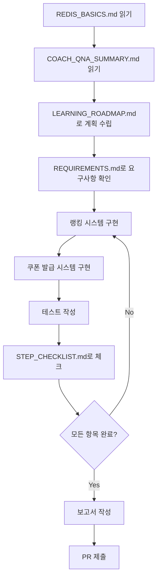

# Week 7 문서 인덱스

## 📚 문서 구조

Week 7 과제(Redis 기반 랭킹 시스템 및 선착순 쿠폰 발급)에 필요한 모든 문서를 제공합니다.

---

## 🎯 학습 순서 (권장)

### 1단계: 기초 학습
1. **[REDIS_BASICS.md](./REDIS_BASICS.md)** ← 시작은 여기서
   - Redis 기본 개념
   - 주요 자료구조 (String, Set, Sorted Set)
   - 원자성, TTL, 키 네이밍 전략
   - Java 사용 예시

2. **[COACH_QNA_SUMMARY.md](./COACH_QNA_SUMMARY.md)**
   - 김종협 코치님 QnA 핵심 요약
   - Redis 단일 스레드 이벤트 루프
   - 랭킹/쿠폰 시스템 설계 핵심
   - 트랜잭션 규칙 (⭐ 중요)

### 2단계: 학습 계획
3. **[LEARNING_ROADMAP.md](./LEARNING_ROADMAP.md)**
   - 10시간 학습 로드맵 (5일 코스)
   - 3시간 압축 학습 가이드
   - 자가진단 체크리스트

### 3단계: 과제 요구사항
4. **[REQUIREMENTS.md](./REQUIREMENTS.md)**
   - Step 13: Ranking Design 요구사항
   - Step 14: Asynchronous Design 요구사항
   - 평가 기준 및 Pass 조건
   - 제출 사항

### 4단계: 구현
5. **구현 가이드 (`agent_docs/` 폴더)**
   - [`agent_docs/redis_ranking.md`](../../agent_docs/redis_ranking.md)
     → Sorted Set 랭킹 시스템 구현 상세
   - [`agent_docs/redis_coupon_issue.md`](../../agent_docs/redis_coupon_issue.md)
     → 선착순 쿠폰 발급 구현 상세 (Lua 스크립트 포함)
   - [`agent_docs/testing_redis_features.md`](../../agent_docs/testing_redis_features.md)
     → Testcontainers 기반 테스트 시나리오

### 5단계: 체크리스트
6. **[STEP_CHECKLIST.md](./STEP_CHECKLIST.md)**
   - Step 13-14 전체 체크리스트
   - 설계/구현/테스트/문서화 단계별 체크
   - 코드 품질 체크리스트
   - PR 제출 전 최종 점검

### 6단계: CLAUDE.md 마이그레이션 (선택)
7. **[CLAUDE_MD_MIGRATION_GUIDE.md](./CLAUDE_MD_MIGRATION_GUIDE.md)**
   - Week 7용 CLAUDE.md 재구성 가이드
   - Before/After 비교
   - Progressive Disclosure 전략
   - agent_docs 폴더 활용법

---

## 📖 문서별 용도

| 문서 | 용도 | 소요 시간 | 필수 여부 |
|------|------|----------|-----------|
| **REDIS_BASICS.md** | Redis 기초 개념 학습 | 30분 | ✅ 필수 |
| **COACH_QNA_SUMMARY.md** | 핵심 개념 및 주의사항 | 20분 | ✅ 필수 |
| **LEARNING_ROADMAP.md** | 학습 계획 수립 | 10분 | ✅ 필수 |
| **REQUIREMENTS.md** | 과제 요구사항 확인 | 15분 | ✅ 필수 |
| **STEP_CHECKLIST.md** | 진행 상황 체크 | 수시 | ✅ 필수 |
| **CLAUDE_MD_MIGRATION_GUIDE.md** | CLAUDE.md 재구성 | 30분 | ⭐ 선택 |

---

## 🎯 빠른 시작 (Quick Start)

### 처음 시작하시나요?
```
1. REDIS_BASICS.md 읽기 (30분)
2. COACH_QNA_SUMMARY.md 읽기 (20분)
3. REQUIREMENTS.md 읽기 (15분)
4. agent_docs/redis_ranking.md 보며 랭킹 구현 (2시간)
5. agent_docs/redis_coupon_issue.md 보며 쿠폰 구현 (2시간)
6. agent_docs/testing_redis_features.md 보며 테스트 작성 (1시간)
7. STEP_CHECKLIST.md 체크하며 마무리 (1시간)
```

### 시간이 부족하신가요? (3시간 코스)
```
1. COACH_QNA_SUMMARY.md 읽기 (20분)
2. LEARNING_ROADMAP.md의 3시간 코스 진행 (3시간)
3. STEP_CHECKLIST.md 체크 (수시)
```

---

## 🔑 핵심 개념 요약

### Redis 사용 원칙
1. **단일 스레드 이벤트 루프:** Lua 스크립트는 짧게
2. **원자적 연산 활용:** ZINCRBY, DECR, SADD
3. **TTL 필수:** 모든 키에 TTL 설정 (메모리 누수 방지)

### 랭킹 시스템
- **자료구조:** Sorted Set
- **갱신 시점:** 결제 완료 시 (주문 생성 ❌)
- **명령어:** ZINCRBY (원자적, 분산락 불필요)

### 쿠폰 발급
- **핵심 규칙:** 수량 차감 + 발급 기록은 **트랜잭션 단위** ⭐
- **실패 시:** 즉시 원복
- **금지 사항:** 스케줄러로 나중에 맞추는 방식 ❌

---

## 📊 문서 맵

```
docs/week7/
├── README.md                          ← 현재 문서 (인덱스)
├── REDIS_BASICS.md                    ← Redis 기초 개념
├── COACH_QNA_SUMMARY.md               ← QnA 핵심 요약
├── LEARNING_ROADMAP.md                ← 학습 로드맵
├── REQUIREMENTS.md                    ← 과제 요구사항
├── STEP_CHECKLIST.md                  ← 진행 체크리스트
└── CLAUDE_MD_MIGRATION_GUIDE.md       ← CLAUDE.md 재구성

agent_docs/
├── redis_ranking.md                   ← 랭킹 구현 상세
├── redis_coupon_issue.md              ← 쿠폰 구현 상세
└── testing_redis_features.md          ← 테스트 가이드

.claude/commands/
├── architecture.md                    ← 레이어드 아키텍처
├── concurrency.md                     ← 동시성 제어
└── testing.md                         ← 테스트 전략
```

---

## ✅ 과제 진행 플로우



---

## 🎓 학습 목표

이 문서들을 모두 학습하면:

### 기초 역량
- [ ] Redis 자료구조 3가지를 설명할 수 있다
- [ ] 단일 스레드 이벤트 루프를 이해한다
- [ ] 원자성이 무엇인지 이해한다
- [ ] TTL을 설정할 수 있다

### 실전 역량
- [ ] Sorted Set으로 랭킹 시스템을 구현할 수 있다
- [ ] Set으로 중복 발급을 방지할 수 있다
- [ ] 트랜잭션 규칙을 지켜 쿠폰 발급을 구현할 수 있다
- [ ] Testcontainers로 통합 테스트를 작성할 수 있다

### 심화 역량
- [ ] Lua 스크립트로 원자적 처리를 구현할 수 있다
- [ ] 동시성 테스트를 작성할 수 있다
- [ ] 성능 최적화 전략을 수립할 수 있다
- [ ] 설계 보고서를 작성할 수 있다

---

## 💡 자주 묻는 질문

### Q1: 어떤 문서부터 읽어야 하나요?
**A:** `REDIS_BASICS.md` → `COACH_QNA_SUMMARY.md` → `REQUIREMENTS.md` 순서로 읽으세요.

### Q2: 시간이 부족한데 어떻게 해야 하나요?
**A:** `LEARNING_ROADMAP.md`의 3시간 압축 코스를 따라가세요.

### Q3: 구현 중 막히면 어떻게 하나요?
**A:** `agent_docs/` 폴더의 구현 가이드를 참조하세요. 코드 예시가 포함되어 있습니다.

### Q4: 테스트는 어떻게 작성하나요?
**A:** `agent_docs/testing_redis_features.md`에 Testcontainers 기반 테스트 시나리오가 있습니다.

### Q5: CLAUDE.md는 꼭 바꿔야 하나요?
**A:** 선택 사항입니다. 하지만 `CLAUDE_MD_MIGRATION_GUIDE.md`를 참조하면 Claude가 과제를 더 잘 도와줄 수 있습니다.

---

## 📚 참고 자료

### 외부 링크
- [Redis 공식 문서](https://redis.io/docs/)
- [Redis Data Types](https://redis.io/docs/data-types/)
- [Sorted Sets](https://redis.io/docs/data-types/sorted-sets/)
- [Testcontainers Redis](https://java.testcontainers.org/modules/databases/redis/)

### 내부 문서
- Week 6 문서: `docs/week6/` (분산락, 캐시 전략 참고)
- Week 4 문서: `docs/week4/` (JPA, N+1 문제 참고)
- 아키텍처 가이드: `.claude/commands/architecture.md`

---

## 🎉 완료 후

과제를 완료했다면:

1. **회고 작성:** KPT 형식으로 회고 작성
2. **보고서 작성:** 설계 및 구현 과정 문서화
3. **PR 제출:** PR 템플릿에 따라 제출
4. **학습 공유:** 팀원들과 학습 내용 공유

---

## ⚡ 바로 시작하기

```bash
# 1. Redis 실행 (Docker)
docker run -d -p 6379:6379 redis:7-alpine

# 2. 프로젝트 빌드
./gradlew clean build

# 3. 테스트 실행
./gradlew test

# 4. 문서 읽기
cat docs/week7/REDIS_BASICS.md
```

**Good luck! 🚀**
