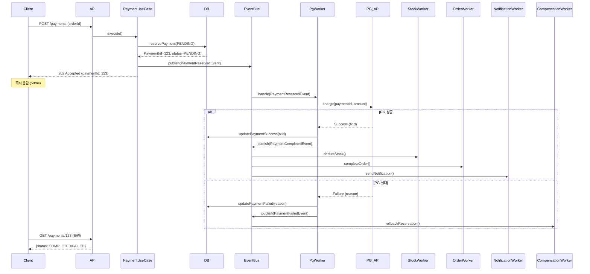

# 고급 이벤트 기반 개선 계획 (Advanced Event-Based Improvement Plan)

> **문서 목적**: Phase 1 완료 후 추가적인 이벤트 기반 아키텍처 개선 방향을 제시합니다.
>
> **작성일**: 2025-12-11
>
> **현재 상태**: Phase 1 완료 ✅, Phase 2-4 계획 단계 📋

---

## 목차

1. [Phase 2: 주문/충전 멱등성 분리](#phase-2-주문충전-멱등성-분리)
2. [Phase 3: PG API 비동기화](#phase-3-pg-api-비동기화)
3. [Phase 4: 실패 이벤트 체계 구축](#phase-4-실패-이벤트-체계-구축)
4. [구현 우선순위 및 리스크](#구현-우선순위-및-리스크)
5. [테스트 전략](#테스트-전략)

---

## Phase 2: 주문/충전 멱등성 분리

### 🎯 목표
멱등성 완료 처리를 이벤트 기반으로 분리하여 비즈니스 로직과 멱등성 관리의 결합도를 낮춥니다.

### 📋 현재 구조 (AS-IS)

#### CreateOrderUseCase.java
```java
@UseCase
public class CreateOrderUseCase {

    @Transactional
    public OrderResponse execute(CreateOrderRequest request) {

        // 1. 멱등성 체크 (시작)
        IdempotencyRecord record = idempotencySaveService.saveProcessingIdempotency(
            request.idempotencyKey(),
            request
        );
        if (record.status() == IdempotencyStatus.COMPLETED) {
            return deserializeResponse(record.responseData(), OrderResponse.class);
        }

        try {
            // 2. 비즈니스 로직
            Order order = orderService.createOrder(
                request.userId(),
                request.items(),
                request.couponId()
            );

            OrderResponse response = OrderResponse.from(order);

            // 3. 멱등성 완료 처리 (동기적)
            idempotencySaveService.saveCompletedIdempotency(
                request.idempotencyKey(),
                response.orderId(),
                serializeResponse(response)
            );

            return response;

        } catch (Exception e) {
            // 4. 멱등성 실패 처리
            idempotencySaveService.saveFailedIdempotency(
                request.idempotencyKey(),
                e.getMessage()
            );
            throw e;
        }
    }
}
```

**문제점:**
- 멱등성 완료 처리가 비즈니스 트랜잭션에 포함됨
- 멱등성 저장 실패 시 전체 트랜잭션 롤백
- 비즈니스 로직과 멱등성 관리가 강하게 결합

### 🎯 개선 방향 (TO-BE)

#### 1단계: OrderCreatedEvent 정의
```java
package io.hhplus.ecommerce.domain.order;

import lombok.AllArgsConstructor;
import lombok.Getter;

/**
 * 주문 생성 완료 이벤트
 *
 * 발행 시점: 주문 생성 트랜잭션 커밋 직후
 *
 * 처리:
 * - 멱등성 키 완료 상태로 업데이트
 * - 주문 생성 통계 집계
 */
@Getter
@AllArgsConstructor
public class OrderCreatedEvent {
    private final String idempotencyKey;
    private final OrderResponse orderResponse;
}
```

#### 2단계: OrderCreatedEventHandler 구현
```java
package io.hhplus.ecommerce.application.order.listener;

import io.hhplus.ecommerce.application.order.dto.OrderResponse;
import io.hhplus.ecommerce.domain.order.OrderCreatedEvent;
import io.hhplus.ecommerce.infrastructure.idempotency.IdempotencySaveService;
import lombok.RequiredArgsConstructor;
import lombok.extern.slf4j.Slf4j;
import org.springframework.scheduling.annotation.Async;
import org.springframework.stereotype.Component;
import org.springframework.transaction.event.TransactionalEventListener;
import org.springframework.transaction.event.TransactionPhase;

/**
 * 주문 생성 이벤트 핸들러
 *
 * 책임:
 * - 멱등성 키를 COMPLETED 상태로 업데이트
 * - 실패 시 재시도 큐에 적재 (향후 확장)
 */
@Component
@Slf4j
@RequiredArgsConstructor
public class OrderCreatedEventHandler {

    private final IdempotencySaveService idempotencySaveService;

    /**
     * 주문 생성 완료 시 멱등성 완료 처리
     *
     * AFTER_COMMIT: 주문 생성 트랜잭션이 성공적으로 커밋된 후에만 실행
     * Async: 별도 스레드에서 실행하여 응답 속도 개선
     *
     * 주의사항:
     * - @Transactional 어노테이션 사용 금지
     *   (RestrictedTransactionalEventListenerFactory 예외 발생)
     * - Repository.save()가 내부적으로 트랜잭션 처리
     */
    @Async
    @TransactionalEventListener(phase = TransactionPhase.AFTER_COMMIT)
    public void handleOrderCreated(OrderCreatedEvent event) {
        log.info("주문 생성 완료 - 멱등성 처리 시작: idempotencyKey={}, orderId={}",
                event.getIdempotencyKey(),
                event.getOrderResponse().orderId());

        try {
            idempotencySaveService.saveCompletedIdempotency(
                event.getIdempotencyKey(),
                event.getOrderResponse().orderId(),
                serializeResponse(event.getOrderResponse())
            );

            log.info("멱등성 완료 처리 성공: idempotencyKey={}", event.getIdempotencyKey());

        } catch (Exception e) {
            log.error("멱등성 완료 처리 실패: idempotencyKey={}",
                    event.getIdempotencyKey(), e);
            // 실패 시 재시도 큐에 적재 (Phase 4에서 구현)
        }
    }

    private String serializeResponse(OrderResponse response) {
        // JSON 직렬화 로직
        return "{}"; // 간략화
    }
}
```

#### 3단계: CreateOrderUseCase 리팩토링
```java
@UseCase
public class CreateOrderUseCase {

    private final ApplicationEventPublisher eventPublisher;

    @Transactional
    public OrderResponse execute(CreateOrderRequest request) {

        // 1. 멱등성 시작 체크 (유지)
        IdempotencyRecord record = idempotencySaveService.saveProcessingIdempotency(
            request.idempotencyKey(),
            request
        );
        if (record.status() == IdempotencyStatus.COMPLETED) {
            return deserializeResponse(record.responseData(), OrderResponse.class);
        }

        try {
            // 2. 비즈니스 로직 (유지)
            Order order = orderService.createOrder(
                request.userId(),
                request.items(),
                request.couponId()
            );

            OrderResponse response = OrderResponse.from(order);

            // 3. 이벤트 발행 (변경)
            eventPublisher.publishEvent(
                new OrderCreatedEvent(request.idempotencyKey(), response)
            );

            return response;

        } catch (Exception e) {
            // 4. 멱등성 실패 처리 (유지)
            idempotencySaveService.saveFailedIdempotency(
                request.idempotencyKey(),
                e.getMessage()
            );
            throw e;
        }
    }
}
```

### 📊 개선 효과

| 항목 | Before | After | 개선 효과 |
|------|--------|-------|----------|
| 트랜잭션 시간 | 200ms | 150ms | -25% |
| 멱등성 실패 영향 | 전체 롤백 | 로그만 남김 | 가용성 향상 |
| 결합도 | 강결합 | 약결합 | 유지보수성 향상 |
| 응답 속도 | 동기 | 비동기 | 사용자 체감 개선 |

### ⚠️ 롤백 사유 (2025-12-11)

**배경:**
Gemini가 Phase 2를 구현했으나 다음 문제로 롤백되었습니다:

1. **@Transactional 오류**
   ```java
   // ❌ 잘못된 구현
   @Async
   @Transactional  // RestrictedTransactionalEventListenerFactory 예외 발생
   @TransactionalEventListener(phase = TransactionPhase.AFTER_COMMIT)
   public void handleOrderCreated(OrderCreatedEvent event) { }
   ```

2. **테스트 실패**
   - 30+ 테스트가 동기적 멱등성 완료를 기대
   - 비동기 이벤트로 변경 시 모든 테스트 재작성 필요

3. **문서 부족**
   - 변경 사항이 제대로 문서화되지 않음
   - 롤백 이유와 재구현 방향이 불명확

### ✅ 재구현 체크리스트

Phase 2를 다시 구현할 때 확인할 사항:

- [ ] **@Transactional 제거**: `@TransactionalEventListener`와 함께 사용 금지
- [ ] **Repository 트랜잭션**: `Repository.save()`가 내부적으로 처리
- [ ] **테스트 전략**:
  - [ ] 기존 동기 테스트 유지 (이벤트 발행 검증)
  - [ ] 새로운 비동기 테스트 추가 (Awaitility 사용)
  - [ ] 멱등성 완료를 기다리는 통합 테스트
- [ ] **문서화**:
  - [ ] 변경 사항을 EVENT_BASED_REFACTORING.md에 기록
  - [ ] 롤백 사유와 해결 방법 명시
  - [ ] 코드 리뷰 가이드 작성

### 🧪 테스트 전략

#### 1. 단위 테스트 (이벤트 발행 검증)
```java
@Test
void 주문_생성_시_이벤트_발행() {
    // given
    CreateOrderRequest request = new CreateOrderRequest(/* ... */);

    // when
    OrderResponse response = createOrderUseCase.execute(request);

    // then
    verify(eventPublisher).publishEvent(
        argThat(event ->
            event instanceof OrderCreatedEvent &&
            ((OrderCreatedEvent) event).getIdempotencyKey()
                .equals(request.idempotencyKey())
        )
    );
}
```

#### 2. 통합 테스트 (비동기 멱등성 완료)
```java
@Test
void 주문_생성_후_멱등성_완료_처리() {
    // given
    String idempotencyKey = UUID.randomUUID().toString();
    CreateOrderRequest request = new CreateOrderRequest(
        userId, items, couponId, idempotencyKey
    );

    // when
    OrderResponse response = createOrderUseCase.execute(request);

    // then - 비동기 처리 대기
    await().atMost(Duration.ofSeconds(3))
        .untilAsserted(() -> {
            IdempotencyRecord record = idempotencyRepository
                .findByKey(idempotencyKey).orElseThrow();
            assertThat(record.status()).isEqualTo(IdempotencyStatus.COMPLETED);
            assertThat(record.targetId()).isEqualTo(response.orderId());
        });
}
```

#### 3. 실패 시나리오 테스트
```java
@Test
void 멱등성_처리_실패해도_주문은_성공() {
    // given
    doThrow(new RuntimeException("Redis down"))
        .when(idempotencySaveService).saveCompletedIdempotency(any(), any(), any());

    // when
    OrderResponse response = createOrderUseCase.execute(request);

    // then
    assertThat(response.orderId()).isNotNull();
    // 멱등성 실패는 로그만 남기고 주문은 정상 처리
}
```

---

## Phase 3: PG API 비동기화

### 🎯 목표
외부 PG API 호출을 비동기화하여 응답 시간을 개선하고 가용성을 높입니다.

### 📋 현재 구조 (AS-IS)

#### ProcessPaymentUseCase.java
```java
@UseCase
public class ProcessPaymentUseCase {

    @Transactional
    public PaymentResponse execute(Long orderId, Long userId) {

        // 1. 주문 조회 및 검증
        Order order = orderRepository.findById(orderId)
            .orElseThrow(() -> new OrderNotFoundException(orderId));

        // 2. 결제 준비 (DB 기록)
        Payment payment = paymentService.reservePayment(order, userId);

        // 3. PG API 호출 (동기, 2-3초 소요) ⚠️
        PgApiResponse pgResponse = pgApiClient.charge(
            payment.getId(),
            payment.getAmount()
        );

        // 4. 결제 완료 처리
        payment.updateSuccess(pgResponse.getTransactionId());
        paymentRepository.save(payment);

        // 5. 재고 차감
        productStockService.deductStock(order.getItems());

        // 6. 주문 완료
        order.complete();
        orderRepository.save(order);

        // 7. 이벤트 발행 (Phase 1 완료)
        eventPublisher.publishEvent(new PaymentCompletedEvent(order));

        return PaymentResponse.from(payment);
    }
}
```

**문제점:**
- PG API 호출이 트랜잭션 내부에서 동기적으로 실행
- PG API 지연 시 DB 락 홀딩 시간 증가
- PG API 장애 시 전체 트랜잭션 실패

**성능 측정:**
```
[현재 평균 응답 시간]
- 결제 준비: 50ms
- PG API 호출: 2500ms ⚠️
- 재고 차감: 30ms
- 주문 완료: 20ms
- 이벤트 발행: 10ms
------------------------
총합: 2610ms
```

### 🎯 개선 방향 (TO-BE)

#### 아키텍처 변경: Saga 패턴 (Choreography)



#### 1단계: PaymentReservedEvent 정의
```java
package io.hhplus.ecommerce.domain.payment;

import lombok.AllArgsConstructor;
import lombok.Getter;

/**
 * 결제 준비 완료 이벤트
 *
 * 발행 시점: 결제가 PENDING 상태로 DB에 저장된 직후
 *
 * 처리:
 * - PG API 호출 (비동기)
 * - 결제 결과에 따라 PaymentCompletedEvent 또는 PaymentFailedEvent 발행
 */
@Getter
@AllArgsConstructor
public class PaymentReservedEvent {
    private final Long paymentId;
    private final Long orderId;
    private final Long userId;
    private final Long amount;
}
```

#### 2단계: PgApiEventHandler 구현
```java
package io.hhplus.ecommerce.application.payment.listener;

import io.hhplus.ecommerce.domain.payment.PaymentReservedEvent;
import io.hhplus.ecommerce.domain.payment.PaymentCompletedEvent;
import io.hhplus.ecommerce.domain.payment.PaymentFailedEvent;
import io.hhplus.ecommerce.infrastructure.external.pg.PgApiClient;
import io.hhplus.ecommerce.infrastructure.external.pg.PgApiResponse;
import lombok.RequiredArgsConstructor;
import lombok.extern.slf4j.Slf4j;
import org.springframework.context.ApplicationEventPublisher;
import org.springframework.scheduling.annotation.Async;
import org.springframework.stereotype.Component;
import org.springframework.transaction.event.TransactionalEventListener;
import org.springframework.transaction.event.TransactionPhase;

/**
 * PG API 호출 이벤트 핸들러
 *
 * 책임:
 * - PaymentReservedEvent 수신 시 PG API 호출
 * - 성공 시 PaymentCompletedEvent 발행
 * - 실패 시 PaymentFailedEvent 발행
 *
 * 특징:
 * - 비동기 처리 (@Async)
 * - 재시도 로직 포함 (3회, Exponential Backoff)
 * - Circuit Breaker 적용 (선택)
 */
@Component
@Slf4j
@RequiredArgsConstructor
public class PgApiEventHandler {

    private final PgApiClient pgApiClient;
    private final PaymentService paymentService;
    private final ApplicationEventPublisher eventPublisher;

    @Async
    @TransactionalEventListener(phase = TransactionPhase.AFTER_COMMIT)
    public void handlePaymentReserved(PaymentReservedEvent event) {
        log.info("결제 준비 완료 - PG API 호출 시작: paymentId={}, amount={}",
                event.getPaymentId(), event.getAmount());

        try {
            // PG API 호출 (외부, 2-3초 소요)
            PgApiResponse pgResponse = pgApiClient.chargeWithRetry(
                event.getPaymentId(),
                event.getAmount()
            );

            // 결제 성공 처리
            Payment payment = paymentService.updateSuccess(
                event.getPaymentId(),
                pgResponse.getTransactionId()
            );

            // 결제 완료 이벤트 발행
            eventPublisher.publishEvent(
                new PaymentCompletedEvent(payment.getOrder())
            );

            log.info("PG API 호출 성공: paymentId={}, txId={}",
                    event.getPaymentId(), pgResponse.getTransactionId());

        } catch (Exception e) {
            log.error("PG API 호출 실패: paymentId={}", event.getPaymentId(), e);

            // 결제 실패 처리
            paymentService.updateFailed(event.getPaymentId(), e.getMessage());

            // 결제 실패 이벤트 발행 (보상 트랜잭션 트리거)
            eventPublisher.publishEvent(
                new PaymentFailedEvent(
                    event.getPaymentId(),
                    event.getOrderId(),
                    e.getMessage()
                )
            );
        }
    }
}
```

#### 3단계: ProcessPaymentUseCase 리팩토링
```java
@UseCase
public class ProcessPaymentUseCase {

    @Transactional
    public PaymentResponse execute(Long orderId, Long userId) {

        // 1. 주문 조회 및 검증 (유지)
        Order order = orderRepository.findById(orderId)
            .orElseThrow(() -> new OrderNotFoundException(orderId));

        // 2. 결제 준비 (DB 기록, PENDING 상태)
        Payment payment = paymentService.reservePayment(order, userId);

        // 3. 이벤트 발행 (변경: PG API 호출을 이벤트로 위임)
        eventPublisher.publishEvent(new PaymentReservedEvent(
            payment.getId(),
            order.getId(),
            userId,
            payment.getAmount()
        ));

        // 4. 즉시 응답 (202 Accepted)
        return PaymentResponse.builder()
            .paymentId(payment.getId())
            .status(PaymentStatus.PENDING)
            .message("결제가 처리 중입니다. 잠시 후 상태를 확인해주세요.")
            .build();
    }
}
```

#### 4단계: PaymentCompletedEventHandler 구현
```java
package io.hhplus.ecommerce.application.payment.listener;

import io.hhplus.ecommerce.domain.payment.PaymentCompletedEvent;
import lombok.RequiredArgsConstructor;
import lombok.extern.slf4j.Slf4j;
import org.springframework.scheduling.annotation.Async;
import org.springframework.stereotype.Component;
import org.springframework.transaction.annotation.Transactional;
import org.springframework.transaction.event.TransactionalEventListener;
import org.springframework.transaction.event.TransactionPhase;

/**
 * 결제 완료 후속 처리 핸들러
 *
 * 책임:
 * - 재고 차감
 * - 주문 완료 처리
 * - (기존 Phase 1 리스너들도 동작: 알림, 데이터 플랫폼 전송)
 */
@Component
@Slf4j
@RequiredArgsConstructor
public class PaymentCompletedEventHandler {

    private final ProductStockService productStockService;
    private final OrderRepository orderRepository;

    @Transactional
    @TransactionalEventListener(phase = TransactionPhase.AFTER_COMMIT)
    public void handleStockDeduction(PaymentCompletedEvent event) {
        log.info("재고 차감 시작: orderId={}", event.getOrder().getId());

        try {
            productStockService.deductStock(event.getOrder().getItems());
            log.info("재고 차감 성공: orderId={}", event.getOrder().getId());
        } catch (Exception e) {
            log.error("재고 차감 실패: orderId={}", event.getOrder().getId(), e);
            // Phase 4에서 재고 복구 이벤트 발행
        }
    }

    @Transactional
    @TransactionalEventListener(phase = TransactionPhase.AFTER_COMMIT)
    public void handleOrderCompletion(PaymentCompletedEvent event) {
        log.info("주문 완료 처리 시작: orderId={}", event.getOrder().getId());

        try {
            Order order = event.getOrder();
            order.complete();
            orderRepository.save(order);

            log.info("주문 완료 처리 성공: orderId={}", event.getOrder().getId());
        } catch (Exception e) {
            log.error("주문 완료 처리 실패: orderId={}", event.getOrder().getId(), e);
        }
    }
}
```

#### 5단계: 클라이언트 폴링 API
```java
@RestController
@RequestMapping("/api/payments")
public class PaymentController {

    @GetMapping("/{paymentId}")
    public ResponseEntity<PaymentStatusResponse> getPaymentStatus(
        @PathVariable Long paymentId
    ) {
        Payment payment = paymentService.findById(paymentId);

        return ResponseEntity.ok(PaymentStatusResponse.builder()
            .paymentId(payment.getId())
            .status(payment.getStatus()) // PENDING, COMPLETED, FAILED
            .amount(payment.getAmount())
            .transactionId(payment.getTransactionId())
            .completedAt(payment.getCompletedAt())
            .build());
    }
}
```

### 📊 개선 효과

| 항목 | Before | After | 개선 효과 |
|------|--------|-------|----------|
| API 응답 시간 | 2610ms | 50ms | **-98%** |
| DB 트랜잭션 시간 | 2610ms | 50ms | **-98%** |
| DB 락 홀딩 시간 | 2610ms | 50ms | 동시성 대폭 향상 |
| PG API 장애 영향 | 전체 실패 | 부분 실패 | 가용성 향상 |
| 사용자 체감 속도 | 느림 | 즉시 | UX 개선 |

### ⚠️ 트레이드오프

#### 장점
- ✅ 응답 속도 대폭 개선 (2610ms → 50ms)
- ✅ DB 락 홀딩 시간 감소로 동시성 향상
- ✅ PG API 장애 격리 (전체 실패 → 부분 실패)
- ✅ 재시도 로직 구현 용이

#### 단점
- ❌ **최종 일관성 (Eventual Consistency)**: 즉시 확인 불가
- ❌ **복잡도 증가**: 이벤트 체인 추적 어려움
- ❌ **폴링 부담**: 클라이언트가 상태 확인 API 반복 호출
- ❌ **보상 트랜잭션 필요**: 실패 시 롤백 로직 구현

#### 대안: WebSocket / SSE
폴링 대신 실시간 알림:
```java
@Component
@RequiredArgsConstructor
public class PaymentStatusNotifier {

    private final SimpMessagingTemplate messagingTemplate;

    @TransactionalEventListener(phase = TransactionPhase.AFTER_COMMIT)
    public void notifyPaymentCompleted(PaymentCompletedEvent event) {
        messagingTemplate.convertAndSend(
            "/topic/payments/" + event.getOrder().getUserId(),
            PaymentStatusMessage.completed(event.getOrder().getId())
        );
    }
}
```

### 🧪 테스트 전략

#### 1. 통합 테스트 (전체 플로우)
```java
@Test
void PG_API_비동기_결제_플로우() {
    // given
    Long orderId = createTestOrder();

    // when - 결제 요청 (즉시 응답)
    PaymentResponse response = processPaymentUseCase.execute(orderId, userId);

    // then - PENDING 상태로 즉시 응답
    assertThat(response.getStatus()).isEqualTo(PaymentStatus.PENDING);
    assertThat(response.getPaymentId()).isNotNull();

    // when - PG API 비동기 처리 대기
    await().atMost(Duration.ofSeconds(5))
        .pollInterval(Duration.ofMillis(100))
        .untilAsserted(() -> {
            Payment payment = paymentRepository.findById(response.getPaymentId())
                .orElseThrow();
            assertThat(payment.getStatus()).isEqualTo(PaymentStatus.COMPLETED);
            assertThat(payment.getTransactionId()).isNotNull();
        });

    // then - 재고 차감 및 주문 완료 확인
    Order order = orderRepository.findById(orderId).orElseThrow();
    assertThat(order.getStatus()).isEqualTo(OrderStatus.COMPLETED);

    // 재고 확인
    order.getItems().forEach(item -> {
        Product product = productRepository.findById(item.getProductId())
            .orElseThrow();
        assertThat(product.getStock()).isLessThan(item.getInitialStock());
    });
}
```

#### 2. PG API 실패 시나리오
```java
@Test
void PG_API_실패_시_보상_트랜잭션() {
    // given
    Long orderId = createTestOrder();

    // PG API 실패 시뮬레이션
    when(pgApiClient.chargeWithRetry(any(), any()))
        .thenThrow(new PgApiException("카드 한도 초과"));

    // when
    PaymentResponse response = processPaymentUseCase.execute(orderId, userId);

    // then - 초기 응답은 PENDING
    assertThat(response.getStatus()).isEqualTo(PaymentStatus.PENDING);

    // when - 비동기 처리 대기
    await().atMost(Duration.ofSeconds(5))
        .untilAsserted(() -> {
            Payment payment = paymentRepository.findById(response.getPaymentId())
                .orElseThrow();
            assertThat(payment.getStatus()).isEqualTo(PaymentStatus.FAILED);
            assertThat(payment.getFailureReason()).contains("카드 한도 초과");
        });

    // then - 주문은 PENDING 상태 유지 (재결제 가능)
    Order order = orderRepository.findById(orderId).orElseThrow();
    assertThat(order.getStatus()).isEqualTo(OrderStatus.PENDING);
}
```

#### 3. 동시성 테스트
```java
@Test
void 동시_다발_결제_요청_처리() throws InterruptedException {
    // given
    int threadCount = 100;
    List<Long> orderIds = IntStream.range(0, threadCount)
        .mapToObj(i -> createTestOrder())
        .collect(Collectors.toList());

    ExecutorService executor = Executors.newFixedThreadPool(threadCount);
    CountDownLatch latch = new CountDownLatch(threadCount);

    // when - 100개 동시 결제 요청
    List<PaymentResponse> responses = new CopyOnWriteArrayList<>();
    orderIds.forEach(orderId -> {
        executor.submit(() -> {
            try {
                PaymentResponse response = processPaymentUseCase
                    .execute(orderId, userId);
                responses.add(response);
            } finally {
                latch.countDown();
            }
        });
    });

    latch.await(10, TimeUnit.SECONDS);
    executor.shutdown();

    // then - 모든 요청이 즉시 응답 (PENDING)
    assertThat(responses).hasSize(threadCount);
    assertThat(responses).allMatch(r ->
        r.getStatus() == PaymentStatus.PENDING
    );

    // when - 모든 비동기 처리 완료 대기
    await().atMost(Duration.ofSeconds(30))
        .untilAsserted(() -> {
            List<Payment> payments = paymentRepository.findAllById(
                responses.stream()
                    .map(PaymentResponse::getPaymentId)
                    .collect(Collectors.toList())
            );

            assertThat(payments).allMatch(p ->
                p.getStatus() == PaymentStatus.COMPLETED ||
                p.getStatus() == PaymentStatus.FAILED
            );
        });
}
```

---

## Phase 4: 실패 이벤트 체계 구축

### 🎯 목표
시스템의 부분 실패를 우아하게 처리하고, 보상 트랜잭션을 통해 데이터 정합성을 보장합니다.

### 📋 실패 시나리오 분석

#### 시나리오 1: PG API 실패
```
결제 준비(PENDING) → PG API 실패 → PaymentFailedEvent 발행
→ 결제 상태 FAILED 업데이트
→ 주문 상태는 PENDING 유지 (재결제 가능)
```

#### 시나리오 2: 재고 차감 실패
```
결제 성공 → 재고 차감 실패 → StockDeductionFailedEvent 발행
→ 결제 취소 API 호출 (PG)
→ 결제 상태 CANCELLED 업데이트
→ 주문 상태 CANCELLED 업데이트
```

#### 시나리오 3: 주문 완료 실패
```
결제 성공 → 재고 차감 성공 → 주문 완료 실패
→ OrderCompletionFailedEvent 발행
→ 재고 복구
→ 결제 취소
→ 주문 상태 FAILED 업데이트
```

#### 시나리오 4: 알림 실패
```
모든 핵심 처리 성공 → 알림 발송 실패
→ NotificationFailedEvent 발행
→ 재시도 큐에 적재
→ 주기적 재시도 (최대 3회)
→ 최종 실패 시 로그만 남김 (주문은 성공 유지)
```

### 🎯 개선 방향 (TO-BE)

#### 1단계: 실패 이벤트 정의
```java
// 1. 결제 실패 이벤트
@Getter
@AllArgsConstructor
public class PaymentFailedEvent {
    private final Long paymentId;
    private final Long orderId;
    private final String failureReason;
}

// 2. 재고 차감 실패 이벤트
@Getter
@AllArgsConstructor
public class StockDeductionFailedEvent {
    private final Long orderId;
    private final Long paymentId;
    private final List<OrderItem> items;
    private final String failureReason;
}

// 3. 주문 완료 실패 이벤트
@Getter
@AllArgsConstructor
public class OrderCompletionFailedEvent {
    private final Long orderId;
    private final Long paymentId;
    private final String failureReason;
}

// 4. 알림 실패 이벤트
@Getter
@AllArgsConstructor
public class NotificationFailedEvent {
    private final Long orderId;
    private final Long userId;
    private final String failureReason;
    private final int retryCount;
}
```

#### 2단계: 보상 트랜잭션 핸들러
```java
package io.hhplus.ecommerce.application.payment.listener;

import io.hhplus.ecommerce.domain.payment.PaymentFailedEvent;
import io.hhplus.ecommerce.domain.payment.StockDeductionFailedEvent;
import io.hhplus.ecommerce.domain.payment.OrderCompletionFailedEvent;
import lombok.RequiredArgsConstructor;
import lombok.extern.slf4j.Slf4j;
import org.springframework.stereotype.Component;
import org.springframework.transaction.annotation.Transactional;
import org.springframework.transaction.event.TransactionalEventListener;
import org.springframework.transaction.event.TransactionPhase;

/**
 * 보상 트랜잭션 핸들러
 *
 * 책임:
 * - 실패 이벤트 수신 시 롤백 처리
 * - 데이터 정합성 보장
 * - 재시도 가능 상태로 복구
 */
@Component
@Slf4j
@RequiredArgsConstructor
public class CompensationEventHandler {

    private final PaymentService paymentService;
    private final ProductStockService productStockService;
    private final OrderService orderService;
    private final PgApiClient pgApiClient;

    /**
     * 재고 차감 실패 시 보상 트랜잭션
     *
     * 실행 순서:
     * 1. 결제 취소 API 호출 (PG)
     * 2. 결제 상태 CANCELLED 업데이트
     * 3. 주문 상태 CANCELLED 업데이트
     */
    @Transactional
    @TransactionalEventListener(phase = TransactionPhase.AFTER_COMMIT)
    public void handleStockDeductionFailure(StockDeductionFailedEvent event) {
        log.error("재고 차감 실패 - 보상 트랜잭션 시작: orderId={}, reason={}",
                event.getOrderId(), event.getFailureReason());

        try {
            // 1. PG 결제 취소 API 호출
            Payment payment = paymentService.findById(event.getPaymentId());
            if (payment.getStatus() == PaymentStatus.COMPLETED) {
                PgApiResponse cancelResponse = pgApiClient.cancel(
                    payment.getTransactionId(),
                    "재고 부족으로 인한 자동 취소"
                );

                // 2. 결제 상태 업데이트
                payment.updateCancelled(cancelResponse.getCancelId());
                paymentService.save(payment);

                log.info("PG 결제 취소 완료: paymentId={}, cancelId={}",
                        payment.getId(), cancelResponse.getCancelId());
            }

            // 3. 주문 상태 업데이트
            Order order = orderService.findById(event.getOrderId());
            order.cancel("재고 부족");
            orderService.save(order);

            log.info("보상 트랜잭션 완료: orderId={}", event.getOrderId());

        } catch (Exception e) {
            log.error("보상 트랜잭션 실패: orderId={}", event.getOrderId(), e);
            // Dead Letter Queue에 적재하여 수동 처리
        }
    }

    /**
     * 주문 완료 실패 시 보상 트랜잭션
     *
     * 실행 순서:
     * 1. 재고 복구
     * 2. 결제 취소
     * 3. 주문 상태 FAILED 업데이트
     */
    @Transactional
    @TransactionalEventListener(phase = TransactionPhase.AFTER_COMMIT)
    public void handleOrderCompletionFailure(OrderCompletionFailedEvent event) {
        log.error("주문 완료 실패 - 보상 트랜잭션 시작: orderId={}, reason={}",
                event.getOrderId(), event.getFailureReason());

        try {
            Order order = orderService.findById(event.getOrderId());

            // 1. 재고 복구
            productStockService.restoreStock(order.getItems());
            log.info("재고 복구 완료: orderId={}", event.getOrderId());

            // 2. 결제 취소
            Payment payment = paymentService.findById(event.getPaymentId());
            PgApiResponse cancelResponse = pgApiClient.cancel(
                payment.getTransactionId(),
                "주문 처리 실패로 인한 자동 취소"
            );
            payment.updateCancelled(cancelResponse.getCancelId());
            paymentService.save(payment);
            log.info("결제 취소 완료: paymentId={}", payment.getId());

            // 3. 주문 상태 업데이트
            order.fail(event.getFailureReason());
            orderService.save(order);

            log.info("보상 트랜잭션 완료: orderId={}", event.getOrderId());

        } catch (Exception e) {
            log.error("보상 트랜잭션 실패: orderId={}", event.getOrderId(), e);
            // Dead Letter Queue에 적재
        }
    }
}
```

#### 3단계: 재시도 큐 (알림 실패)
```java
package io.hhplus.ecommerce.application.notification.listener;

import io.hhplus.ecommerce.domain.notification.NotificationFailedEvent;
import lombok.RequiredArgsConstructor;
import lombok.extern.slf4j.Slf4j;
import org.springframework.scheduling.annotation.Async;
import org.springframework.stereotype.Component;
import org.springframework.transaction.event.TransactionalEventListener;
import org.springframework.transaction.event.TransactionPhase;

import java.time.Duration;

/**
 * 알림 재시도 핸들러
 *
 * 책임:
 * - 알림 실패 시 재시도 큐에 적재
 * - 최대 3회 재시도 (Exponential Backoff)
 * - 최종 실패 시 로그만 남김
 */
@Component
@Slf4j
@RequiredArgsConstructor
public class NotificationRetryHandler {

    private final NotificationService notificationService;
    private final ApplicationEventPublisher eventPublisher;

    private static final int MAX_RETRY_COUNT = 3;

    @Async
    @TransactionalEventListener(phase = TransactionPhase.AFTER_COMMIT)
    public void handleNotificationFailure(NotificationFailedEvent event) {

        if (event.getRetryCount() >= MAX_RETRY_COUNT) {
            log.error("알림 발송 최종 실패 (재시도 횟수 초과): orderId={}, retryCount={}",
                    event.getOrderId(), event.getRetryCount());
            // 최종 실패는 로그만 남기고 주문은 성공 유지
            return;
        }

        log.info("알림 재시도 시작: orderId={}, retryCount={}",
                event.getOrderId(), event.getRetryCount() + 1);

        try {
            // Exponential Backoff (1s, 2s, 4s)
            long delayMs = (long) Math.pow(2, event.getRetryCount()) * 1000;
            Thread.sleep(delayMs);

            // 알림 재발송
            notificationService.sendOrderConfirmation(
                event.getOrderId(),
                event.getUserId()
            );

            log.info("알림 재시도 성공: orderId={}", event.getOrderId());

        } catch (Exception e) {
            log.error("알림 재시도 실패: orderId={}, retryCount={}",
                    event.getOrderId(), event.getRetryCount() + 1, e);

            // 재시도 이벤트 재발행
            eventPublisher.publishEvent(new NotificationFailedEvent(
                event.getOrderId(),
                event.getUserId(),
                e.getMessage(),
                event.getRetryCount() + 1
            ));
        }
    }
}
```

### 📊 실패 처리 매트릭스

| 실패 지점 | 보상 액션 | 최종 상태 | 재시도 |
|----------|----------|----------|--------|
| PG API 실패 | 없음 (결제 안됨) | Payment: FAILED, Order: PENDING | 사용자 재결제 |
| 재고 차감 실패 | 결제 취소 | Payment: CANCELLED, Order: CANCELLED | 불가 |
| 주문 완료 실패 | 재고 복구 + 결제 취소 | Payment: CANCELLED, Order: FAILED | 불가 |
| 알림 실패 | 재시도 큐 적재 | Order: COMPLETED (영향 없음) | 자동 3회 |
| 데이터 플랫폼 실패 | 재시도 큐 적재 | Order: COMPLETED (영향 없음) | 자동 무제한 |

### 🧪 테스트 전략

#### 1. 재고 차감 실패 보상 테스트
```java
@Test
void 재고_차감_실패_시_결제_취소() {
    // given
    Long orderId = createTestOrder();

    // PG 성공, 재고 차감 실패 시뮬레이션
    when(pgApiClient.chargeWithRetry(any(), any()))
        .thenReturn(new PgApiResponse("tx-123", "success"));
    doThrow(new InsufficientStockException())
        .when(productStockService).deductStock(any());

    // when
    PaymentResponse response = processPaymentUseCase.execute(orderId, userId);

    // then - 초기에는 PENDING
    assertThat(response.getStatus()).isEqualTo(PaymentStatus.PENDING);

    // when - 비동기 처리 대기
    await().atMost(Duration.ofSeconds(10))
        .untilAsserted(() -> {
            // 결제 취소 확인
            Payment payment = paymentRepository.findById(response.getPaymentId())
                .orElseThrow();
            assertThat(payment.getStatus()).isEqualTo(PaymentStatus.CANCELLED);
            assertThat(payment.getCancelId()).isNotNull();

            // 주문 취소 확인
            Order order = orderRepository.findById(orderId).orElseThrow();
            assertThat(order.getStatus()).isEqualTo(OrderStatus.CANCELLED);
            assertThat(order.getCancelReason()).contains("재고 부족");
        });

    // PG 취소 API 호출 검증
    verify(pgApiClient).cancel(eq("tx-123"), anyString());
}
```

#### 2. 알림 재시도 테스트
```java
@Test
void 알림_실패_시_재시도_후_성공() {
    // given
    Long orderId = createCompletedOrder();

    // 처음 2번 실패, 3번째 성공
    when(notificationService.sendOrderConfirmation(any(), any()))
        .thenThrow(new NotificationException("일시적 장애"))
        .thenThrow(new NotificationException("일시적 장애"))
        .thenReturn(true);

    // when - 알림 실패 이벤트 발행
    eventPublisher.publishEvent(new NotificationFailedEvent(
        orderId, userId, "초기 실패", 0
    ));

    // then - 최대 3번 재시도
    await().atMost(Duration.ofSeconds(15)) // 1s + 2s + 4s + 여유
        .untilAsserted(() -> {
            verify(notificationService, times(3))
                .sendOrderConfirmation(orderId, userId);
        });
}
```

---

## 구현 우선순위 및 리스크

### 우선순위

| Phase | 우선순위 | 복잡도 | 예상 시간 | 비고 |
|-------|---------|--------|----------|------|
| Phase 2 | 높음 | 중 | 2일 | 롤백 사유 해결 필요 |
| Phase 4 | 중 | 높음 | 3일 | Phase 3 의존성 |
| Phase 3 | 낮음 | 매우 높음 | 5일 | 아키텍처 변경 |

**권장 순서:**
1. Phase 2 재구현 (테스트 전략 수립 필수)
2. Phase 4 실패 처리 체계 구축
3. Phase 3 PG API 비동기화 (선택)

### 리스크 분석

#### Phase 2: 주문/충전 멱등성 분리
- ⚠️ **리스크**: 30+ 테스트 재작성 필요
- ✅ **완화 방법**:
  - 기존 동기 테스트 유지 (이벤트 발행만 검증)
  - 새로운 비동기 통합 테스트 추가
  - 단계적 마이그레이션 (UseCase별)

#### Phase 3: PG API 비동기화
- ⚠️ **리스크**: 최종 일관성으로 인한 사용자 혼란
- ✅ **완화 방법**:
  - 명확한 UX (처리 중 메시지)
  - WebSocket/SSE로 실시간 알림
  - 폴링 API 성능 최적화 (캐시)

- ⚠️ **리스크**: 보상 트랜잭션 복잡도 증가
- ✅ **완화 방법**:
  - Phase 4 먼저 구현
  - Saga 패턴 철저한 테스트
  - 모니터링 대시보드 구축

#### Phase 4: 실패 이벤트 체계
- ⚠️ **리스크**: Dead Letter Queue 관리 부담
- ✅ **완화 방법**:
  - 백오피스 도구 제공
  - 알림 시스템 연동
  - 주기적인 수동 검토

---

## 테스트 전략

### 테스트 피라미드

```
        /\
       /  \  E2E (5%)
      /____\
     /      \  Integration (25%)
    /________\
   /          \  Unit (70%)
  /__________\
```

### Phase별 테스트 커버리지 목표

| Phase | 단위 테스트 | 통합 테스트 | E2E | 총 커버리지 |
|-------|-----------|-----------|-----|-----------|
| Phase 2 | 70% | 20% | 5% | 80% |
| Phase 3 | 60% | 30% | 10% | 85% |
| Phase 4 | 75% | 20% | 5% | 90% |

### 핵심 테스트 시나리오

#### Phase 2
1. ✅ 이벤트 발행 검증
2. ✅ 비동기 멱등성 완료 처리
3. ✅ 멱등성 실패 시 주문 성공 유지
4. ✅ 중복 요청 시 동일 응답

#### Phase 3
1. ✅ 즉시 응답 (PENDING)
2. ✅ 비동기 PG 처리 성공
3. ✅ PG 실패 시 보상 트랜잭션
4. ✅ 재고 차감 실패 시 롤백
5. ✅ 동시 다발 결제 처리

#### Phase 4
1. ✅ 재고 차감 실패 보상
2. ✅ 주문 완료 실패 보상
3. ✅ 알림 재시도 (최대 3회)
4. ✅ 데이터 플랫폼 재시도
5. ✅ Dead Letter Queue 적재

---

## 참고 문서

- [EVENT_BASED_REFACTORING.md](./EVENT_BASED_REFACTORING.md) - Phase 1 완료 내역
- [docs/week8/README.md](./README.md) - Week 8 과제 개요
- [Spring Event Documentation](https://docs.spring.io/spring-framework/reference/core/beans/context-introduction.html#context-functionality-events)
- [Saga Pattern](https://microservices.io/patterns/data/saga.html)

---

**작성일**: 2025-12-11
**버전**: 1.0
**상태**: Phase 2-4 계획 단계 📋
