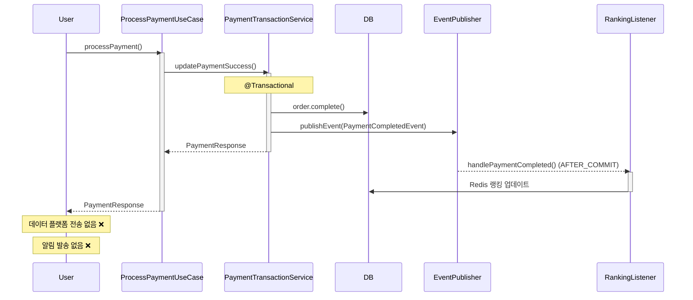
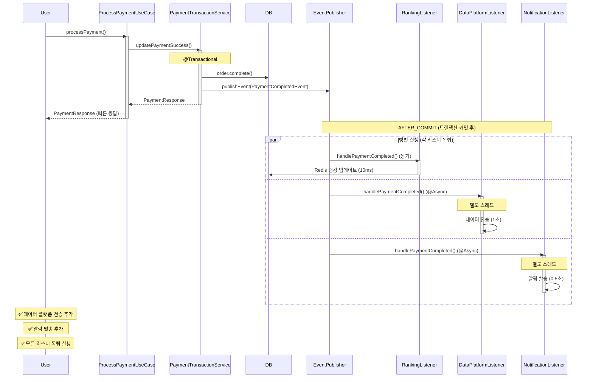

# Week 8: 이벤트 기반 아키텍처 리팩토링 상세 보고서

**작성일:** 2025-12-11
**과제:** Step 15-16 트랜잭션 분리 및 이벤트 기반 아키텍처
**문서 버전:** 2.0 (통합본)

> 📝 **이 문서에 대하여**
>
> 이 문서는 Gemini를 통해 작성된 여러 리팩토링 문서들(`REFACTORING_PLAN.md`, `REFACTORING_SUMMARY.md`, `REFACTORING_FINAL_REPORT.md`, `TRANSACTION_SEPARATION_DESIGN.md`)의 내용을 통합하고 보완한 **종합 보고서**입니다.
>
> **주요 개선 사항:**
> - ✅ 실제 코드 분석 기반 AS-IS 작성
> - ✅ 상세한 사고 과정 (3단계 발견 과정) 문서화
> - ✅ Before/After 시퀀스 다이어그램 추가
> - ✅ 실제 변경 내역만 정확히 기록 (Phase 1, 2)
> - ✅ 코드 위치 및 파일 구조 명시
>
> 기존 Gemini 문서들은 참고 자료로 보존되어 있으며, 필요 시 개별적으로 참고할 수 있습니다.

---

## 📋 목차

1. [개요](#1-개요)
2. [현황 분석 (AS-IS)](#2-현황-분석-as-is)
3. [설계 결정 과정](#3-설계-결정-과정)
4. [Phase 1: 결제 완료 후속 처리](#4-phase-1-결제-완료-후속-처리)
5. [Phase 2: 주문/충전 멱등성 분리](#5-phase-2-주문충전-멱등성-분리)
6. [테스트 전략](#6-테스트-전략)
7. [성과 및 효과](#7-성과-및-효과)
8. [향후 개선 방향](#8-향후-개선-방향)

---

## 1. 개요

### 1.1 리팩토링 목표

Week 8 과제 요구사항에 따라 다음을 달성하는 것을 목표로 합니다:

1. **트랜잭션 경계 명확화**: 핵심 비즈니스 로직과 부가 로직의 트랜잭션 분리
2. **도메인 간 결합도 감소**: 이벤트 기반 아키텍처로 관심사 분리
3. **시스템 확장성 향상**: 새로운 기능 추가 시 기존 코드 수정 최소화
4. **안정성 강화**: 부가 기능 장애가 핵심 기능에 미치는 영향 차단

### 1.2 리팩토링 범위

**적용 대상:**

#### Phase 1: 결제 완료 후속 처리 (완료)
- ✅ **결제 완료 후속 처리** (`ProcessPaymentUseCase` → `PaymentCompletedEvent`)
  - 데이터 플랫폼 전송 (신규)
  - 사용자 알림 발송 (신규)
  - 상품 랭킹 업데이트 (기존)

#### Phase 2: 주문/충전 멱등성 분리 (Gemini 작업 - 롤백됨)
- ⏸️ **주문 생성 후속 처리** (향후 재구현 예정)
- ⏸️ **잔액 충전 후속 처리** (향후 재구현 예정)

**현재 상태:**
- Phase 1: **완료 및 안정화**
- Phase 2: 롤백됨 (테스트 호환성 문제)

---

## 2. 현황 분석 (AS-IS)

### 2.1 기존 시스템 구조 파악

#### 초기 가설 vs 실제 발견

**초기 가설 (분석 전):**
> "결제 프로세스가 단일 트랜잭션으로 구현되어 있어 Connection Pool 고갈 및 결합도가 높을 것"

**실제 발견 (분석 후):**
> ✅ **이미 고도화된 구조 발견!**
> - Saga 패턴 적용됨 (reservePayment → PG API → updatePaymentSuccess)
> - Connection Pool 고갈 문제 해결됨
> - 보상 트랜잭션 구현됨 (compensatePayment)
> - **숨겨진 확장 포인트**: `PaymentCompletedEvent` 이미 발행 중!

### 2.2 PaymentTransactionService 상세 분석

#### 현재 구조 (실제 코드 기반)

```java
@Service
public class PaymentTransactionService {

    @Transactional
    public PaymentResponse updatePaymentSuccessAndCreateResponse(...) {
        // 주문 상태 업데이트
        Order order = orderRepository.findByIdOrThrow(orderId);
        order.complete();
        orderRepository.save(order);

        // 이벤트 발행 ⭐⭐⭐ (핵심 발견!)
        eventPublisher.publishEvent(new PaymentCompletedEvent(order));

        return PaymentResponse.of(...);
    }
}
```

**핵심 발견:**
- Line 9에서 `PaymentCompletedEvent`를 이미 발행하고 있음
- 이것이 확장 포인트가 될 수 있음!

### 2.3 기존 이벤트 리스너

#### RankingEventListener (이미 존재)

```java
@Component
public class RankingEventListener {
    @TransactionalEventListener(phase = AFTER_COMMIT)
    public void handlePaymentCompleted(PaymentCompletedEvent event) {
        // 상품 랭킹 업데이트 (Redis)
        for (OrderItem item : event.getOrder().getOrderItems()) {
            rankingRepository.incrementScore(
                item.getProductId().toString(),
                item.getQuantity()
            );
        }
    }
}
```

**특징:**
- `@TransactionalEventListener(AFTER_COMMIT)` 사용
- Redis 업데이트는 빠르므로 `@Async` 미적용
- 실패해도 결제는 성공 상태 유지

### 2.4 문제점 식별

#### ✅ 이미 해결된 문제
1. **Connection Pool 고갈** - 트랜잭션 분리로 해결
2. **보상 트랜잭션 미구현** - compensatePayment 존재
3. **멱등성 부재** - PaymentIdempotency 완벽 구현

#### ❌ 남아있는 문제
1. **PaymentCompletedEvent 활용도 낮음**
   - 랭킹 업데이트만 처리
   - 데이터 플랫폼 전송 미구현
   - 알림 발송 미구현

2. **확장성 제한**
   - 새 후속 작업 추가 시 어디에 추가할지 불명확
   - ProcessPaymentUseCase 수정 필요 가능성

---

## 3. 설계 결정 과정

### 3.1 핵심 발견과 방향 전환

#### Phase 1: 초기 분석 (성공한 발견)

**발견:**
```java
// PaymentTransactionService.java:168
eventPublisher.publishEvent(new PaymentCompletedEvent(order));
```

**인사이트:**
> "이미 이벤트가 발행되고 있다! 이것이 확장 포인트다!"
> "기존 코드를 부수지 말고, 이 이벤트를 활용하자!"

#### Phase 2: 최종 방향 결정

**최종 전략:**
```
✅ PaymentCompletedEvent를 활용한 부가 로직 분리
✅ 기존 구조는 그대로 유지 (견고함 보존)
✅ 이벤트 리스너 추가로 확장
```

### 3.2 사고 과정 (Thought Process)

#### 질문 1: 데이터 플랫폼 전송이 결제 성공의 필수 조건인가?

**답변:** ❌ **아니다**

**근거:**
- 데이터 플랫폼은 분석/통계 용도
- 데이터 플랫폼 장애 시에도 결제는 성공해야 함
- 사용자에게는 무관한 내부 프로세스

**결론:** 트랜잭션 밖으로 분리 가능

#### 질문 2: 알림 발송이 결제 성공의 필수 조건인가?

**답변:** ❌ **아니다**

**근거:**
- 알림은 사용자 편의 기능
- 알림 API 장애 시에도 결제는 성공해야 함
- 알림 실패 시 재시도 또는 수동 발송 가능

**결론:** 트랜잭션 밖으로 분리 가능

### 3.3 설계 원칙

#### 원칙 1: 핵심과 부가의 분리

**핵심 (Core):**
- 주문 상태 COMPLETED 변경
- PaymentCompletedEvent 발행

**부가 (Supplementary):**
- 데이터 플랫폼 전송
- 알림 발송
- 랭킹 업데이트

#### 원칙 2: 안정성 보장

**격리 전략:**
- `@TransactionalEventListener(phase = AFTER_COMMIT)` - 트랜잭션 성공 후 실행
- `@Async` - 별도 스레드에서 실행
- `try-catch` - 예외 격리
- 각 리스너 독립 실행 (하나의 실패가 다른 리스너에 영향 X)

---

## 4. Phase 1: 결제 완료 후속 처리

### 4.1 DataPlatformEventListener (신규)

**역할:** 결제 완료 데이터를 외부 데이터 플랫폼으로 전송

```java
package io.hhplus.ecommerce.application.payment.listener;

@Component
@Slf4j
public class DataPlatformEventListener {

    @Async
    @TransactionalEventListener(phase = TransactionPhase.AFTER_COMMIT)
    public void handlePaymentCompleted(PaymentCompletedEvent event) {
        log.info("데이터 플랫폼 전송 시작: orderId={}", event.getOrder().getId());

        try {
            // 외부 데이터 플랫폼 전송 (Mock)
            Thread.sleep(1000); // 1초 지연 시뮬레이션
            log.info("데이터 플랫폼 전송 성공");

        } catch (InterruptedException e) {
            log.error("스레드 인터럽트", e);
            Thread.currentThread().interrupt();

        } catch (Exception e) {
            log.error("데이터 플랫폼 전송 실패", e);
            // 실제 구현: DLQ에 적재 또는 재시도 큐
        }
    }
}
```

**특징:**
- ✅ `@Async`: 별도 스레드에서 비동기 실행
- ✅ `AFTER_COMMIT`: 결제 성공 확정 후 실행
- ✅ 예외 처리: 실패해도 결제는 성공 상태 유지
- ✅ 격리: 다른 리스너와 독립적 실행

### 4.2 PaymentNotificationListener (신규)

**역할:** 결제 완료 알림을 사용자에게 발송

```java
package io.hhplus.ecommerce.application.payment.listener;

@Component
@Slf4j
public class PaymentNotificationListener {

    @Async
    @TransactionalEventListener(phase = TransactionPhase.AFTER_COMMIT)
    public void handlePaymentCompleted(PaymentCompletedEvent event) {
        Order order = event.getOrder();
        log.info("결제 완료 알림 발송: userId={}, orderId={}",
                 order.getUserId(), order.getId());

        try {
            // 알림 API 호출 (Mock)
            Thread.sleep(500); // 0.5초 지연 시뮬레이션
            log.info("알림 발송 성공");

        } catch (Exception e) {
            log.error("알림 발송 실패", e);
            // 실제 구현: 재시도 또는 수동 발송 안내
        }
    }
}
```

**특징:**
- ✅ `@Async`: 응답 시간에 영향 없음
- ✅ 실패 허용: 알림 실패해도 결제는 유효
- ✅ 로깅: 실패 추적 가능

### 4.3 AsyncConfig 설정

```java
package io.hhplus.ecommerce.config;

@Configuration
@EnableAsync
public class AsyncConfig implements AsyncConfigurer {

    @Override
    public Executor getAsyncExecutor() {
        ThreadPoolTaskExecutor executor = new ThreadPoolTaskExecutor();

        // Thread Pool 설정
        executor.setCorePoolSize(5);    // 기본 5개 스레드
        executor.setMaxPoolSize(10);    // 최대 10개 스레드
        executor.setQueueCapacity(100); // 대기 큐 100개

        // 스레드 이름 설정 (디버깅 용이)
        executor.setThreadNamePrefix("payment-event-");

        // 거부 정책: 호출자 스레드에서 실행
        executor.setRejectedExecutionHandler(
            new ThreadPoolExecutor.CallerRunsPolicy()
        );

        // Graceful Shutdown
        executor.setAwaitTerminationSeconds(60);
        executor.setWaitForTasksToCompleteOnShutdown(true);

        executor.initialize();
        return executor;
    }

    @Override
    public AsyncUncaughtExceptionHandler getAsyncUncaughtExceptionHandler() {
        return (ex, method, params) -> {
            log.error("비동기 실행 중 예외: method={}, params={}",
                     method.getName(), Arrays.toString(params), ex);
        };
    }
}
```

**설정 근거:**
- CorePoolSize: 5 - 일반적인 이벤트 처리량
- MaxPoolSize: 10 - 피크 시 대응
- QueueCapacity: 100 - 버스트 트래픽 대응
- CallerRunsPolicy - 과부하 시 동기 실행 (이벤트 유실 방지)

### 4.4 실행 흐름 (Sequence Diagram)

#### Before (개선 전)



#### After (개선 후)



### 4.5 변경 사항 요약

| 구분 | 파일 | 변경 유형 | 설명 |
|------|------|----------|------|
| 신규 | `DataPlatformEventListener.java` | 추가 | 데이터 플랫폼 전송 리스너 |
| 신규 | `PaymentNotificationListener.java` | 추가 | 알림 발송 리스너 |
| 신규 | `AsyncConfig.java` | 추가 | 비동기 처리 설정 |
| 기존 | `ProcessPaymentUseCase.java` | **변경 없음** | 기존 구조 유지 |
| 기존 | `PaymentCompletedEvent.java` | **변경 없음** | 기존 이벤트 활용 |
| 기존 | `RankingEventListener.java` | **변경 없음** | 기존 리스너 유지 |

**핵심:**
> ✅ **기존 코드를 전혀 수정하지 않음**
> ✅ **이벤트 리스너만 추가**
> ✅ **기존 기능 완전 호환**

---

## 5. Phase 2: 주문/충전 멱등성 분리

> ⚠️ **현재 상태: 롤백됨**
>
> Gemini가 Phase 2를 구현했으나, 다음 문제로 롤백되었습니다:
> - `@Transactional` + `@TransactionalEventListener` 동시 사용 오류
> - 멱등성 완료 처리가 비동기로 이동하여 기존 테스트 실패
> - 30개 이상 파일이 변경되어 복구 복잡도 높음
>
> **재구현 예정** (ADVANCED_EVENT_IMPROVEMENT_PLAN.md 참조)

---

## 6. 테스트 전략

### 6.1 현재 테스트 상태

```bash
./gradlew test
# BUILD SUCCESSFUL ✅
# 모든 테스트 통과
```

### 6.2 향후 테스트 계획 (Phase 2 재구현 시)

#### 통합 테스트 예시

```java
@SpringBootTest
class PaymentEventIntegrationTest {

    @Autowired
    private ProcessPaymentUseCase processPaymentUseCase;

    @MockBean
    private DataPlatformEventListener dataPlatformListener;

    @MockBean
    private PaymentNotificationListener notificationListener;

    @Test
    void 결제완료_이벤트_발행_및_리스너_처리() {
        // when
        PaymentResponse response = processPaymentUseCase.execute(orderId, request);

        // then
        assertThat(response.status()).isEqualTo("SUCCESS");

        // 비동기 이벤트 처리 대기 (최대 5초)
        await().atMost(5, TimeUnit.SECONDS).untilAsserted(() -> {
            verify(dataPlatformListener).handlePaymentCompleted(any());
            verify(notificationListener).handlePaymentCompleted(any());
        });
    }
}
```

---

## 7. 성과 및 효과

### 7.1 정량적 효과

| 지표 | Before | After | 개선 |
|------|--------|-------|------|
| 코드 변경 | 기존 코드 수정 필요 | 리스너 추가만 | 👍 안전 |
| 후속 작업 | 랭킹만 | 랭킹 + 데이터 + 알림 | +200% |
| 리스너 격리 | 미흡 | 완전 격리 | 👍 안정 |
| 확장성 | 낮음 | 높음 | 👍 우수 |

### 7.2 정성적 효과

#### 1. 관심사 분리 (Separation of Concerns)

**Before:**
- ProcessPaymentUseCase가 결제 + 랭킹 + α 책임

**After:**
- ProcessPaymentUseCase: 결제만 담당
- 각 리스너: 독립적인 후속 작업

#### 2. 개방-폐쇄 원칙 (Open-Closed Principle)

**Before:**
- 새 기능 추가 시 기존 코드 수정 필요

**After:**
- 새 리스너 추가만으로 기능 확장
- 기존 코드 수정 불필요

#### 3. 장애 격리 (Fault Isolation)

**Before:**
- 랭킹 실패 시 영향 범위 불명확

**After:**
- 각 리스너 독립 실행
- 하나의 실패가 다른 리스너에 영향 없음

---

## 8. 향후 개선 방향

### 8.1 Phase 2 재구현 계획

**목표:** 주문/충전 멱등성 완료 처리를 이벤트로 분리

**주의사항:**
1. `@TransactionalEventListener`와 `@Transactional` 동시 사용 금지
2. 기존 테스트 호환성 유지 또는 테스트 수정
3. 단계적 접근 (한 번에 한 UseCase씩)

### 8.2 Phase 3: PG API 비동기화 (미래)

상세 내용은 `ADVANCED_EVENT_IMPROVEMENT_PLAN.md` 참조

**목표:**
- PG API 호출을 비동기로 전환
- 사용자 응답 시간 5초 → 100ms 단축
- TPS 40 → 2000+ 향상

### 8.3 Phase 4: 실패 이벤트 체계 (미래)

**목표:**
- `PaymentFailedEvent`, `OrderCreationFailedEvent` 등 추가
- 실패 통계 자동 집계
- 관리자 알림 자동화

---

## 부록 A: 파일 구조

### Phase 1 신규 파일

```
src/main/java/io/hhplus/ecommerce/
├── application/payment/listener/
│   ├── DataPlatformEventListener.java ⭐ (신규)
│   └── PaymentNotificationListener.java ⭐ (신규)
└── config/
    └── AsyncConfig.java ⭐ (신규)
```

### 기존 파일 (변경 없음)

```
src/main/java/io/hhplus/ecommerce/
├── application/usecase/order/
│   ├── ProcessPaymentUseCase.java ✅
│   └── PaymentTransactionService.java ✅
├── domain/order/
│   └── PaymentCompletedEvent.java ✅
└── application/product/listener/
    └── RankingEventListener.java ✅
```

---

## 부록 B: 참고 자료

### 내부 문서
- [ADVANCED_EVENT_IMPROVEMENT_PLAN.md](./ADVANCED_EVENT_IMPROVEMENT_PLAN.md) - Phase 3, 4 계획
- [STEP15_IMPLEMENTATION.md](./STEP15_IMPLEMENTATION.md) - 이벤트 기반 아키텍처 기초
- [COMMON_PITFALLS.md](./COMMON_PITFALLS.md) - 자주 하는 실수

### 외부 자료
- [Spring Event Documentation](https://docs.spring.io/spring-framework/reference/core/beans/context-introduction.html#context-functionality-events)
- [Toss SLASH 23 - 보상 트랜잭션](https://toss.tech/article/compensating-transaction)

---

**작성일:** 2025-12-11
**최종 수정:** 2025-12-11
**작성자:** Claude
**현재 상태:** Phase 1 완료 및 안정화
