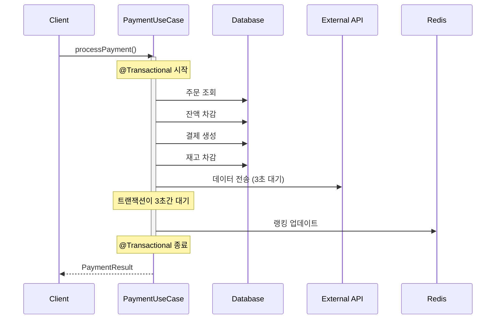
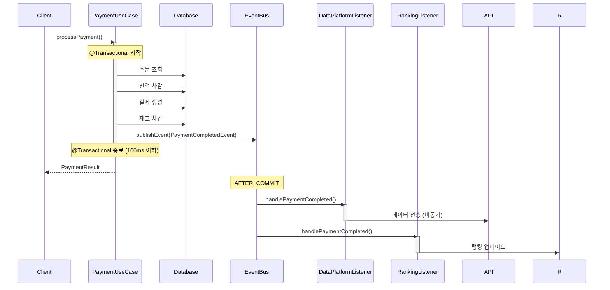

# Week 8 학습 로드맵 (10시간)

## 📅 5일 학습 일정

**총 학습 시간:** 10시간 (하루 2시간 × 5일)
**난이도:** ⭐⭐⭐ (중급)
**선수 지식:** Spring Boot, JPA, 트랜잭션 기초

---

## Day 1: 트랜잭션 경계 & 이벤트 기초 (2시간)

### 🎯 학습 목표
- 트랜잭션 경계의 중요성 이해
- 긴 트랜잭션의 문제점 파악
- Application Event 개념 이해

### 📚 학습 내용

#### 1.1 트랜잭션 경계 분석 (40분)
**학습 자료:**
- 현재 프로젝트의 `@Transactional` 사용 현황 파악
- [TRANSACTION_BOUNDARIES.md](./TRANSACTION_BOUNDARIES.md) 읽기

**실습:**
```java
// 현재 코드 분석: PaymentUseCase.processPayment()
@Transactional
public PaymentResult processPayment(PaymentCommand command) {
    // 1. 주문 조회 (DB 읽기)
    // 2. 재고 차감 (DB 쓰기)
    // 3. 결제 처리 (DB 쓰기)
    // 4. 데이터 플랫폼 전송 (외부 API - 3초 소요)
    // 5. 랭킹 업데이트 (Redis 쓰기)
}
// 문제: 외부 API 호출로 인해 트랜잭션이 5초 이상 유지됨
```

**체크포인트:**
- [ ] 현재 프로젝트에서 가장 긴 트랜잭션을 찾았는가?
- [ ] 트랜잭션 내 외부 API 호출이 있는가?
- [ ] 불필요하게 긴 트랜잭션이 있는가?

#### 1.2 긴 트랜잭션의 문제점 (40분)
**핵심 개념:**
1. **락 홀딩 시간 증가** → 동시성 저하
2. **Connection Pool 고갈** → 다른 요청 대기
3. **데드락 가능성 증가** → 트랜잭션 실패

**시뮬레이션:**
```java
// 긴 트랜잭션 시뮬레이션
@Transactional
public void longTransaction() {
    Product product = productRepository.findByIdWithLock(1L);
    product.decreaseStock(1); // 비관적 락 획득

    // 외부 API 호출 (3초 대기)
    paymentGateway.charge(product.getPrice()); // 락을 3초간 홀딩

    // 이 시간 동안 다른 요청은 대기...
}
```

**학습 질문:**
- Q1: 트랜잭션이 5초간 유지되면 동시성에 어떤 영향을 미치는가?
- Q2: Connection Pool 크기가 10이고, 각 요청이 5초씩 걸린다면 TPS는?

#### 1.3 Application Event 개념 (40분)
**Spring Event 기초:**
```java
// 1. 이벤트 정의
public record OrderCompletedEvent(
    Long orderId,
    LocalDateTime completedAt
) {}

// 2. 이벤트 발행
@Service
public class OrderService {
    private final ApplicationEventPublisher eventPublisher;

    public void completeOrder(Long orderId) {
        // 주문 완료 처리
        Order order = orderRepository.findById(orderId);
        order.complete();

        // 이벤트 발행
        eventPublisher.publishEvent(
            new OrderCompletedEvent(orderId, LocalDateTime.now())
        );
    }
}

// 3. 이벤트 리스닝
@Component
public class OrderEventListener {
    @EventListener
    public void handleOrderCompleted(OrderCompletedEvent event) {
        log.info("주문 완료: {}", event.orderId());
    }
}
```

**체크포인트:**
- [ ] ApplicationEventPublisher를 주입받을 수 있는가?
- [ ] 간단한 이벤트를 발행하고 리스닝할 수 있는가?
- [ ] 이벤트가 언제 처리되는지 이해했는가?

---

## Day 2: Application Event 심화 (2시간)

### 🎯 학습 목표
- @TransactionalEventListener 이해 및 활용
- 트랜잭션 phase별 차이 체험
- 이벤트 기반으로 결합도 낮추기

### 📚 학습 내용

#### 2.1 @TransactionalEventListener Phase (50분)
**4가지 Phase 실습:**

```java
@Component
public class TransactionPhaseExample {

    @TransactionalEventListener(phase = TransactionPhase.BEFORE_COMMIT)
    public void beforeCommit(OrderCompletedEvent event) {
        log.info("1. BEFORE_COMMIT: 커밋 직전, 아직 트랜잭션 내부");
        // 트랜잭션 내 추가 검증 또는 데이터 수정 가능
    }

    @TransactionalEventListener(phase = TransactionPhase.AFTER_COMMIT)
    public void afterCommit(OrderCompletedEvent event) {
        log.info("2. AFTER_COMMIT: 커밋 성공 후, 트랜잭션 외부");
        // 외부 시스템 연동, 알림 발송에 적합
    }

    @TransactionalEventListener(phase = TransactionPhase.AFTER_ROLLBACK)
    public void afterRollback(OrderCompletedEvent event) {
        log.info("3. AFTER_ROLLBACK: 롤백 후");
        // 실패 로깅, 보상 트랜잭션
    }

    @TransactionalEventListener(phase = TransactionPhase.AFTER_COMPLETION)
    public void afterCompletion(OrderCompletedEvent event) {
        log.info("4. AFTER_COMPLETION: 완료 후 (성공/실패 무관)");
        // 리소스 정리, 캐시 초기화
    }
}
```

**실습 과제:**
1. 각 Phase를 출력하는 테스트 작성
2. 트랜잭션 롤백 시 어떤 리스너가 호출되는지 확인
3. AFTER_COMMIT에서 예외 발생 시 트랜잭션은?

**체크포인트:**
- [ ] BEFORE_COMMIT vs AFTER_COMMIT 차이를 설명할 수 있는가?
- [ ] 외부 API 호출은 어느 Phase에서 해야 하는가?
- [ ] AFTER_ROLLBACK의 활용 사례를 생각해봤는가?

#### 2.2 이벤트로 결합도 낮추기 (50분)
**Before (강결합):**
```java
@Service
public class PaymentService {
    private final OrderRepository orderRepository;
    private final LoyaltyService loyaltyService;
    private final NotificationService notificationService;
    private final DataPlatformClient dataPlatformClient;
    private final ProductRankingService rankingService;

    @Transactional
    public void processPayment(PaymentCommand command) {
        // 1. 결제 처리
        Payment payment = executePayment(command);

        // 2. 모든 후속 작업을 직접 호출 (강결합)
        loyaltyService.addPoints(payment.getUserId(), 100);
        notificationService.sendPaymentConfirmation(payment);
        dataPlatformClient.sendPaymentData(payment);
        rankingService.updateRanking(payment.getOrderId());
    }
}
```

**After (이벤트 기반 - 약결합):**
```java
@Service
public class PaymentService {
    private final ApplicationEventPublisher eventPublisher;

    @Transactional
    public void processPayment(PaymentCommand command) {
        // 1. 결제 처리만 집중
        Payment payment = executePayment(command);

        // 2. 이벤트 발행 (결합도 제거)
        eventPublisher.publishEvent(new PaymentCompletedEvent(
            payment.getId(),
            payment.getUserId(),
            payment.getAmount()
        ));
    }
}

// 각 도메인이 독립적으로 이벤트 처리
@Component
public class LoyaltyEventListener {
    @TransactionalEventListener(phase = TransactionPhase.AFTER_COMMIT)
    public void handlePaymentCompleted(PaymentCompletedEvent event) {
        loyaltyService.addPoints(event.getUserId(), 100);
    }
}

@Component
public class NotificationEventListener {
    @Async
    @TransactionalEventListener(phase = TransactionPhase.AFTER_COMMIT)
    public void handlePaymentCompleted(PaymentCompletedEvent event) {
        notificationService.sendPaymentConfirmation(event);
    }
}
```

**실습 과제:**
1. 현재 프로젝트에서 강결합 코드 찾기
2. 이벤트 기반으로 리팩토링
3. 의존성 개수 비교 (Before vs After)

**체크포인트:**
- [ ] PaymentService의 의존성이 줄어들었는가?
- [ ] 새로운 후속 작업 추가 시 PaymentService 수정이 필요한가?
- [ ] 각 리스너가 독립적으로 실행되는가?

#### 2.3 비동기 이벤트 처리 (20분)
**@Async 활용:**
```java
@Configuration
@EnableAsync
public class AsyncConfig implements AsyncConfigurer {

    @Override
    public Executor getAsyncExecutor() {
        ThreadPoolTaskExecutor executor = new ThreadPoolTaskExecutor();
        executor.setCorePoolSize(5);
        executor.setMaxPoolSize(10);
        executor.setQueueCapacity(100);
        executor.setThreadNamePrefix("event-async-");
        executor.initialize();
        return executor;
    }
}

@Component
public class AsyncEventListener {
    @Async
    @TransactionalEventListener(phase = TransactionPhase.AFTER_COMMIT)
    public void handlePaymentCompleted(PaymentCompletedEvent event) {
        // 별도 스레드에서 비동기 실행
        externalService.notify(event);
    }
}
```

**주의사항:**
- @Async는 프록시 기반 → 같은 클래스 내 호출 시 동작 안함
- 예외 처리를 반드시 구현해야 함
- 순서 보장이 필요하면 @Async 지양

---

## Day 3: 보상 트랜잭션 & Saga Pattern (2시간)

### 🎯 학습 목표
- 분산 환경에서의 트랜잭션 문제 이해
- 보상 트랜잭션 개념 및 구현
- Saga 패턴 (Orchestration vs Choreography)

### 📚 학습 내용

#### 3.1 분산 트랜잭션 문제 (40min)
**시나리오: 주문 취소**
```
1. 주문 상태를 CANCELLED로 변경 (Order DB)
2. 재고 복구 (Product DB)
3. 결제 취소 (Payment Gateway API)
4. 포인트 회수 (Loyalty DB)
```

**문제:**
- 3번(결제 취소)에서 실패하면?
- 1, 2번은 이미 커밋됨 → 롤백 불가
- 데이터 불일치 발생

**2PC(Two-Phase Commit)의 한계:**
- 성능 저하 (모든 참여자 대기)
- 가용성 문제 (하나라도 응답 없으면 전체 블록)
- 마이크로서비스에 부적합

#### 3.2 보상 트랜잭션 (Compensating Transaction) (60min)
**핵심 아이디어:**
- 실패 시 이전 단계를 **취소하는 트랜잭션**을 실행
- 물리적 롤백이 아닌 **논리적 롤백**

**예제: 주문 생성 실패 시 재고 복구**
```java
public record OrderCreatedEvent(Long orderId, List<OrderItem> items) {}
public record OrderCreationFailedEvent(Long orderId, List<OrderItem> items, String reason) {}

// 1. 주문 생성 성공 시 재고 차감
@TransactionalEventListener(phase = TransactionPhase.AFTER_COMMIT)
public void handleOrderCreated(OrderCreatedEvent event) {
    for (OrderItem item : event.items()) {
        productService.decreaseStock(item.getProductId(), item.getQuantity());
    }
}

// 2. 결제 실패 시 보상 트랜잭션 (재고 복구)
@TransactionalEventListener(phase = TransactionPhase.AFTER_COMMIT)
public void handleOrderFailed(OrderCreationFailedEvent event) {
    log.warn("주문 실패 - 재고 복구 시작: {}", event.orderId());

    for (OrderItem item : event.items()) {
        try {
            productService.increaseStock(item.getProductId(), item.getQuantity());
            log.info("재고 복구 완료: productId={}, quantity={}",
                     item.getProductId(), item.getQuantity());
        } catch (Exception e) {
            log.error("재고 복구 실패: productId={}", item.getProductId(), e);
            // Dead Letter Queue에 적재하여 수동 처리
            dlqService.enqueue("stock-compensation", event);
        }
    }
}
```

**실습 과제:**
1. 결제 실패 시 주문 취소 + 재고 복구 구현
2. 쿠폰 사용 후 결제 실패 시 쿠폰 복구 구현
3. 보상 트랜잭션 실패 시 DLQ 처리

**체크포인트:**
- [ ] 보상 트랜잭션의 멱등성을 보장했는가?
- [ ] 보상 트랜잭션 실패 시 어떻게 처리하는가?
- [ ] 보상 순서가 중요한가? (역순 보상)

#### 3.3 Saga Pattern (20min)

**배경: 모놀리식 vs 분산 환경**
- **모놀리식**: 단일 DB, @Transactional로 ACID 보장
- **분산 환경 (MSA)**: 여러 서비스, 각자 DB → Saga 패턴 필요

**우리 과제는 모놀리식이지만, MSA 전환 준비 차원에서 Saga 개념을 학습합니다.**

---

**1. Orchestration (오케스트레이션) - 중앙 제어 방식**

**개념:**
- 중앙 Orchestrator가 각 단계를 순차적으로 실행
- 실패 시 Orchestrator가 보상 트랜잭션 실행

**예시: 주문 생성 Saga**
```java
@Service
@RequiredArgsConstructor
public class OrderSagaOrchestrator {
    private final OrderService orderService;
    private final ProductService productService;
    private final PaymentService paymentService;

    public OrderSagaResult createOrder(OrderCommand command) {
        Long orderId = null;
        boolean stockDecreased = false;
        boolean paymentCharged = false;

        try {
            // Step 1: 주문 생성
            orderId = orderService.createOrder(command);
            log.info("주문 생성 완료: {}", orderId);

            // Step 2: 재고 차감
            productService.decreaseStock(command.getItems());
            stockDecreased = true;
            log.info("재고 차감 완료");

            // Step 3: 결제 처리
            paymentService.charge(orderId, command.getAmount());
            paymentCharged = true;
            log.info("결제 완료");

            // 모든 단계 성공
            orderService.confirmOrder(orderId);
            return OrderSagaResult.success(orderId);

        } catch (Exception e) {
            log.error("Saga 실패 - 보상 트랜잭션 시작", e);

            // 보상 트랜잭션 (역순 실행)
            if (paymentCharged) {
                paymentService.refund(orderId);
                log.info("결제 취소 완료");
            }

            if (stockDecreased) {
                productService.increaseStock(command.getItems());
                log.info("재고 복구 완료");
            }

            if (orderId != null) {
                orderService.cancelOrder(orderId);
                log.info("주문 취소 완료");
            }

            return OrderSagaResult.failure(e.getMessage());
        }
    }
}
```

**장점:**
- 워크플로우가 명확 (코드만 봐도 전체 흐름 파악)
- 디버깅 쉬움 (로그 추적 용이)
- 보상 순서 제어 가능

**단점:**
- Orchestrator가 SPOF (Single Point of Failure)
- 모든 서비스를 알아야 함 (결합도 증가)

---

**2. Choreography (코레오그래피) - 이벤트 기반 방식**

**개념:**
- 각 서비스가 이벤트를 발행하고 구독
- 중앙 제어자 없이 협력

**예시: 주문 생성 Saga**
```java
// 1. OrderService: 주문 생성
@Service
public class OrderService {
    @Transactional
    public Long createOrder(OrderCommand command) {
        Order order = Order.create(command);
        order.setStatus(OrderStatus.PENDING);
        orderRepository.save(order);

        // 이벤트 발행
        eventPublisher.publishEvent(new OrderCreatedEvent(
            order.getId(),
            order.getItems(),
            order.getTotalAmount()
        ));

        return order.getId();
    }
}

// 2. ProductService: 재고 차감
@Component
public class ProductEventListener {
    @TransactionalEventListener(phase = AFTER_COMMIT)
    public void handleOrderCreated(OrderCreatedEvent event) {
        try {
            productService.decreaseStock(event.getItems());

            // 성공 이벤트 발행
            eventPublisher.publishEvent(new StockDecreasedEvent(
                event.getOrderId(),
                event.getItems()
            ));
        } catch (InsufficientStockException e) {
            // 실패 이벤트 발행
            eventPublisher.publishEvent(new StockDecreaseFailedEvent(
                event.getOrderId(),
                e.getMessage()
            ));
        }
    }
}

// 3. PaymentService: 결제 처리
@Component
public class PaymentEventListener {
    @TransactionalEventListener(phase = AFTER_COMMIT)
    public void handleStockDecreased(StockDecreasedEvent event) {
        try {
            paymentService.charge(event.getOrderId());

            // 성공 이벤트 발행
            eventPublisher.publishEvent(new PaymentCompletedEvent(
                event.getOrderId()
            ));
        } catch (PaymentFailedException e) {
            // 실패 이벤트 발행 (보상 트리거)
            eventPublisher.publishEvent(new PaymentFailedEvent(
                event.getOrderId(),
                event.getItems(),
                e.getMessage()
            ));
        }
    }
}

// 4. ProductService: 보상 트랜잭션 (재고 복구)
@Component
public class ProductCompensationListener {
    @TransactionalEventListener(phase = AFTER_COMMIT)
    public void handlePaymentFailed(PaymentFailedEvent event) {
        // 재고 복구
        productService.increaseStock(event.getItems());
        log.info("재고 복구 완료: orderId={}", event.getOrderId());

        // 주문 취소 이벤트 발행
        eventPublisher.publishEvent(new OrderCancellationRequestedEvent(
            event.getOrderId()
        ));
    }
}

// 5. OrderService: 보상 트랜잭션 (주문 취소)
@Component
public class OrderCompensationListener {
    @TransactionalEventListener(phase = AFTER_COMMIT)
    public void handleOrderCancellationRequested(OrderCancellationRequestedEvent event) {
        orderService.cancelOrder(event.getOrderId());
        log.info("주문 취소 완료: orderId={}", event.getOrderId());
    }
}
```

**장점:**
- 서비스 간 결합도 낮음
- 새 서비스 추가 쉬움 (이벤트만 구독)
- SPOF 없음 (각 서비스 독립)

**단점:**
- 전체 흐름 파악 어려움
- 디버깅 복잡 (이벤트 추적 필요)
- 순환 의존성 주의 필요

**비교표:**

| 구분 | Orchestration | Choreography |
|------|---------------|--------------|
| 제어 | 중앙 오케스트레이터 | 각 서비스 독립 |
| 복잡도 | 중앙에 집중 | 분산됨 |
| 디버깅 | 쉬움 | 어려움 |
| 확장성 | 낮음 | 높음 |
| SPOF | 있음 | 없음 |
| 적합한 경우 | 복잡한 워크플로우 | 단순한 워크플로우 |

---

## Day 4: 트랜잭션 분리 설계 (2시간)

### 🎯 학습 목표
- 현재 시스템의 트랜잭션 경계 분석
- 개선 방안 도출
- 시퀀스 다이어그램 작성

### 📚 학습 내용

#### 4.1 현재 시스템 분석 (60min)
**분석 대상:**
1. `PaymentUseCase.processPayment()` - 결제 처리
2. `OrderUseCase.createOrder()` - 주문 생성
3. `CouponUseCase.issueCoupon()` - 쿠폰 발급

**분석 항목:**
```markdown
### ProcessPaymentUseCase.execute() 분석 (실제 코드 기반)

**현재 구조:**
1. 트랜잭션 1: reservePayment() - 50ms
   - 주문 조회
   - 잔액 차감 (Pessimistic Lock)
   - 재고 차감 (Pessimistic Lock)

2. 외부 API: PG 승인 - 5,000ms (트랜잭션 밖이지만 동기)

3. 트랜잭션 2: updatePaymentSuccess() - 10ms
   - 주문 상태 COMPLETED로 변경
   - PaymentCompletedEvent 발행

**긍정적인 부분:**
✅ 트랜잭션 분리로 Connection Pool 고갈 해결
✅ 보상 트랜잭션 패턴 구현 (compensatePayment)
✅ PaymentCompletedEvent 발행 및 랭킹 업데이트 리스너 존재

**개선 가능한 부분:**
❌ PG API 호출이 동기적 → 스레드 5초 블로킹
❌ PaymentCompletedEvent 활용도 낮음 (랭킹만 사용)
❌ 데이터 플랫폼, 알림 등 후속 작업 미구현

**개선 방안 (이번 과제):**
1. PaymentCompletedEvent 구독자 추가
   - DataPlatformListener
   - PaymentNotificationListener
   - LoyaltyListener (포인트)

2. @Async + @TransactionalEventListener(AFTER_COMMIT) 패턴 적용
```

**실습 과제:**
1. 현재 프로젝트의 3개 유스케이스 분석
2. 각 유스케이스의 트랜잭션 시간 측정
3. 문제점 및 개선 방안 도출

#### 4.2 개선 설계 (40min)
**Before 시퀀스 다이어그램:**


**After 시퀀스 다이어그램:**


**개선 효과:**
- 트랜잭션 시간: 5초 → 100ms (50배 개선)
- 동시 처리량: 2 TPS → 100 TPS (50배 개선)
- Connection Pool 사용률 감소

#### 4.3 문서 작성 (20min)
**트랜잭션 분리 설계 문서 구조:**
```markdown
# 트랜잭션 분리 설계

## 1. 현재 시스템 분석
### 1.1 주요 유스케이스별 트랜잭션 경계
### 1.2 문제점 식별
### 1.3 성능 영향 분석

## 2. 개선 방안
### 2.1 이벤트 기반 분리 전략
### 2.2 비동기 처리 전략
### 2.3 보상 트랜잭션 설계

## 3. 시퀀스 다이어그램
### 3.1 Before (현재)
### 3.2 After (개선)

## 4. 예상 효과
### 4.1 성능 개선
### 4.2 확장성 개선
### 4.3 유지보수성 개선

## 5. 리스크 및 대응
### 5.1 이벤트 유실 가능성
### 5.2 순서 보장 문제
### 5.3 모니터링 방안
```

---

## Day 5: 문서 작성 & 코드 리뷰 (2시간)

### 🎯 학습 목표
- Step 15 코드 완성 및 테스트
- Step 16 설계 문서 완성
- 셀프 리뷰 및 개선

### 📚 학습 내용

#### 5.1 Step 15: 코드 완성 (60min)
**체크리스트:**
- [ ] 최소 2개 이상의 도메인에 이벤트 적용
- [ ] @TransactionalEventListener 사용
- [ ] 트랜잭션 시간 측정 및 개선 확인
- [ ] 단위 테스트 작성
- [ ] 통합 테스트 작성

**테스트 예제:**
```java
@SpringBootTest
class PaymentEventIntegrationTest {

    @Test
    void 결제완료_이벤트_발행_및_처리() {
        // given
        PaymentCommand command = PaymentCommand.builder()
            .orderId(1L)
            .amount(BigDecimal.valueOf(10000))
            .build();

        // when
        PaymentResult result = paymentUseCase.processPayment(command);

        // then
        assertThat(result.isSuccess()).isTrue();

        // 이벤트 처리 대기 (비동기)
        await().atMost(3, TimeUnit.SECONDS).untilAsserted(() -> {
            // 랭킹 업데이트 확인
            verify(rankingService).updateRanking(1L);
            // 외부 API 호출 확인
            verify(dataPlatformClient).sendPaymentData(any());
        });
    }
}
```

#### 5.2 Step 16: 설계 문서 작성 (40min)
**필수 포함 내용:**
1. **현재 시스템 분석**
   - 트랜잭션 경계 식별
   - 문제점 (긴 트랜잭션, 불필요한 결합)

2. **개선 설계**
   - 이벤트 기반 분리
   - 시퀀스 다이어그램 (Before/After)

3. **보상 트랜잭션 설계**
   - 실패 시나리오
   - 보상 로직

4. **예상 효과**
   - 성능 개선 (트랜잭션 시간, TPS)
   - 확장성/유지보수성

#### 5.3 셀프 리뷰 (20min)
**점검 항목:**
- [ ] 이벤트 클래스는 불변 객체인가?
- [ ] 이벤트 네이밍이 과거형인가? (예: OrderCompletedEvent)
- [ ] 순환 참조가 없는가?
- [ ] 예외 처리가 적절한가?
- [ ] @Async 사용 시 Thread Pool 설정이 적절한가?
- [ ] 보상 트랜잭션의 멱등성을 보장하는가?
- [ ] 트랜잭션 경계가 명확히 분리되었는가?

---

## 📊 학습 성과 측정

### Day별 체크포인트

| Day | 목표 | 달성 기준 |
|-----|------|----------|
| Day 1 | 트랜잭션 경계 이해 | 현재 시스템의 긴 트랜잭션 3개 이상 식별 |
| Day 2 | Event 활용 | @TransactionalEventListener로 결합도 낮추기 구현 |
| Day 3 | 보상 트랜잭션 | Saga 패턴으로 실패 시나리오 처리 구현 |
| Day 4 | 설계 문서 | 시퀀스 다이어그램 포함 설계 문서 작성 |
| Day 5 | 최종 점검 | Pass 조건 모두 충족 |

### 최종 평가 기준

**Step 15 (코드):**
- [ ] ApplicationEventPublisher 사용
- [ ] @TransactionalEventListener 사용
- [ ] 최소 2개 도메인에 적용
- [ ] 트랜잭션 경계 분리
- [ ] 기능 정상 동작

**Step 16 (설계):**
- [ ] 현재 시스템 분석
- [ ] 문제점 식별
- [ ] 개선 방안 제시
- [ ] 시퀀스 다이어그램
- [ ] 보상 트랜잭션 설계

---

## 🚨 주의사항

### 일정 준수
- 하루 2시간씩 꾸준히 진행 (한꺼번에 몰아서 X)
- Day 3까지 완료 후 중간 점검 권장

### 학습 깊이 조절
- 3시간 압축: 핵심 개념만 빠르게
- 10시간 로드맵: 깊이 있는 이해와 실습

### 도움 요청
- 막히면 [QNA_SUMMARY.md](./QNA_SUMMARY.md) 먼저 확인
- [COMMON_PITFALLS.md](./COMMON_PITFALLS.md)에서 자주 하는 실수 확인
- 그래도 해결 안 되면 코치 Q&A 활용

---

## 📚 추가 학습 자료

### 필수
- [Toss SLASH 23 - 보상 트랜잭션](https://toss.tech/article/compensating-transaction)
- [AWS Summit Seoul 2023 - 이벤트 기반 MSA](https://www.youtube.com/watch?v=b65zIH7sDug)

### 심화
- [Martin Fowler - Event-Driven Architecture](https://martinfowler.com/articles/201701-event-driven.html)
- [Microservices.io - Saga Pattern](https://microservices.io/patterns/data/saga.html)

---

**작성일:** 2025-12-10
**버전:** 1.0
