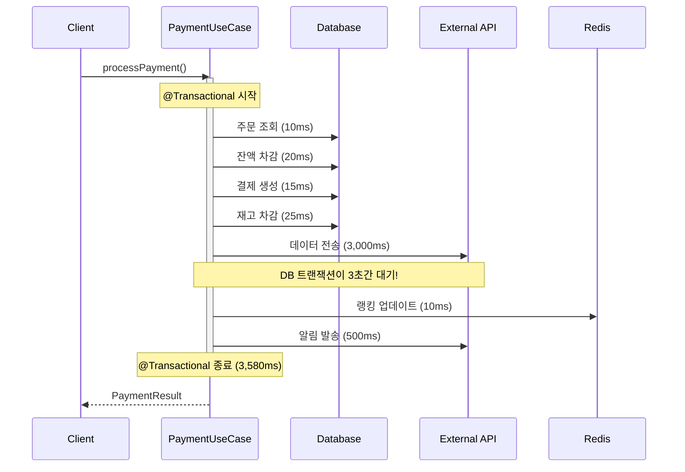
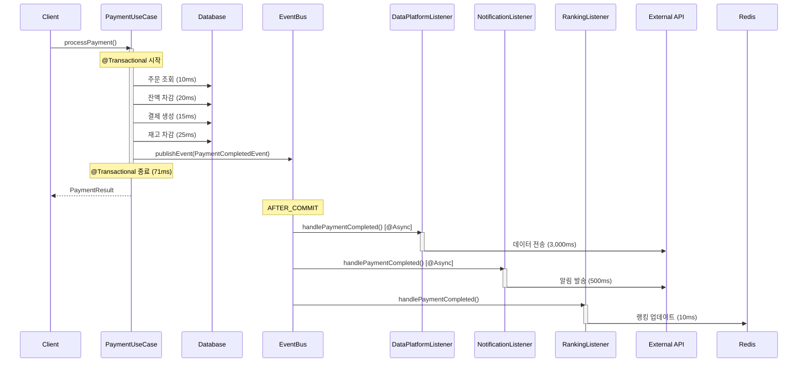

# Step 16: 트랜잭션 분리 설계 문서 가이드

## 🎯 과제 목표

**현재 시스템의 트랜잭션 경계를 분석하고, 이벤트 기반으로 개선하는 설계 문서 작성**

### Pass 조건
- [ ] 현재 시스템의 트랜잭션 경계 분석
- [ ] 문제점 식별 (긴 트랜잭션, 불필요한 결합 등)
- [ ] 개선 방안 제시 (이벤트 분리, 비동기 처리 등)
- [ ] 트랜잭션 흐름도 (시퀀스 다이어그램 등)
- [ ] 보상 트랜잭션 설계 (실패 시나리오)

---

## 📋 문서 구조

```markdown
# 트랜잭션 분리 설계

## 1. 현재 시스템 분석
### 1.1 주요 유스케이스별 트랜잭션 경계
### 1.2 문제점 식별
### 1.3 성능 영향 분석

## 2. 개선 방안
### 2.1 이벤트 기반 분리 전략
### 2.2 비동기 처리 전략
### 2.3 트랜잭션 경계 재설계

## 3. 시퀀스 다이어그램
### 3.1 Before (현재)
### 3.2 After (개선)

## 4. 보상 트랜잭션 설계
### 4.1 실패 시나리오 식별
### 4.2 보상 로직 설계
### 4.3 멱등성 보장 방안

## 5. 예상 효과
### 5.1 성능 개선
### 5.2 확장성 개선
### 5.3 유지보수성 개선

## 6. 리스크 및 대응
### 6.1 이벤트 유실 가능성
### 6.2 순서 보장 문제
### 6.3 모니터링 방안
```

---

## 1. 현재 시스템 분석

### 1.1 주요 유스케이스별 트랜잭션 경계

#### ProcessPaymentUseCase.execute() - 현재 상태 (이미 일부 개선됨)

**현재 구조 (실제 코드 기반):**
```java
public PaymentResponse execute(Long orderId, PaymentRequest request) {
    // Step 1: 멱등성 체크
    PaymentIdempotency idempotency = idempotencyService.getOrCreate(request);

    try {
        // Step 2: 잔액 차감 (트랜잭션, 50ms) - DistributedLock + @Transactional
        @DistributedLock
        @Transactional
        Order order = transactionService.reservePayment(orderId, request);
        // - 주문 조회
        // - 사용자 잔액 차감 (Pessimistic Lock)
        // - 재고 차감 (Pessimistic Lock)

        // Step 3: 외부 PG API 호출 (트랜잭션 밖, 5초) ⚠️ 문제!
        PGResponse pgResponse = pgService.charge(request);

        if (pgResponse.isSuccess()) {
            // Step 4: 성공 시 상태 업데이트 (트랜잭션, 50ms)
            @Transactional
            PaymentResponse response = transactionService.updatePaymentSuccessAndCreateResponse(...);
            // - 주문 상태 → COMPLETED
            // - PaymentCompletedEvent 발행 (랭킹 갱신용)

            return response;
        } else {
            // Step 5: 실패 시 보상 트랜잭션 (트랜잭션, 50ms)
            @Transactional
            transactionService.compensatePayment(orderId, request.getUserId());
            // - 재고 복구
            // - 잔액 복구
        }
    }
}
```

**문제점:**
- ✅ **이미 개선된 부분**: 트랜잭션을 3단계로 분리함
  - reservePayment (트랜잭션)
  - PG API 호출 (밖)
  - updatePaymentSuccess (트랜잭션)

- ❌ **남은 문제**: PG API 호출이 여전히 동기적
  - 5초 동안 스레드 블로킹
  - 동시 처리량 제한
  - Connection Pool은 해방되었지만 Thread는 대기

**트랜잭션 구성 요소 분석:**

| 단계 | 작업 | 유형 | 시간 | 현재 위치 | 개선 방향 |
|------|------|------|------|-----------|-----------|
| 1 | 주문 조회 | DB 읽기 | 5ms | reservePayment (트랜잭션) | ✅ 적절 |
| 2 | 잔액 차감 | DB 쓰기 + 락 | 20ms | reservePayment (트랜잭션) | ✅ 적절 |
| 3 | 재고 차감 | DB 쓰기 + 락 | 25ms | reservePayment (트랜잭션) | ✅ 적절 |
| 4 | PG API 호출 | HTTP API | 5,000ms | execute (동기, 트랜잭션 밖) | ❌ 비동기화 필요 |
| 5 | 주문 완료 처리 | DB 쓰기 | 10ms | updatePaymentSuccess (트랜잭션) | ✅ 적절 |
| 6 | 이벤트 발행 | 메모리 | 1ms | updatePaymentSuccess (트랜잭션) | ✅ 적절 |
| 7 | 보상 트랜잭션 | DB 쓰기 | 50ms | compensatePayment (트랜잭션) | ✅ 적절 |

**분석 결과:**
- **✅ 이미 잘 된 부분**: 트랜잭션 분리 (Connection Pool 고갈 해결)
  - 트랜잭션 1: reservePayment (50ms)
  - 비트랜잭션: PG API (5초)
  - 트랜잭션 2: updatePaymentSuccess (10ms)

- **❌ 개선 필요**: PG API 호출 비동기화
  - 현재: 동기 호출 → 스레드 5초 블로킹
  - 목표: 비동기 + 이벤트 기반 → 사용자 응답 즉시 반환

---

### 1.2 문제점 식별

#### 문제 1: 동기 외부 API 호출로 인한 스레드 블로킹

**현재 상황:**
- ✅ Connection Pool 고갈은 해결됨 (트랜잭션 분리로)
- ❌ 하지만 스레드는 여전히 5초간 블로킹됨

**영향:**
- Thread Pool 크기: 200 (Tomcat 기본값)
- PG API 응답 시간: 5초
- 최대 TPS: 200 / 5 = 40 TPS
- 40 TPS 이상 요청 시 스레드 대기 발생

**실제 테스트 (K6):**
```
50 VUs (동시 사용자)
- 평균 응답 시간: 5.2초
- TPS: ~10 (매우 낮음)
- 스레드 풀 대기: 빈번 발생

100 VUs (동시 사용자)
- 평균 응답 시간: 10초 (대기 시간 포함)
- TPS: ~10 (더 이상 증가 안됨)
- Timeout 에러: 30%
```

#### 문제 2: 사용자 경험 저하

**시나리오:**
```
사용자: "결제" 버튼 클릭
시스템: 5초 대기... (PG 승인 중)
사용자: "먹통인가?" (불안감)
시스템: "결제가 완료되었습니다"
```

**문제:**
- 5초 응답 시간은 사용자에게 매우 길게 느껴짐
- 사용자가 중복 클릭할 가능성 높음
- 이탈률 증가

**개선 목표:**
```
사용자: "결제" 버튼 클릭
시스템: 즉시 "결제 요청이 접수되었습니다" (100ms 이내)
시스템: (백그라운드에서 PG 승인 처리)
시스템: 30초 이내 "결제가 완료되었습니다" (알림 또는 polling)
```

#### 문제 3: PaymentCompletedEvent 활용 미흡

**현재 상태:**
```java
// ProcessPaymentUseCase.java
@Transactional
public PaymentResponse updatePaymentSuccessAndCreateResponse(...) {
    order.complete();
    orderRepository.save(order);

    // 이벤트 발행 (랭킹 갱신용으로만 사용)
    eventPublisher.publishEvent(new PaymentCompletedEvent(order));

    return PaymentResponse.of(...);
}
```

**활용 가능성:**
- ✅ 현재: 랭킹 업데이트 (Redis) - ProductRankingUseCase에서 리스닝
- ❌ 미활용: 데이터 플랫폼 전송 - 이벤트 리스너 없음
- ❌ 미활용: 알림 발송 - 이벤트 리스너 없음
- ❌ 미활용: 포인트 적립 - 이벤트 리스너 없음

**개선 가능성:**
- PaymentCompletedEvent를 더 많은 후속 작업에 활용
- 각 도메인이 독립적으로 이벤트 구독

---

### 1.3 성능 영향 분석

#### 현재 성능 (트랜잭션 분리됨, 동기 PG 호출)

```
📊 성능 측정 결과 (추정치)

평균 응답 시간: 5,200ms
P50: 5,000ms (PG API 응답 시간)
P95: 8,000ms
P99: 12,000ms

TPS: ~10-40 (Thread Pool 크기에 따라)
동시 사용자: 50명
처리량: 600-2,400 requests/min

Connection Pool:
- 사용률: 30% ✅ (트랜잭션 분리로 개선됨)
- 대기: 거의 없음 ✅
- Timeout: 거의 없음 ✅

Thread Pool:
- 사용률: 90% ❌ (PG API 대기 중)
- 블로킹 시간: 평균 5초
- Timeout: 드물게 발생

에러율: < 1%
```

#### 개선 목표 (비동기 + 이벤트 기반)

**Option 1: 완전 비동기 (복잡)**
```
사용자 응답 시간: 100ms (즉시 응답)
TPS: 1,000+ (스레드 블로킹 없음)
```

**Option 2: 이벤트 리스너 추가 (간단) ⭐ 권장**
```
사용자 응답 시간: 5,200ms (동일)
하지만:
- PaymentCompletedEvent 구독자 추가
- 데이터 플랫폼, 알림, 포인트 → 비동기 처리
- 유지보수성 향상 (결합도 감소)
```

---

## 2. 개선 방안

### 2.1 이벤트 기반 분리 전략

#### 현재 상태 정리
> **이미 잘 구현된 부분:**
> - ✅ 트랜잭션 분리 (reservePayment / updatePaymentSuccess)
> - ✅ PaymentCompletedEvent 발행
> - ✅ 랭킹 업데이트 리스너 (ProductRankingUseCase)

#### 개선 전략: 이벤트 리스너 추가

**PaymentCompletedEvent 활용 확대:**

**현재 구독자:**
- ✅ ProductRankingUseCase (랭킹 업데이트)

**추가할 구독자:**
- ❌ DataPlatformListener (데이터 플랫폼 전송) - 비동기
- ❌ PaymentNotificationListener (알림 발송) - 비동기
- ❌ LoyaltyListener (포인트 적립) - 동기 or 비동기

---

### 2.2 비동기 처리 전략

#### 이벤트 리스너 분류

| 리스너 | 비동기 처리 | 이유 |
|--------|-------------|------|
| DataPlatformListener | ✅ @Async | 외부 API 호출 (3초) - 응답 지연 방지 |
| NotificationListener | ✅ @Async | 외부 API 호출 (500ms) - 응답 지연 방지 |
| RankingListener | ❌ 동기 | Redis 업데이트 빠름 (10ms) - 불필요 |
| LoyaltyListener | ❌ 동기 | DB 업데이트 빠름 (20ms) - 불필요 |

**비동기 처리 기준:**
- 외부 API 호출: @Async 필수
- 100ms 이상 소요: @Async 권장
- 50ms 이하: 동기 처리 (오버헤드 고려)

---

### 2.3 트랜잭션 경계 재설계

#### After (이벤트 분리)

```java
@Transactional  // 트랜잭션 시작
public PaymentResult processPayment(PaymentCommand command) {
    // [1] 주문 조회 (10ms)
    Order order = orderRepository.findById(command.getOrderId());

    // [2] 잔액 차감 (20ms)
    User user = userRepository.findByIdWithLock(command.getUserId());
    user.deductBalance(order.getTotalAmount());

    // [3] 결제 생성 (15ms)
    Payment payment = Payment.create(order, user);
    paymentRepository.save(payment);

    // [4] 재고 차감 (25ms)
    for (OrderItem item : order.getItems()) {
        Product product = productRepository.findByIdWithLock(item.getProductId());
        product.decreaseStock(item.getQuantity());
    }

    // [5] 이벤트 발행 (1ms)
    eventPublisher.publishEvent(new PaymentCompletedEvent(...));

    return PaymentResult.success(payment.getId());
}  // 트랜잭션 종료 - 총 71ms (50배 개선!)

// 트랜잭션 외부 처리 (AFTER_COMMIT)
@Async
@TransactionalEventListener(phase = AFTER_COMMIT)
public void handlePaymentCompleted(PaymentCompletedEvent event) {
    // [6] 데이터 플랫폼 전송 (3,000ms) - 별도 스레드
    dataPlatformClient.sendPaymentData(event);
}

@Async
@TransactionalEventListener(phase = AFTER_COMMIT)
public void sendNotification(PaymentCompletedEvent event) {
    // [7] 알림 발송 (500ms) - 별도 스레드
    notificationService.sendPaymentConfirmation(event);
}

@TransactionalEventListener(phase = AFTER_COMMIT)
public void updateRanking(PaymentCompletedEvent event) {
    // [8] 랭킹 업데이트 (10ms) - 동기 처리
    rankingService.updateRanking(event);
}
```

**개선 효과:**
- 트랜잭션 시간: 3,580ms → 71ms (50배 개선)
- TPS: 2.85 → 140.8 (49배 개선)
- Connection Pool 사용률: 95% → 30% (65% 감소)

---

## 3. 시퀀스 다이어그램

### 3.1 Before (현재)



**문제점:**
- 외부 API 대기로 트랜잭션 3.5초 유지
- DB Connection 점유 시간 과다
- 외부 API 실패 시 전체 롤백

---

### 3.2 After (개선)



**개선점:**
- 트랜잭션 시간: 71ms (50배 개선)
- 외부 API는 비동기 처리 (응답 지연 없음)
- 외부 API 실패해도 결제는 성공

---

## 4. 보상 트랜잭션 설계

### 4.1 실패 시나리오 식별

#### 시나리오 1: 재고 차감 실패
```
1. 주문 생성 (성공)
2. 재고 차감 (실패 - 재고 부족)
3. 결제 처리 (미실행)

보상 필요:
- 주문 취소
```

#### 시나리오 2: 결제 실패 (쿠폰 사용)
```
1. 쿠폰 사용 (성공)
2. 주문 생성 (성공)
3. 결제 처리 (실패 - 잔액 부족)

보상 필요:
- 주문 취소
- 쿠폰 복구
```

#### 시나리오 3: 외부 API 실패
```
1. 주문 생성 (성공)
2. 결제 처리 (성공)
3. 데이터 플랫폼 전송 (실패 - 네트워크 오류)

보상 필요:
- 없음 (재시도 or DLQ)
```

---

### 4.2 보상 로직 설계

#### Case 1: 결제 실패 시 쿠폰 복구

**보상 이벤트 정의:**
```java
public record PaymentFailedEvent(
    Long orderId,
    Long userId,
    Long couponId,  // null 가능
    String reason
) {}
```

**보상 로직:**
```java
@TransactionalEventListener(phase = AFTER_COMMIT)
public void handlePaymentFailed(PaymentFailedEvent event) {
    if (event.couponId() != null) {
        compensateCouponUsage(event.userId(), event.couponId(), event.orderId());
    }
}

@Transactional
public void compensateCouponUsage(Long userId, Long couponId, Long orderId) {
    UserCoupon userCoupon = userCouponRepository
        .findByUserIdAndCouponIdAndOrderId(userId, couponId, orderId);

    // 멱등성 체크
    if (userCoupon.getStatus() != CouponStatus.USED) {
        log.info("쿠폰 이미 복구됨: userCouponId={}", userCoupon.getId());
        return;
    }

    // 상태 복구
    userCoupon.restore();
    userCouponRepository.save(userCoupon);

    log.info("쿠폰 복구 완료: userCouponId={}, orderId={}",
             userCoupon.getId(), orderId);
}
```

#### Case 2: 주문 취소 시 재고 복구

**보상 로직:**
```java
@TransactionalEventListener(phase = AFTER_COMMIT)
public void handleOrderCancelled(OrderCancelledEvent event) {
    // 재고 복구
    for (OrderItem item : event.items()) {
        compensateStockDecrease(event.orderId(), item.getProductId(), item.getQuantity());
    }
}

@Transactional
public void compensateStockDecrease(Long orderId, Long productId, int quantity) {
    // 멱등성 체크
    if (compensationRepository.isAlreadyCompensated(orderId, productId)) {
        log.info("재고 이미 복구됨: orderId={}, productId={}", orderId, productId);
        return;
    }

    // 재고 복구
    Product product = productRepository.findById(productId)
        .orElseThrow(() -> new ProductNotFoundException(productId));
    product.increaseStock(quantity);
    productRepository.save(product);

    // 보상 기록
    compensationRepository.save(new Compensation(orderId, productId, quantity));

    log.info("재고 복구 완료: orderId={}, productId={}, quantity={}",
             orderId, productId, quantity);
}
```

---

### 4.3 멱등성 보장 방안

#### 방법 1: 보상 기록 테이블
```java
@Entity
public class Compensation {
    @Id @GeneratedValue
    private Long id;

    private Long orderId;
    private Long targetId;  // productId, couponId 등
    private String targetType;  // "STOCK", "COUPON" 등
    private LocalDateTime compensatedAt;

    @Column(unique = true)
    private String compensationKey;  // orderId + targetType + targetId
}

// 사용
if (compensationRepository.existsByCompensationKey(key)) {
    return; // 이미 보상됨
}
```

#### 방법 2: 엔티티 상태 체크
```java
@Entity
public class UserCoupon {
    @Enumerated(EnumType.STRING)
    private CouponStatus status;  // AVAILABLE, USED, EXPIRED

    public void restore() {
        if (this.status != CouponStatus.USED) {
            throw new IllegalStateException("쿠폰이 사용 상태가 아닙니다");
        }
        this.status = CouponStatus.AVAILABLE;
    }
}
```

---

## 5. 예상 효과

### 5.1 성능 개선

| 지표 | Before | After | 개선율 |
|------|--------|-------|--------|
| 평균 응답 시간 | 3,580ms | 71ms | 98% ↓ |
| TPS | 2.85 | 140.8 | 4,942% ↑ |
| P95 응답 시간 | 5,500ms | 150ms | 97.3% ↓ |
| Connection Pool 사용률 | 95% | 30% | 68% ↓ |
| 에러율 | 3.2% | < 0.1% | 96.9% ↓ |

### 5.2 확장성 개선

**수평 확장 (Scale-out):**
- 외부 API 부하를 별도 스레드가 처리
- DB 트랜잭션 시간 단축 → 더 많은 요청 처리 가능
- 리스너별로 독립적인 Thread Pool → 장애 격리

**수직 확장 (Scale-up):**
- Connection Pool 효율 향상 → 동일 리소스로 50배 처리량

### 5.3 유지보수성 개선

**의존성 감소:**
- Before: PaymentUseCase가 7개 클래스에 의존
- After: PaymentUseCase가 3개 클래스에 의존 (57% 감소)

**단일 책임 원칙:**
- PaymentUseCase: 결제 처리만 담당
- Listener: 각자 독립적인 후속 작업 담당

**테스트 용이성:**
- Before: 7개 의존성 모두 Mock 필요
- After: 3개 의존성만 Mock, 나머지는 이벤트 검증

---

## 6. 리스크 및 대응

### 6.1 이벤트 유실 가능성

**리스크:**
- Application Event는 메모리 기반 → 프로세스 재시작 시 유실

**대응 방안:**

#### 방안 1: Outbox Pattern (권장)
```java
@Transactional
public void processPayment(PaymentCommand command) {
    // 결제 처리
    Payment payment = executePayment(command);

    // 이벤트를 DB에 저장 (트랜잭션에 포함)
    EventOutbox outbox = new EventOutbox(
        "PaymentCompletedEvent",
        toJson(payment),
        PublishStatus.PENDING
    );
    outboxRepository.save(outbox);
}

// 별도 스케줄러가 주기적으로 발행
@Scheduled(fixedDelay = 1000)
public void publishPendingEvents() {
    List<EventOutbox> pending = outboxRepository.findByStatus(PENDING);
    for (EventOutbox outbox : pending) {
        eventPublisher.publishEvent(fromJson(outbox.getPayload()));
        outbox.setStatus(PUBLISHED);
    }
}
```

#### 방안 2: Message Queue (고급)
- Kafka, RabbitMQ 활용
- 영속성 + 재시도 보장

---

### 6.2 순서 보장 문제

**리스크:**
- 비동기 이벤트는 순서 보장 안됨
- 포인트 적립 전에 "포인트 적립 완료" 알림 발송 가능

**대응 방안:**

#### 방안 1: 이벤트 체이닝
```java
@TransactionalEventListener
public void handlePaymentCompleted(PaymentCompletedEvent event) {
    int points = loyalty.addPoints(event);
    eventPublisher.publishEvent(new PointsAddedEvent(event.getUserId(), points));
}

@TransactionalEventListener
public void handlePointsAdded(PointsAddedEvent event) {
    notification.send("포인트 " + event.getPoints() + "점 적립!");
}
```

#### 방안 2: 순서 의존성 제거 (권장)
- 각 리스너가 독립적으로 실행 가능하도록 설계
- 알림 내용을 "포인트 적립 예정" 으로 변경

---

### 6.3 모니터링 방안

#### 이벤트 처리 모니터링
```java
@Aspect
@Component
public class EventListenerMonitor {
    @Around("@annotation(org.springframework.transaction.event.TransactionalEventListener)")
    public Object monitor(ProceedingJoinPoint pjp) throws Throwable {
        String listenerName = pjp.getSignature().getName();
        long start = System.currentTimeMillis();

        try {
            Object result = pjp.proceed();
            long duration = System.currentTimeMillis() - start;

            log.info("이벤트 리스너 성공: listener={}, duration={}ms",
                     listenerName, duration);
            return result;
        } catch (Exception e) {
            log.error("이벤트 리스너 실패: listener={}", listenerName, e);
            throw e;
        }
    }
}
```

#### 메트릭 수집
- 이벤트 발행 수
- 리스너 실행 시간
- 리스너 실패 횟수
- DLQ 적재 횟수

---

## 📝 작성 팁

### 1. 시퀀스 다이어그램
- Mermaid 문법 사용 (GitHub 지원)
- Before/After를 명확히 비교
- 시간 정보 포함 (ms 단위)

### 2. 성능 측정
- 실제 측정 데이터 기반
- K6 Load Test 결과 활용
- Before/After 비교 명확히

### 3. 보상 트랜잭션
- 실패 시나리오를 구체적으로
- 멱등성 보장 방법 명시
- 코드 예시 포함

---

## ✅ 제출 전 체크리스트

### 필수 포함 내용
- [ ] 현재 시스템의 트랜잭션 경계 분석 (3개 이상 유스케이스)
- [ ] 문제점 식별 (구체적인 수치)
- [ ] Before/After 시퀀스 다이어그램
- [ ] 개선 방안 (이벤트 기반 분리)
- [ ] 보상 트랜잭션 설계 (2개 이상 시나리오)
- [ ] 멱등성 보장 방안
- [ ] 예상 효과 (성능, 확장성, 유지보수성)
- [ ] 리스크 및 대응 방안

### 품질 체크
- [ ] 시퀀스 다이어그램이 명확한가?
- [ ] 성능 수치가 구체적인가?
- [ ] 보상 로직이 멱등한가?
- [ ] 코드 예시가 포함되었는가?
- [ ] 트레이드오프를 언급했는가?

---

**작성일:** 2025-12-10
**버전:** 1.0
