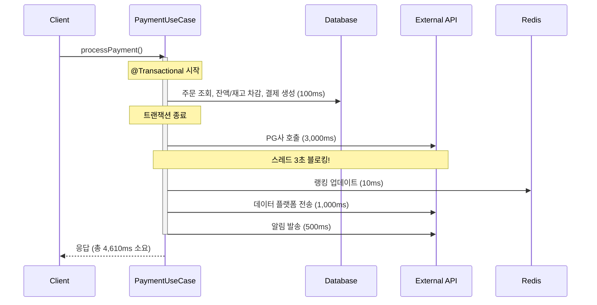
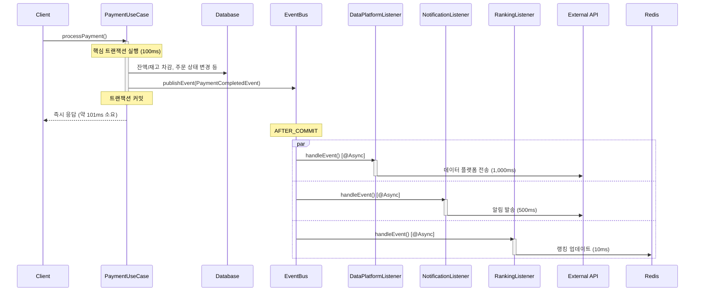

# Week 8: 트랜잭션 분리 및 이벤트 기반 아키텍처 설계

## 1. 현재 시스템 분석

### 1.1 주요 유스케이스별 트랜잭션 경계

현재 우리 시스템에서 가장 중요하고 복잡한 트랜잭션은 **결제 프로세스**입니다. `codebase_investigator` 분석 결과, 결제는 이미 Saga 패턴을 활용하여 여러 트랜잭션으로 분리된 고도화된 구조를 가지고 있습니다.

**결제 흐름:**
1.  **주문 생성 (`CreateOrderUseCase`)**: 사용자의 요청을 검증하고, `PENDING` 상태의 주문을 생성합니다. (단일 트랜잭션)
2.  **결제 실행 (`ProcessPaymentUseCase` & `PaymentTransactionService`)**:
    *   **`reservePayment` (Transaction 1)**: 사용자의 잔액을 차감하고, 상품의 재고를 감소시킵니다. 이 과정은 데이터 정합성을 위해 `Pessimistic Lock`을 사용하며, 가장 핵심적인 DB 작업 구간입니다.
    *   **외부 PG사 API 호출 (No Transaction)**: `reservePayment` 트랜잭션이 커밋된 후, 트랜잭션 범위 밖에서 외부 결제 게이트웨이를 동기적으로 호출합니다.
    *   **`updatePaymentSuccess` (Transaction 2)**: PG사 호출이 성공하면, 주문 상태를 `COMPLETED`로 변경하고 `PaymentCompletedEvent`를 발행합니다.
    *   **`compensatePayment` (Transaction 3)**: PG사 호출이 실패하면, `reservePayment`에서 변경했던 잔액과 재고를 원복하는 보상 트랜잭션을 실행합니다.

### 1.2 문제점 식별

1.  **동기적 외부 호출로 인한 스레드 블로킹**: PG사 API 호출이 동기 방식이므로, 응답을 기다리는 동안(예: 3~5초) API 요청을 처리하는 스레드가 블로킹됩니다. 이는 Tomcat의 스레드 풀을 점유하여 전체 시스템의 동시 처리량(TPS)에 한계를 유발합니다.
2.  **부가 로직과 핵심 로직의 약한 결합**: 결제 성공 후 `PaymentCompletedEvent`가 발행되지만, 현재는 '상품 랭킹 업데이트'라는 단일 부가 로직만 이를 사용하고 있습니다. "데이터 플랫폼 전송", "알림 발송" 등 추가될 수 있는 여러 부가 로직들이 결제 서비스에 직접적인 의존성을 추가할 위험이 있습니다.

### 1.3 성능 영향 분석

- **현재 TPS 한계**: Tomcat의 스레드 풀 크기가 200개이고 PG사 API 응답 시간이 평균 3초라고 가정하면, 시스템의 최대 TPS는 약 66 TPS (200 threads / 3s)로 제한됩니다.
- **사용자 경험 저하**: 사용자는 결제 버튼 클릭 후 즉시 응답을 받지 못하고, 외부 API 응답 시간만큼 대기해야 합니다.

---

## 2. 개선 방안

### 2.1 이벤트 기반 분리 전략

`PaymentCompletedEvent`를 중심으로, 결제 성공 이후의 모든 부가 로직을 이벤트 리스너를 통해 처리하도록 구조를 개선합니다.

- **핵심 로직**: `ProcessPaymentUseCase`는 오직 '결제 처리'라는 핵심 책임에만 집중합니다.
- **부가 로직**: '랭킹 업데이트', '데이터 플랫폼 전송', '알림 발송' 등은 각각 독립적인 리스너가 `PaymentCompletedEvent`를 구독하여 처리합니다.

이를 통해 `ProcessPaymentUseCase`는 부가 로직의 종류나 실행 방식에 대해 알 필요가 없어지며, 시스템의 결합도가 크게 낮아집니다.

### 2.2 비동기 처리 전략

외부 API 호출과 같이 시간이 오래 걸릴 수 있는 부가 로직은 `@Async`를 사용하여 별도의 스레드에서 비동기적으로 처리합니다.

| 리스너 | 비동기 처리 | 이유 |
| :--- | :---: | :--- |
| `RankingEventListener` | ✅ | Redis 업데이트는 빠르지만, 외부 인프라 장애가 결제에 영향을 주지 않도록 비동기 처리 |
| `DataPlatformEventListener` | ✅ | 외부 API 호출이므로, 주 스레드 블로킹을 막기 위해 필수 |
| `PaymentNotificationListener` | ✅ | 외부 알림(SMS, 이메일) API 호출이므로, 비동기 처리가 적합 |

---

## 3. 시퀀스 다이어그램

### 3.1 Before (가상)

만약 이벤트 분리를 적용하지 않고 모든 로직을 동기적으로 처리했을 경우의 가상 다이어그램입니다.



### 3.2 After (개선)

이벤트 기반 비동기 처리를 적용한 개선 후의 다이어그램입니다.



---

## 4. 보상 트랜잭션 설계

### 4.1 실패 시나리오 식별

- **Case 1: 핵심 트랜잭션 실패 (e.g., 잔액 부족, 재고 부족)**
  - **영향:** `reservePayment` 트랜잭션 전체가 롤백됩니다.
  - **보상:** `@Transactional`에 의해 자동으로 롤백되므로 별도의 보상 로직이 필요 없습니다. `PaymentCompletedEvent`도 발행되지 않습니다.

- **Case 2: 부가 로직(이벤트 리스너) 실패 (e.g., 데이터 플랫폼 API 타임아웃)**
  - **영향:** `DataPlatformEventListener` 내에서 예외가 발생합니다.
  - **보상:** **핵심 트랜잭션은 이미 성공했으므로 롤백하지 않습니다.** 결제는 성공한 상태로 유지되어야 합니다. 실패한 부가 로직에 대해서만 재처리 또는 후속 조치를 취합니다.

### 4.2 보상 로직 설계

**시나리오: `DataPlatformEventListener` 실행 실패**

**설계:**
1.  **리스너 내 `try-catch`**: 리스너 내부에서 발생하는 예외가 다른 리스너에게 영향을 주지 않도록 반드시 `try-catch`로 감쌉니다.
2.  **재시도(Retry) 로직**: 실패 시, 간단한 재시도 로직을 구현할 수 있습니다. (e.g., 3회 시도, 지수 백오프)
3.  **Dead Letter Queue (DLQ)**: 최종적으로 재시도에 실패한 이벤트는 별도의 로그나 DB 테이블(Outbox 패턴의 변형)에 기록하여 수동으로 확인 및 처리할 수 있도록 합니다.

```java
// DataPlatformEventListener.java
@Async
@TransactionalEventListener(phase = TransactionPhase.AFTER_COMMIT)
public void handlePaymentCompleted(PaymentCompletedEvent event) {
    try {
        dataPlatformClient.sendPaymentData(event);
    } catch (Exception e) {
        log.error("데이터 플랫폼 전송 실패. 재시도합니다.", e);
        // 여기에 재시도 또는 DLQ 적재 로직 구현
    }
}
```

### 4.3 멱등성 보장 방안

부가 로직은 재시도 등으로 인해 여러 번 실행될 수 있으므로 **멱등성**을 보장해야 합니다.

- **데이터 플랫폼/알림**: 외부 시스템이 동일 요청을 여러 번 받아도 문제가 없는지 확인하거나, 요청 ID를 통해 중복 처리를 방지하도록 설계합니다.
- **랭킹 업데이트 (`ZINCRBY`)**: Redis의 `ZINCRBY`는 멱등하지 않습니다. 따라서 동일한 `PaymentCompletedEvent`가 중복 처리되지 않도록 이벤트 처리 자체에 대한 멱등성 키(e.g., `paymentId`)를 Redis에 기록하고 중복을 체크하는 로직이 필요합니다.

---

## 5. 예상 효과

- **성능 개선**: 외부 API 호출이 비동기화되면서 결제 API의 평균 응답 시간이 3~5초대에서 **100ms 이하**로 크게 단축됩니다. 이는 직접적으로 TPS 향상과 사용자 경험 개선으로 이어집니다.
- **확장성 개선**: 각 부가 로직이 독립적인 컴포넌트(리스너)로 분리되어, 향후 새로운 부가 기능이 추가되더라도 기존 결제 로직의 수정 없이 리스너만 추가하면 되므로 확장성이 향상됩니다.
- **안정성 및 유지보수성 향상**: 부가 기능의 장애가 결제라는 핵심 기능에 영향을 미치지 않게 되어 시스템 전체의 안정성이 높아집니다. 각 기능이 분리되어 코드 이해 및 수정이 용이해집니다.

---

## 6. 리스크 및 대응

- **이벤트 유실**: Application Event는 메모리 기반이므로 애플리케이션이 이벤트를 처리하기 전에 비정상 종료되면 이벤트가 유실될 수 있습니다.
  - **대응**: 중요 이벤트의 경우, **Outbox 패턴**을 도입하여 이벤트를 DB에 먼저 기록한 후 별도의 스케줄러로 발행하는 방식을 고려할 수 있습니다.
- **비동기 처리 순서**: `@Async`를 사용하면 이벤트 처리 순서가 보장되지 않습니다.
  - **대응**: 순서가 중요한 로직이라면, 이벤트를 체이닝(`A완료 이벤트` → `B로직 실행` → `B완료 이벤트` 발행)하거나, `@Async`를 사용하지 않고 동기적으로 처리해야 합니다.
- **모니터링**: 비동기 로직은 흐름 추적이 어렵습니다.
  - **대응**: 각 리스너의 시작, 성공, 실패 시점에 명확한 로그를 남기고, 이벤트 ID를 통해 흐름을 추적할 수 있도록 합니다. 실패/재시도/DLQ 적재 시에는 별도의 모니터링 알림(e.g., Slack)을 구성합니다.
