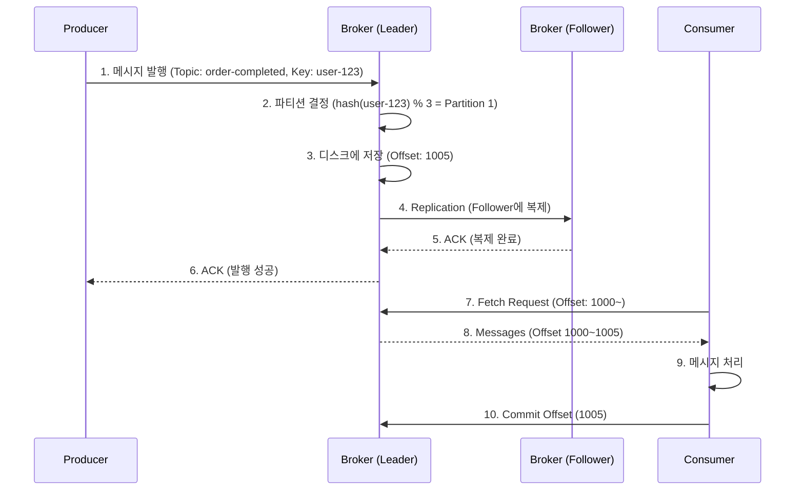
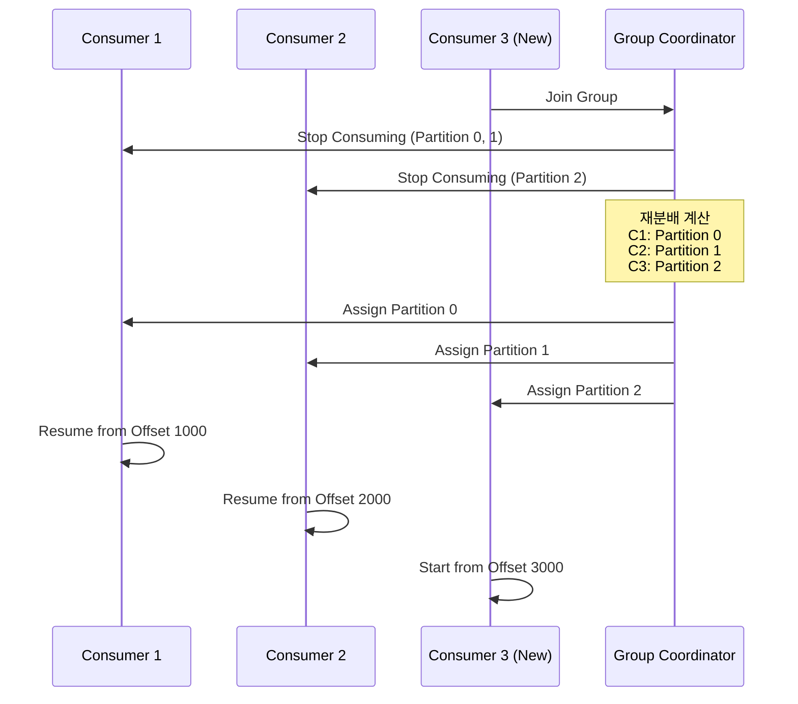

# Kafka 기본 개념

> **목표**: Apache Kafka의 핵심 개념과 구성 요소를 이해하고, 메시지 흐름을 파악한다.

---

## 📋 목차

1. [Kafka란 무엇인가?](#kafka란-무엇인가)
2. [핵심 구성 요소](#핵심-구성-요소)
3. [메시지 흐름](#메시지-흐름)
4. [파티션과 병렬 처리](#파티션과-병렬-처리)
5. [Consumer Group](#consumer-group)
6. [Replication과 고가용성](#replication과-고가용성)
7. [Offset 관리](#offset-관리)
8. [실전 시나리오](#실전-시나리오)

---

## Kafka란 무엇인가?

### 정의

**Apache Kafka**는 대규모 실시간 데이터 스트리밍을 위한 **분산 메시징 시스템**입니다.

```
[기존 메시징]
Producer → Message Queue → Consumer

[Kafka]
Producer → Kafka Cluster (분산 저장) → Multiple Consumers (병렬 처리)
```

### 특징

1. **높은 처리량 (High Throughput)**
   - 초당 수백만 건의 메시지 처리 가능
   - 파티션 기반 병렬 처리

2. **확장성 (Scalability)**
   - Broker 추가로 수평 확장
   - Consumer 추가로 처리량 증가

3. **내구성 (Durability)**
   - 디스크 기반 영구 저장
   - Replication으로 데이터 복제

4. **순서 보장 (Ordering)**
   - 파티션 단위 순서 보장
   - 메시지 키 기반 파티셔닝

5. **고가용성 (High Availability)**
   - Cluster 구성으로 장애 대응
   - Leader/Follower 구조

### 왜 Kafka를 사용하는가?

**문제 상황**
```java
// Before: API 직접 호출
@Transactional
public void createOrder(Order order) {
    orderRepository.save(order);

    // 데이터 플랫폼이 장애나면? → 주문 실패
    dataPlatformClient.sendOrderData(order);

    // 알림 서비스가 느리면? → 주문 지연
    notificationClient.sendNotification(order);
}
```

**Kafka 적용 후**
```java
// After: Kafka로 메시지 발행
@Transactional
public void createOrder(Order order) {
    orderRepository.save(order);
    eventPublisher.publishEvent(new OrderCompletedEvent(order));
}

@TransactionalEventListener(phase = TransactionPhase.AFTER_COMMIT)
public void publishToKafka(OrderCompletedEvent event) {
    // 메시지만 발행하면 끝 (책임 분리)
    kafkaProducer.send("order-completed", event.getOrder());
}

// 각 구독자가 독립적으로 처리
@KafkaListener(topics = "order-completed", groupId = "data-platform")
public void handleForDataPlatform(Order order) {
    // 자기 속도로 처리, 실패해도 재시도 가능
    dataPlatformClient.sendOrderData(order);
}

@KafkaListener(topics = "order-completed", groupId = "notification")
public void handleForNotification(Order order) {
    // 독립적으로 처리
    notificationClient.sendNotification(order);
}
```

**효과**
- ✅ 주문 처리 속도 향상 (외부 API 대기 X)
- ✅ 장애 격리 (한 구독자 실패가 다른 구독자에 영향 X)
- ✅ 확장 용이 (새로운 구독자 추가 쉬움)
- ✅ 재처리 가능 (Offset 조정으로 메시지 재소비)

---

## 핵심 구성 요소

### 1. Producer (생산자)

메시지를 Kafka에 발행하는 주체

```java
// Producer 예제
@Component
@RequiredArgsConstructor
public class OrderEventProducer {

    private final KafkaTemplate<String, OrderEvent> kafkaTemplate;

    public void publishOrderCompleted(Order order) {
        OrderEvent event = new OrderEvent(order.getId(), order.getUserId(), order.getTotalAmount());

        // Topic: "order-completed", Key: userId (파티셔닝 기준)
        kafkaTemplate.send("order-completed", order.getUserId(), event);
    }
}
```

**Producer의 책임**
- 메시지를 생성하여 특정 Topic에 발행
- 메시지 키를 지정하여 파티션 결정 (옵션)
- 발행 성공/실패 확인

**중요 설정**
```yaml
spring:
  kafka:
    producer:
      bootstrap-servers: localhost:9092
      key-serializer: org.apache.kafka.common.serialization.StringSerializer
      value-serializer: org.springframework.kafka.support.serializer.JsonSerializer
      acks: all  # 모든 Replica가 받을 때까지 대기
      retries: 3  # 실패 시 재시도 횟수
```

### 2. Consumer (소비자)

Kafka로부터 메시지를 읽어오는 주체

```java
// Consumer 예제
@Component
public class OrderEventConsumer {

    @KafkaListener(
        topics = "order-completed",
        groupId = "notification-service",
        containerFactory = "kafkaListenerContainerFactory"
    )
    public void handleOrderCompleted(OrderEvent event) {
        log.info("Order completed: {}", event.getOrderId());
        // 알림 발송 로직
        notificationService.sendOrderCompletedNotification(event);
    }
}
```

**Consumer의 책임**
- 특정 Topic/Partition의 메시지 소비
- Offset 관리 (어디까지 읽었는지)
- 메시지 처리 후 Commit

**중요 설정**
```yaml
spring:
  kafka:
    consumer:
      bootstrap-servers: localhost:9092
      group-id: notification-service
      key-deserializer: org.apache.kafka.common.serialization.StringDeserializer
      value-deserializer: org.springframework.kafka.support.serializer.JsonDeserializer
      auto-offset-reset: earliest  # Offset 없을 때 처음부터 읽기
      enable-auto-commit: false  # 수동 Commit (안전)
      properties:
        spring.json.trusted.packages: "*"
```

### 3. Broker (브로커)

Kafka 서버 인스턴스 (메시지 저장 및 전달)

```
Kafka Cluster
├── Broker 1 (Leader for Partition 0, Follower for Partition 1)
├── Broker 2 (Leader for Partition 1, Follower for Partition 2)
└── Broker 3 (Leader for Partition 2, Follower for Partition 0)
```

**Broker의 역할**
- Producer로부터 메시지를 받아 디스크에 저장
- Consumer 요청 시 메시지 전달
- Replication 관리 (Leader/Follower)
- Partition 할당 및 재분배

**특수한 Broker 역할**
1. **Controller**: 다른 Broker 모니터링, Leader 선출
2. **Coordinator**: Consumer Group 관리, Rebalancing 수행

**권장 구성**
- 최소 3대 (고가용성)
- Replication Factor 3 (데이터 복제 3개)

### 4. Topic & Partition

#### Topic: 메시지를 분류하는 단위

```
Kafka Cluster
├── Topic: "order-completed"
│   ├── Partition 0
│   ├── Partition 1
│   └── Partition 2
├── Topic: "payment-completed"
│   ├── Partition 0
│   └── Partition 1
└── Topic: "coupon-issued"
    └── Partition 0
```

**Topic 명명 규칙**
```
# ✅ Good (도메인 이벤트 명확)
order-completed
order-cancelled
payment-completed
coupon-issued

# ❌ Bad (모호함)
order-events
order-status-changed
data-sync
```

#### Partition: Topic 내 메시지를 분산 저장하는 단위

**파티션의 핵심**
1. **병렬 처리**: 파티션 수만큼 Consumer를 배치하여 병렬 처리
2. **순서 보장**: 같은 파티션 내에서는 순서 보장
3. **확장성**: 파티션 추가로 처리량 증가

```
Topic: "order-completed" (3 Partitions)

Partition 0: [Msg1] [Msg4] [Msg7] → Consumer 1
Partition 1: [Msg2] [Msg5] [Msg8] → Consumer 2
Partition 2: [Msg3] [Msg6] [Msg9] → Consumer 3
```

**파티션 수 결정 기준**
- **처리량 기반**: `목표 TPS / 파티션당 처리량 = 필요 파티션 수`
- **시작 권장**: 3개 (보수적)
- **확장**: Lag 발생 시 점진적으로 증가

**파티셔닝 전략**

```java
// 1. 키 없이 발행 (Round-Robin)
kafkaTemplate.send("order-completed", order);
→ Partition 0, 1, 2 순서대로 골고루 분배

// 2. 키 지정 (Hash 기반)
kafkaTemplate.send("order-completed", order.getUserId(), order);
→ 같은 userId는 항상 같은 Partition으로 (순서 보장)

// 3. 파티션 직접 지정
kafkaTemplate.send(new ProducerRecord<>("order-completed", 1, order.getUserId(), order));
→ Partition 1로 강제 발행
```

### 5. Message (메시지)

Kafka에서 취급하는 데이터 단위

```json
{
  "key": "user-12345",           // 파티셔닝 기준 (옵션)
  "value": {                     // 실제 데이터
    "orderId": "order-67890",
    "userId": "user-12345",
    "totalAmount": 50000,
    "status": "COMPLETED"
  },
  "timestamp": 1702889123456,    // 메시지 생성 시각
  "headers": {                   // 메타데이터 (옵션)
    "source": "order-service",
    "version": "1.0"
  }
}
```

**메시지 구조**
- **Key**: 파티셔닝 기준 (같은 키는 같은 파티션)
- **Value**: 실제 데이터 (JSON, Avro, Protobuf 등)
- **Timestamp**: 메시지 생성 시각
- **Headers**: 메타데이터

**메시지 크기 제한**
- 기본: 1MB
- 대용량 메시지: 별도 저장소(S3) 사용 권장

---

## 메시지 흐름

### 전체 흐름



### 단계별 설명

#### 1-2. 메시지 발행 및 파티션 결정

```java
// Producer
kafkaTemplate.send("order-completed", "user-123", orderData);

// Kafka 내부
int partition = hash("user-123") % 3;  // Partition 1
```

#### 3-6. 저장 및 Replication

```
Broker 1 (Leader for Partition 1)
├── Append to log: [Offset 1005] {"orderId": "order-67890", ...}
└── Replicate to Followers

Broker 2 (Follower for Partition 1)
└── Receive and store: [Offset 1005]

Broker 3 (Follower for Partition 1)
└── Receive and store: [Offset 1005]

All Replicas ACK → Send ACK to Producer
```

#### 7-10. 소비 및 Commit

```java
// Consumer
@KafkaListener(topics = "order-completed")
public void handle(OrderData data, Acknowledgment ack) {
    // 메시지 처리
    processOrder(data);

    // 명시적 Commit (처리 완료 후)
    ack.acknowledge();
}
```

---

## 파티션과 병렬 처리

### 순서 보장 vs 병렬 처리

**시나리오: 선착순 쿠폰 발급**

```
요구사항:
- 쿠폰 A: 100개 한정 (순차 처리 필요)
- 쿠폰 B: 200개 한정 (순차 처리 필요)
- 두 쿠폰은 동시에 처리해도 됨 (병렬 처리)
```

**해결책: 메시지 키 = 쿠폰 ID**

```java
// Producer
kafkaTemplate.send("coupon-issued",
                   coupon.getId(),  // Key: coupon-A
                   couponIssuanceData);

// Kafka 파티셔닝
Key: "coupon-A" → hash("coupon-A") % 3 = Partition 0
Key: "coupon-B" → hash("coupon-B") % 3 = Partition 1
Key: "coupon-C" → hash("coupon-C") % 3 = Partition 2
```

**효과**

```
Topic: "coupon-issued" (3 Partitions)

Partition 0 (Coupon A 전용)
├── [Request 1] user-123, coupon-A → Consumer 1 처리 (순차)
├── [Request 2] user-456, coupon-A → Consumer 1 처리 (순차)
└── [Request 3] user-789, coupon-A → Consumer 1 처리 (순차)

Partition 1 (Coupon B 전용)
├── [Request 1] user-111, coupon-B → Consumer 2 처리 (순차)
├── [Request 2] user-222, coupon-B → Consumer 2 처리 (순차)
└── [Request 3] user-333, coupon-B → Consumer 2 처리 (순차)

Partition 2 (Coupon C 전용)
├── [Request 1] user-aaa, coupon-C → Consumer 3 처리 (순차)
└── [Request 2] user-bbb, coupon-C → Consumer 3 처리 (순차)
```

✅ **동일 쿠폰**: 순차 처리 (동시성 제어)
✅ **다른 쿠폰**: 병렬 처리 (처리량 향상)

### 처리량 향상 전략

**Q. 처리량을 높이려면?**

```
A. 파티션과 Consumer를 함께 늘린다

[Before]
Topic: "order-completed" (Partition 3개)
└── Consumer Group: "order-processor"
    ├── Consumer 1 → Partition 0
    ├── Consumer 2 → Partition 1
    └── Consumer 3 → Partition 2
→ 처리량: 3000 TPS

[After]
Topic: "order-completed" (Partition 6개)  ← 파티션 증가
└── Consumer Group: "order-processor"
    ├── Consumer 1 → Partition 0
    ├── Consumer 2 → Partition 1
    ├── Consumer 3 → Partition 2
    ├── Consumer 4 → Partition 3  ← Consumer 추가
    ├── Consumer 5 → Partition 4  ← Consumer 추가
    └── Consumer 6 → Partition 5  ← Consumer 추가
→ 처리량: 6000 TPS
```

**주의사항**
- ❌ `Consumer 수 > Partition 수`: 잉여 Consumer 발생 (Idle)
- ✅ `Consumer 수 ≤ Partition 수`: 효율적 분배

---

## Consumer Group

### 개념

**Consumer Group**: 하나의 Topic을 함께 소비하는 Consumer 집합

```
Topic: "order-completed" (3 Partitions)

Consumer Group: "data-platform"
├── Consumer 1 → Partition 0
├── Consumer 2 → Partition 1
└── Consumer 3 → Partition 2

Consumer Group: "notification"
├── Consumer 1 → Partition 0, 1, 2
```

### 주요 특징

#### 1. 독립적 소비

```
Topic: "order-completed"

├── Consumer Group: "data-platform"
│   └── 모든 메시지를 독립적으로 소비
│
└── Consumer Group: "notification"
    └── 모든 메시지를 독립적으로 소비
```

**효과**: 한 그룹이 메시지를 읽어도 다른 그룹에 영향 없음

#### 2. 파티션 단독 소유

**규칙**: 한 파티션은 같은 Consumer Group 내에서 하나의 Consumer만 소비

```
✅ Good
Consumer Group: "processor"
├── Consumer 1 → Partition 0
├── Consumer 2 → Partition 1
└── Consumer 3 → Partition 2

❌ Bad (불가능)
Consumer Group: "processor"
├── Consumer 1 → Partition 0
└── Consumer 2 → Partition 0  ← 동일 파티션 중복 할당 불가
```

**이유**: 순서 보장을 위해

#### 3. 자동 분배

```
[초기 상태]
Consumer Group: "processor" (Consumer 3개, Partition 3개)
├── Consumer 1 → Partition 0
├── Consumer 2 → Partition 1
└── Consumer 3 → Partition 2

[Consumer 4 추가 후 Rebalancing]
Consumer Group: "processor" (Consumer 4개, Partition 3개)
├── Consumer 1 → Partition 0
├── Consumer 2 → Partition 1
├── Consumer 3 → Partition 2
└── Consumer 4 → (Idle, 할당받은 파티션 없음)

[Consumer 2 장애 후 Rebalancing]
Consumer Group: "processor" (Consumer 3개, Partition 3개)
├── Consumer 1 → Partition 0, 1  ← Partition 1 재할당
├── Consumer 3 → Partition 2
└── Consumer 4 → (Idle)
```

### Rebalancing

**Rebalancing**: Consumer Group 내에서 파티션 소유권을 재분배하는 과정

**발생 조건**
1. Consumer 추가
2. Consumer 장애
3. Partition 추가
4. Consumer가 Heartbeat 응답 실패

**과정**



**주의사항**
- ⚠️ **Rebalancing 중에는 메시지 소비 중단** (Stop-the-world)
- ⚠️ **빈번한 Rebalancing은 성능 저하**
- ✅ **대응**: Heartbeat/Session Timeout 적절히 설정

```yaml
spring:
  kafka:
    consumer:
      properties:
        session.timeout.ms: 30000  # 30초 (기본: 10초)
        heartbeat.interval.ms: 3000  # 3초 (session.timeout / 3)
        max.poll.interval.ms: 300000  # 5분 (처리 시간 고려)
```

---

## Replication과 고가용성

### Replication Factor

**Replication Factor**: 각 파티션의 복제본 개수

```
Topic: "order-completed", Replication Factor: 3

Partition 0
├── Leader: Broker 1 (읽기/쓰기)
├── Follower: Broker 2 (복제본)
└── Follower: Broker 3 (복제본)

Partition 1
├── Leader: Broker 2
├── Follower: Broker 1
└── Follower: Broker 3
```

**권장 설정**
- **Replication Factor: 3** (2대 장애까지 견딤)
- **최소 Broker 수: 3** (RF 3 지원)

### Leader/Follower 역할

```
Partition 0

┌─────────────────┐
│ Leader (Broker 1)│
├─────────────────┤
│ • 읽기/쓰기 담당 │
│ • Producer ACK  │
│ • Consumer 응답  │
└─────────────────┘
        │
        │ Replication
        ├───────────────┐
        ▼               ▼
┌──────────────┐  ┌──────────────┐
│Follower (B2) │  │Follower (B3) │
├──────────────┤  ├──────────────┤
│• 복제만 수행  │  │• 복제만 수행  │
│• 읽기/쓰기 X  │  │• 읽기/쓰기 X  │
└──────────────┘  └──────────────┘
```

### 장애 대응

**시나리오: Broker 1 (Leader) 장애**

```
[Before]
Partition 0: Leader = Broker 1, Followers = [Broker 2, Broker 3]

[Broker 1 Down]
1. Controller가 Broker 1 장애 감지
2. ISR(In-Sync Replicas) 중에서 새 Leader 선출
3. Broker 2를 새 Leader로 승격

[After]
Partition 0: Leader = Broker 2, Followers = [Broker 3]
```

**ISR (In-Sync Replicas)**
- Leader와 동기화된 Follower 집합
- 새 Leader는 ISR에서만 선출 (데이터 유실 방지)

```yaml
# Producer 설정
spring:
  kafka:
    producer:
      acks: all  # 모든 ISR이 받을 때까지 대기 (가장 안전)
      # acks: 0  → 발행만 하고 ACK 대기 X (가장 빠름, 유실 가능)
      # acks: 1  → Leader만 받으면 ACK (중간)
```

---

## Offset 관리

### Offset이란?

**Offset**: 파티션 내 메시지의 위치를 나타내는 순차적 ID

```
Partition 0
├── [Offset 0] Message A
├── [Offset 1] Message B
├── [Offset 2] Message C  ← Current Offset (Consumer가 마지막으로 읽은 위치)
├── [Offset 3] Message D  ← 다음 읽을 메시지
└── [Offset 4] Message E
```

### Offset Commit

**자동 Commit (Auto Commit)**
```yaml
spring:
  kafka:
    consumer:
      enable-auto-commit: true  # 기본값
      auto-commit-interval: 5000  # 5초마다 자동 Commit
```

**문제점**
```java
// Offset 1000부터 10개 메시지 읽음
List<Message> messages = consumer.poll();  // Offset 1000~1009

// 3개만 처리하고 장애 발생
processMessage(messages.get(0));  // Offset 1000
processMessage(messages.get(1));  // Offset 1001
processMessage(messages.get(2));  // Offset 1002
// 💥 장애 발생

// 그 사이 Auto Commit 발생 (Offset 1009까지 Commit됨)
// → Offset 1003~1009 메시지 유실
```

**수동 Commit (Manual Commit)** ✅ 권장
```yaml
spring:
  kafka:
    consumer:
      enable-auto-commit: false  # 수동 Commit
```

```java
@KafkaListener(
    topics = "order-completed",
    containerFactory = "manualAckContainerFactory"
)
public void handleOrder(OrderData order, Acknowledgment ack) {
    try {
        // 메시지 처리
        processOrder(order);

        // 처리 완료 후 Commit
        ack.acknowledge();
    } catch (Exception e) {
        log.error("Failed to process order", e);
        // Commit 하지 않음 → 재처리됨
    }
}
```

### Offset Reset 정책

**Consumer가 Offset을 잃었을 때 어디서부터 읽을까?**

```yaml
spring:
  kafka:
    consumer:
      auto-offset-reset: earliest  # 처음부터
      # auto-offset-reset: latest  # 최신부터
      # auto-offset-reset: none  # 에러 발생
```

**시나리오별 선택**
- `earliest`: 모든 메시지를 처리해야 하는 경우 (데이터 플랫폼)
- `latest`: 최신 메시지만 필요한 경우 (모니터링)
- `none`: Offset 유실 시 명시적 처리 필요

---

## 실전 시나리오

### 시나리오 1: 주문 완료 이벤트 발행

**요구사항**
- 주문 완료 시 데이터 플랫폼과 알림 서비스에 전달
- 두 서비스는 독립적으로 동작

**설계**

```
Topic: "order-completed" (Partition 3)

Producer: OrderService
└── @TransactionalEventListener(AFTER_COMMIT)
    └── Kafka 발행 (Key: orderId)

Consumer Group 1: "data-platform"
└── Consumer 1 → Partition 0, 1, 2
    └── 데이터 플랫폼 API 호출

Consumer Group 2: "notification"
└── Consumer 1 → Partition 0, 1, 2
    └── 알림톡 발송
```

**구현**

```java
// Producer
@TransactionalEventListener(phase = TransactionPhase.AFTER_COMMIT)
public void publishOrderCompleted(OrderCompletedEvent event) {
    OrderMessage message = OrderMessage.from(event.getOrder());
    kafkaTemplate.send("order-completed", event.getOrderId(), message);
}

// Consumer 1: Data Platform
@KafkaListener(topics = "order-completed", groupId = "data-platform")
public void sendToDataPlatform(OrderMessage message) {
    dataPlatformClient.sendOrderData(message);
}

// Consumer 2: Notification
@KafkaListener(topics = "order-completed", groupId = "notification")
public void sendNotification(OrderMessage message) {
    notificationService.sendOrderCompletedNotification(message);
}
```

### 시나리오 2: 선착순 쿠폰 발급

**요구사항**
- 쿠폰별로 순차 처리 (초과 발급 방지)
- 여러 쿠폰 동시 처리 (처리량 향상)

**설계**

```
Topic: "coupon-issuance" (Partition 12)

Producer: CouponService
└── Kafka 발행 (Key: couponId)
    └── hash(couponId) % 12 = Partition

Consumer Group: "coupon-processor"
├── Consumer 1 → Partition 0, 1, 2
├── Consumer 2 → Partition 3, 4, 5
├── Consumer 3 → Partition 6, 7, 8
└── Consumer 4 → Partition 9, 10, 11
```

**파티셔닝 전략**
```java
// Producer
kafkaTemplate.send(
    "coupon-issuance",
    coupon.getId(),  // Key: 쿠폰 ID
    issuanceRequest
);

// 같은 쿠폰은 같은 파티션 → 순차 처리
// 다른 쿠폰은 다른 파티션 → 병렬 처리
```

### 시나리오 3: 콘서트 대기열 토큰 활성화

**요구사항**
- 전체 대기열 순서 보장
- N초당 M개씩 순차 활성화

**설계**

```
Topic: "waiting-token" (Partition 1)  ← 순서 보장을 위해 1개

Producer: WaitingQueueService
└── Kafka 발행 (Key: null, 순서 보장)

Consumer Group: "token-activator"
└── Consumer 1 → Partition 0
    └── N초당 M개씩 처리
```

**구현**

```java
// Consumer
@KafkaListener(topics = "waiting-token", groupId = "token-activator")
public void activateToken(WaitingTokenMessage message) {
    // N초당 M개 제한
    rateLimiter.acquire();

    // 토큰 활성화
    waitingQueueService.activateToken(message.getTokenId());
}
```

---

## 정리

### Kafka 핵심 요약

| 구성 요소 | 역할 | 핵심 개념 |
|----------|------|-----------|
| **Producer** | 메시지 발행 | Topic, Key, Value |
| **Broker** | 메시지 저장/전달 | Cluster, Leader/Follower |
| **Topic** | 메시지 분류 | 카테고리 |
| **Partition** | 병렬 처리 단위 | 순서 보장, 확장성 |
| **Consumer** | 메시지 소비 | Offset, Commit |
| **Consumer Group** | 독립적 소비 | 파티션 분배, Rebalancing |

### Kafka를 언제 사용하는가?

| 상황 | 적합성 | 이유 |
|------|--------|------|
| 이벤트 기반 아키텍처 | ✅ 매우 적합 | 느슨한 결합, 확장성 |
| 대용량 메시지 처리 | ✅ 매우 적합 | 높은 처리량 |
| 메시지 순서 보장 | ✅ 적합 | 파티션 단위 순서 보장 |
| 데이터 파이프라인 | ✅ 매우 적합 | CDC, ETL |
| 실시간 분석 | ✅ 적합 | Kafka Streams |
| 즉시 응답 필요 | ❌ 부적합 | 비동기 특성 |
| 트랜잭션 보장 | ⚠️ 제한적 | 분산 트랜잭션 복잡 |

### 다음 단계

- [ ] [Kafka 설치 및 환경 구성](./kafka-setup.md)
- [ ] [Spring Boot와 Kafka 연동](./kafka-spring-integration.md)
- [ ] [비즈니스 프로세스 개선](./kafka-use-cases.md)

---

## 참고 자료

- [Apache Kafka Documentation](https://kafka.apache.org/documentation/)
- [Confluent Kafka 101](https://developer.confluent.io/learn-kafka/)
- [Spring for Apache Kafka](https://spring.io/projects/spring-kafka)

---

**Last Updated**: 2024-12-18
